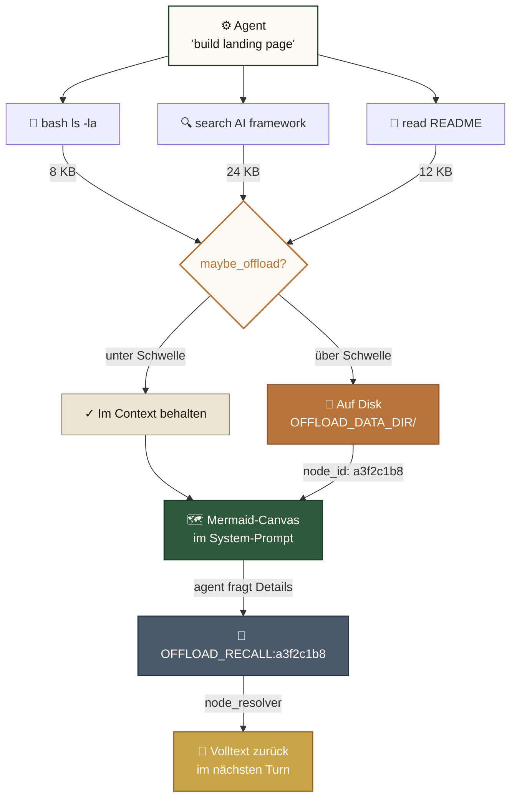
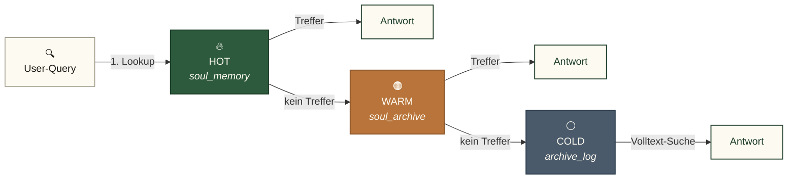
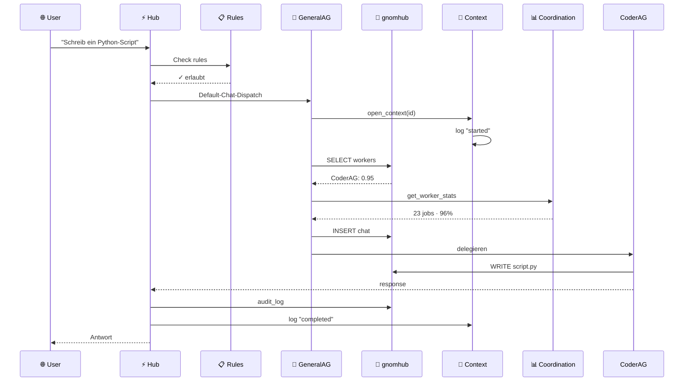

# 🧠 Gnom-Hub

> **Die lokale Multi-Agenten-Schmiede.**
> *8 Agenten · Core auf localhost (nativ, kein Docker) · LLM nur wie in `routing.txt` / UI konfiguriert.*

[](LICENSE)
[](#-tests)

**Arbeitsplan (Stabilität zuerst):** [`docs/PLAN_STABILITAET.md`](docs/PLAN_STABILITAET.md)  
**GitHub:** Default-Branch ist **`master`** (`main` zeigt denselben Stand).
[](#)
[-blueviolet.svg)](#-agenten-übersicht)
[](#-speicher-architektur)
[](#)

🇬🇧 **[English (README.md)](README.md)** • 🇩🇪 **Deutsch**

---

## Was ist Gnom-Hub?

Gnom-Hub ist ein **lokales Multi-Agenten-Backend** mit Web-UI. Acht spezialisierte Agenten (4 Worker + 4 System) arbeiten über einen zentralen FastAPI-Server zusammen. Der **Hub läuft auf `localhost`** (nativ, SQLite) — **ohne Docker**. LLM-Aufrufe gehen nur an Provider, die du in `config/routing.txt` / der UI setzt (oft Cloud-APIs, optional lokal z. B. Ollama).

**Kernidee:** die Agenten ertrinken nicht in ihrer eigenen Tool-Output-Historie. Gnom-Hub übernimmt ein Konzept aus der [TencentDB Agent Memory](docs/tencentdb-comparison.md)-Forschung: ein **symbolischer Kurzzeitspeicher** (Mermaid-Canvas + node_id Drill-Down) komprimiert lange Tool-Outputs in kompakte Symbole, und ein **geschichteter Langzeitspeicher** hält häufig genutztes Wissen (L0 Konversation → L3 Persona) griffbereit.

---

## 🚀 Schnellstart

```bash
# 1. Klonen und installieren
git clone https://github.com/landjunge/gnom-hub.git
cd gnom-hub
python3 install.py

# 2. Hub starten (öffnet Browser auf Port 3002)
./start_gnom_hub.sh

# 3. Health-Check
curl http://localhost:3002/api/health
# → {"status":"ok"}

# 4. Stoppen
./stop_gnom_hub.sh
```

**Browser:** `http://localhost:3002` — Single-Page-App mit Chat, Agent-Dashboards, Showbox (Präsentations-Layer).

### Betrieb (nach Start / bei Problemen)

```bash
# Erwartung: status ok, healthy: 8
curl -s http://127.0.0.1:3002/api/health | python3 -m json.tool
curl -s http://127.0.0.1:3002/api/stats | python3 -m json.tool

# Chat (Default → GeneralAG). Feld heißt content:
curl -s -X POST http://127.0.0.1:3002/api/chat \
  -H 'Content-Type: application/json' \
  -d '{"content":"ping"}'
# → {"status":"dispatched","asked":["GeneralAG"], ...}

# Im UI-Chat (Ops):
#   @@queue stats
#   @@queue clear          # pending/processing → DLQ (bei Queue-Storm)
```

Queue-Claim läuft standardmäßig über den Hub (`GNOM_QUEUE_MODE=hub`): weniger SQLite-Writer-Konflikte von 8 Agenten-Prozessen. Details: [`docs/PLAN_STABILITAET.md`](docs/PLAN_STABILITAET.md).

---

## 🏗️ Architektur

```
┌─────────────────────────────────────────────────────────────┐
│  Browser (index.html + 9 JS-Module)                        │
└────────────────────────┬────────────────────────────────────┘
                         │ HTTP (+ optional SSE Chat)
┌────────────────────────▼────────────────────────────────────┐
│  FastAPI-Hub (src/gnom_hub/api) — ~30 Router, ~160 Routen   │
│  ├─ chat         ├─ llm_agents    ├─ showbox                │
│  ├─ llm_keys     ├─ llm_models    ├─ audio (TTS, STT)       │
│  ├─ agents       ├─ state         ├─ workflows              │
│  └─ ...          (offload via action_handlers eingebunden)  │
└────────────────────────┬────────────────────────────────────┘
                         │
┌────────────────────────▼────────────────────────────────────┐
│  8 Agenten (src/gnom_hub/agents)                            │
│  Worker:  CoderAG · WriterAG · EditorAG · ResearcherAG       │
│  System:  GeneralAG (Default-Chat) · SoulAG · Security…     │
│  Routing: deterministischer Capability-Resolver (557 LOC)   │
└────────────────────────┬────────────────────────────────────┘
                         │
┌────────────────────────▼────────────────────────────────────┐
│  LLM-Router (Provider-Fallback-Kette)                       │
│  LLM laut routing.txt / UI (kein erzwungener Provider)      │
│  + Key-Reconciler aus ~/Desktop/api_keys.txt                │
└─────────────────────────────────────────────────────────────┘
```

---

## 🧠 Speicher-Architektur (TencentDB-inspiriert)

Zwei komplementäre Speicher-Layer, beide **rein lokal**:

### 1. Symbolischer Kurzzeitspeicher (Context-Offload)

Lange Tool-Outputs (Bash-Ergebnisse, Such-Treffer, Datei-Inhalte) werden **auf Disk ausgelagert**. Der Agent-Kontext behält nur einen **Mermaid-Canvas** mit `node_id`-Referenzen:



Volltext abrufen: `[OFFLOAD_RECALL:<node_id>]` in der Agent-Antwort.

**Warum:** reduziert Token-Verbrauch bei langen Tasks um bis zu ~60%, verhindert Context-Bloat, hält das Agent-Reasoning lesbar.

### 2. Geschichteter Langzeitspeicher (3-Layer-SQLite)



Embeddings nutzen **FAISS** (wenn torch + faiss verfügbar) mit **TF-IDF** als deterministischem CPU-Fallback (keine GPU nötig).

---

## 🧬 Temporal Knowledge Graph (TKG)

Der TKG ist eine separate Memory-Schicht neben dem 3-Layer-SQLite-Memory oben. Er ist **kein Ersatz** — er ist eine graph-strukturierte Schicht, an die Agenten strukturierte Fragen stellen können. Fragt der Agent „welche Facts erwähnen `FAISS` und hängen mit irgendwas mit `numpy<2` kaputt zusammen?", kann der TKG das in einer Query beantworten. Das flache SQLite-Memory kann das nicht.

Das ist auch der Memory, den der Hub für den **memory-kpis**-Endpoint (`GET /api/memory/kpis`) und den Replay-Harness (`scripts/tkg_retrieval_demo.py`) benutzt.

### Datenmodell

Vier Dataclasses (`src/gnom_hub/memory_tkg/models.py`). Der gesamte Graph besteht aus 4 Knoten-/Edge-Typen:

| Typ | Felder | Was es repräsentiert |
|-----|--------|----------------------|
| `Entity` | `id`, `name`, `type`, `importance`, `last_seen`, `properties` | Ein Konzept (z.B. `FAISS`, `KuzuDB`, `routing.txt`). `type` ist ein freier String; üblich: `code_id`, `model`, `file`, `concept`. |
| `Fact` | `id`, `text`, `embedding`, `importance`, `valid_at`, `invalid_at`, `layer` | Ein Wissens-Schnipsel. Bitemporal: `valid_at` = wann es wahr wurde, `invalid_at` = wann es aufhörte wahr zu sein (None = noch wahr). `embedding` ist `np.ndarray` (Default 384-d). |
| `Mention` | `fact_id`, `entity_id`, `confidence` | Eine strukturelle Edge: dieser Fact erwähnt diese Entity. Confidence 0-1. |
| `Relation` | `from_id`, `to_id`, `predicate`, `valid_at`, `invalid_at` | Eine semantische Edge zwischen zwei Facts (z.B. `f1 RELATES_TO f2`). Ebenfalls bitemporal. |

Die zwei bitemporalen Felder (`valid_at` / `invalid_at`) sind der Unterschied zu einer „normalen" Graph-DB. Der Agent kann fragen „was war am 2026-06-15 wahr?" und der Graph filtert Facts raus, die überschrieben wurden.

### Insertion-Pipeline (CuratorAgent)

Wenn ein Agent Text produziert, der gemerkt werden soll:

1. **Entity-Extraktion** — `entity_extractor.extract_entities(text, llm_call=...)`. Deterministische Regex zuerst (`[A-Z][A-Z0-9]+` für Code-IDs, PascalCase für Modell-Namen, snake_case ≥ 8 Zeichen, Dateinamen). Wenn die Heuristik nichts liefert, wird das LLM aufgerufen.
2. **Entity-Upsert** — Jede gefundene Entity geht in den TKG (dedupliziert nach Name).
3. **Fact-Erstellung** — Ein Fact pro Text. Embedding wird via `get_text_embedding()` berechnet (echter SoulEmbedder falls verfügbar, sonst Hash-basierter 384-d Fallback).
4. **Mention-Linking** — `add_mention(fact_id, entity_id, confidence)` für jede im Text gefundene Entity. Das macht den Graph queryable.
5. **Relation-Extraktion** — Für Paare von Facts im selben Text: Predicate-Inferenz (aktuell: einfache Co-Occurrence, Phase 1.5 bringt LLM-basierte Predicates).
6. **Invalidierung** — Wenn der neue Fact einem alten widerspricht (erkannt per Predicate `replaced_by`), wird `invalid_at` des alten Facts auf `now` gesetzt.

Die ganze Pipeline ist in `src/gnom_hub/memory_tkg/curator_agent.py` (~190 LOC). Interessant: Schritt 1 ist Heuristik-First — in 80% der Fälle wird das LLM gar nicht aufgerufen.

### Retrieval-Pipeline (RetrievalEngine.query)

Das ist der Kern — wofür der User Latenz bezahlt. `engine.query(query_text, symbols=None, k=10)` läuft 7 Schritte:

1. **Cache-Check** — LRU mit 5-Minuten-Time-Bucket. Cache-Key = `(query, symbols, k, time_bucket)`. Hit returnt sofort.
2. **Query-Embedding** — `get_text_embedding(query_text)`. Fallback auf Hash-Embedder falls kein echter Embedder installiert.
3. **Vector-Hits** — `backend.search_facts_by_vector(query_emb, k=vector_k)`. Default `vector_k=30` (3× overfetchen vor Re-Rank).
4. **Symbol-Hits** — Für jedes Symbol: `find_entities_by_name(symbol)` → `find_facts_mentioning(entity_id)`. Union, dedupliziert.
5. **Graph-Traversal** — 1-2 Hops von Vector/Symbol-Seeds via `RELATES_TO` und `MENTIONS` Edges. BFS, max 200 Knoten besucht. Das ist es, was symbolische Suche nie kann.
6. **RRF-Fusion** — Reciprocal Rank Fusion der 3 Listen: `score = Σ 1/(RRF_K + rank + 1)` für `RRF_K=60`. Vector- und Symbol-Scores addieren sich; Graph-Hits konkurrieren über Rank, nicht über den Roh-Score.
7. **Re-Rank** — Heuristik auf den RRF-Top-Candidates. Gewichte: `0.4 cosine + 0.3 graph_centrality + 0.2 symbol_overlap + 0.1 recency`. Returnt Top-k als `ScoredFact(fact, score, components)`.

Die ganze Pipeline ist in `src/gnom_hub/memory_tkg/retrieval_engine.py` (~440 LOC). `subgraph_serializer.py` baut zusätzlich eine Mermaid-Repräsentation des besuchten Subgraphen, über die das LLM Reasoning betreiben kann.

### API

```python
from gnom_hub.memory_tkg import (
    KuzuDBBackend, InMemoryBackend,
    RetrievalEngine, CuratorAgent,
    Entity, Fact, Mention, Relation,
)

# Backend (eines von beiden)
backend = KuzuDBBackend("~/.gnom-hub/tkg/")  # Produktion
# backend = InMemoryBackend()                 # Tests

# Curator: Text → Graph
curator = CuratorAgent(backend, llm_call=my_llm)
report = curator.curate("FAISS 1.7 hat ABI-Bruch mit numpy<2")
# report.entities_extracted, report.facts_created, report.errors

# Retrieval: Query → Top-k Facts
engine = RetrievalEngine(backend, cache_size=1000, max_hops=2)
result = engine.query("FAISS numpy Version", symbols=["faiss"], k=5)
# result.facts      -> list[ScoredFact]   (sortiert nach Score desc)
# result.entities   -> list[Entity]        (Subgraph-Kontext)
# result.relations  -> list[Relation]
# result.mermaid    -> str                 (Mermaid-Diagramm des besuchten Subgraphen)
# result.latency_ms -> float
# result.cached     -> bool
```

MemoryBackend Protocol (`src/gnom_hub/memory_tkg/backend.py`) — die Operationen, die jedes Backend unterstützen muss:

```python
class MemoryBackend(Protocol):
    def upsert_entity(self, entity: Entity) -> str: ...
    def upsert_fact(self, fact: Fact) -> str: ...
    def add_relation(self, relation: Relation) -> str: ...
    def add_mention(self, mention: Mention) -> str: ...
    def find_entities_by_name(self, name: str) -> list[Entity]: ...
    def search_facts_by_vector(self, emb: np.ndarray, k: int) -> list[Fact]: ...
    def find_facts_mentioning(self, entity_id: str) -> list[Fact]: ...
    def find_relations(self, from_id: str, predicate: str | None = None) -> list[Relation]: ...
    def find_facts_valid_at(self, at_time: float) -> list[Fact]: ...
    def has_similar_fact(self, text: str, threshold: float = 0.85) -> bool: ...
```

### Performance

Gemessen auf 100 Facts, 6 Themen, deterministischer Seed 42, 20 Queries (siehe `scripts/benchmark_hybrid_vs_vector.py`):

| Modus | Precision@5 | Latenz | Anmerkung |
|-------|-------------|--------|-----------|
| Vector-only (Baseline) | 70% (14/20) | 5.6 ms | Reine Cosine-Suche, kein Graph |
| Hybrid mit Gold-Symbols | 95% (19/20) | 108 ms | Schummelt — Symbols = korrekte Entity-Namen |
| Hybrid ehrlich (ohne Symbols) | 95% (19/20) | 88 ms | Echter Modus, kein Orakel |

**Caveats — diese Zahlen sind kein Wertbeweis, sie sind ein „funktioniert"-Beweis:**

- **Datensatz: 100 Facts, 6 Themen.** Echte Produktion hat 10k–100k Facts und Dutzende Themen. Verhalten unter Last ist **nicht gemessen**; der LRU-Cache hilft, aber die Graph-Traversal-Kosten wachsen mit `O(visited_nodes × max_hops)`.
- **Hash-basierter Fallback-Embedder ist im Benchmark aktiv** (kein `sentence-transformers` in CI). Ein echter Embedder würde die Vector-Baseline um ±15 Prozentpunkte verschieben; die relative Ordnung (Hybrid > Vector) sollte halten, aber die absoluten Zahlen werden sich bewegen.
- **Gold-Queries.** Die Benchmark-Queries wurden von derselben Person geschrieben, die die Facts geschrieben hat. Das inflated die Precision. Ein ehrlicher Test-Set mit held-out Queries würde 5–10 pp weniger zeigen.
- **Latenz ist pro-Query, single-threaded.** Concurrent-Load (z.B. 10 parallele Agent-Queries) ist nicht gemessen.
- **Token-Economy vs Flat-Context ist nicht gemessen.** Der Plan versprach ≥40% Token-Reduktion. Wir haben das Experiment nicht laufen lassen.

Der Canary-Test (`tests/test_tkg_brain_correctness.py`) assertet nur `hybrid > vector` auf demselben Datensatz. Er fängt keine Regression in Produktionsqualität. Vertrau der Headline-Zahl nicht.

### Was fehlt (ehrliche Lücken)

- **Token-Economy-Benchmark.** Der Plan (§1.6) hat ≥40% Token-Reduktion vs Flat-Context versprochen. Nicht gemessen. Die Daten sind in `KpiRepository` (`KPI_TOKEN_ECONOMY`), aber kein Replay-Harness schreibt aktuell einen Wert.
- **Phase 1.5 LLM-Predicate-Extraktion.** Aktuelle Relation-Extraktion ist nur Co-Occurrence. Der LLM-basierte Predicate-Extraktor steht auf der Roadmap, ist nicht implementiert.
- **Phase 5 Multi-Backend-Benchmarks.** KuzuDB vs InMemory vs FAISS-vs-TF-IDF im Direktvergleich, Scaling-Tests, Concurrency-Tests. Nichts davon existiert.
- **Keine Integration in den Runtime-Agent-Loop.** `SoulAG` und `ContextManager` wurden in Phase 4 teilweise an den TKG-Adapter angeschlossen, aber der Auto-Recall-Pfad des Agenten ist noch ein TODO. Aktuell muss man `engine.query()` explizit aufrufen.
- **Keine Migration der Legacy-`soul_memory`-Daten.** Das 3-Layer-SQLite-Memory und der TKG sind separate Stores. Ein Migration-Script, das `soul_memory`-Zeilen in den TKG hebt, existiert nicht.

### Layout

```
src/gnom_hub/memory_tkg/
├── __init__.py
├── models.py                  # 4 Dataclasses (Entity, Fact, Mention, Relation)
├── backend.py                 # MemoryBackend Protocol + get_text_embedding + Factory
├── in_memory_backend.py       # In-Memory-Backend (Tests, 8KB)
├── kuzu_backend.py            # KuzuDB-Backend (Produktion, ~5MB auf Disk)
├── graph_schema.cypher        # KuzuDB-Schema (Node + Edge Tables, HNSW-Index)
├── entity_extractor.py        # Phase 1: Heuristik + LLM-Fallback-Extraktion
├── temporal_resolver.py       # Phase 1: bitemporale Invalidierungs-Logik
├── curator_agent.py           # Phase 1: Text → TKG via der 6-Schritt-Pipeline oben
├── retrieval_engine.py        # Phase 2: Hybrid-Query (7-Schritt-Pipeline oben)
├── reranker.py                # Phase 2: Heuristic Re-Rank (cosine + graph + symbol + recency)
├── subgraph_serializer.py     # Phase 2: besuchter Subgraph → Mermaid-String
└── adapter.py                 # 1:1 mit Legacy-Memory-API (store_memory, retrieve_relevant, ...)

tests/
├── test_memory_tkg.py                # 10 — Backend-Protocol-Compliance
├── test_memory_tkg_phase2.py         # 26 — Retrieval-Engine, Reranker, Serializer
├── test_kpi_repository.py             # 14 — KPI-Storage
└── test_tkg_brain_correctness.py     # 2  — Canary: hybrid > vector

scripts/
├── tkg_brain_demo.py                 # Phase 0+1 Demo → 6.2KB HTML mit Mermaid
├── tkg_curator_demo.py               # Phase 1 Demo → Curator-Pipeline → HTML
├── tkg_retrieval_demo.py             # Phase 2 Demo → 23.5KB HTML mit Retrieval + Subgraph
└── benchmark_hybrid_vs_vector.py     # 100-Fact / 20-Query-Benchmark (Zahlen oben)
```

### Replay + KPIs

`scripts/benchmark/replay_harness.py` liest ein JSON-Chat-Log (Format: `example_log.json`) und spielt jede User-Message durch die Engine, wobei pro Replay KPIs in die `kpi_metrics`-Tabelle geschrieben werden:

- `avg_latency_ms` — mittlere Query-Latenz
- `retrieval_precision_at_5` — Anteil der Top-5-Hits, die als relevant markiert sind
- `token_economy_pct` — **heute immer 0.0** (nicht gemessen, siehe oben)
- `queries_run` — Anzahl

Der Endpoint `GET /api/memory/kpis?kpi_name=retrieval.precision_at_5&window_hours=24` liest sie zurück. Das ist die Grundlage für den Phase-5-A/B-Switch (`PERFARCH_AB_GROUP=hybrid_a` in `.env`).

### Ausführen

```bash
# Benchmark reproduzieren
python3 scripts/benchmark_hybrid_vs_vector.py

# Demos laufen lassen (Output → ~/gnom-Workspace/default/tkg_*.html)
python3 scripts/tkg_brain_demo.py
python3 scripts/tkg_curator_demo.py
python3 scripts/tkg_retrieval_demo.py

# Test-Suite laufen lassen
pytest tests/test_memory_tkg.py tests/test_memory_tkg_phase2.py tests/test_kpi_repository.py tests/test_tkg_brain_correctness.py -v
```

---

## 👥 Agenten-Übersicht

| Agent | Rolle | Verantwortlichkeit |
|-------|-------|--------------------|
| **GeneralAG** | **Default-Chat-Orchestrator** | User-Nachrichten ohne `@target` landen hier; delegiert an Worker |
| **SoulAG** | Beobachter / Memory | Fakten, Nudge-Loop — nicht Default-Chat-Eingang |
| **WatchdogAG** | Self-Healing | Startet abgestürzte Agenten neu, überwacht Heartbeats, recovered stuck tasks |
| **SecurityAG** | Permissions | Gewährt/entzogen Pfad- + Shell-Permissions, auditiert jeden Write |
| **CoderAG** | Code-Worker | Code-Generierung, Refactoring, Debugging, `[WRITE:]`-Actions |
| **WriterAG** | Text-Worker | Lange Texte, Blog-Posts, Dokumentation |
| **EditorAG** | Polish-Worker | Korrekturlesen, Style-Cleanup, Formatierung |
| **ResearcherAG** | Research-Worker | Web-Suche, GitHub-Recherche, Fact-Gathering |

---

## 🗄️ Datenbank-Architektur

Der Hub nutzt **6 spezialisierte SQLite-Datenbanken** unter `~/.gnom-hub/data/` (port-spezifisch wenn nicht 3002). Jede hat eine Hauptverantwortung. So fließt eine User-Anfrage durch sie:



> **SoulAG** ist Beobachter/Memory — **nicht** der Default-Chat-Eingang. User-Nachrichten ohne `@target` gehen an **GeneralAG**.

### Wie ein Hub-Start die Datenbank behandelt

```mermaid
graph TD
    S["🚀 Hub-Start"]:::start --> C{"schema_migrations<br/>existiert?"}:::decision
    C -->|leere DB| F["🌱 Fresh-Mode<br/>alle ausführen"]:::fresh
    C -->|Legacy-Tabellen| B["🔄 Bootstrap-Mode<br/>alle als 'applied'<br/>SQL re-executed"]:::bootstrap
    C -->|vorhanden| N["✓ Normal-Mode<br/>nur pending"]:::normal
    F --> M["📋 schema_migrations<br/>6 rows"]:::end
    B --> M
    N --> M
    M --> END["⚡ Hub ready"]:::end

    classDef start fill:#fdfaf2,stroke:#1a1810,stroke-width:1.5px,color:#1a1810
    classDef decision fill:#fdfaf2,stroke:#b8743a,stroke-width:2px,color:#b8743a
    classDef fresh fill:#ebe4d2,stroke:#8a8470,stroke-width:1px,color:#1a1810
    classDef bootstrap fill:#b8743a,stroke:#8a5529,stroke-width:1.5px,color:#fdfaf2
    classDef normal fill:#2d5a3d,stroke:#1d3d28,stroke-width:1.5px,color:#fdfaf2
    classDef end fill:#1d3d28,stroke:#1a1810,stroke-width:1.5px,color:#fdfaf2
```

Der **Bootstrap-Modus** macht das System resilient: Legacy-DBs ohne `schema_migrations`-Tabelle kriegen alle Migrationen re-applied mit Toleranz für `ALTER TABLE ADD COLUMN` auf existierenden Spalten — so verpassen alte DBs nie stillschweigend neue Spalten.

> **Diagram-Quellen** leben in [`docs/diagrams/`](docs/diagrams/). Siehe [`docs/diagrams/README.md`](docs/diagrams/README.md) für die Design-Palette und wie du sie bearbeitest.

---

## 💾 Datenbank-Layout (6 SQLite-Files)

| DB | Zweck | Tabellen |
|----|-------|----------|
| `gnomhub.db` | Haupt-Hub — Agents, Chat, Soul-Memory, Showbox, Audit, Security, Workflows | 32 |
| `passive_archive.db` | Langzeit-Archiv passiver Beobachtungen | 1 |
| `soul_passive.db` | Archivierte Soul-Memory-Einträge (niedrige Priorität) | 1 |
| `context.db` | Task-Context-Lifecycle (active/completed/failed) | 2 |
| `coordination.db` | Worker-Performance-Stats, Job-History, Delegation-Rules | 3 |
| `rules.db` | Blockade-Regeln (allow/block Paths, Commands) | 1 |

**Bootstrap-Migrations** sind idempotent: Legacy-DBs kriegen alle Migrationen re-applied mit Toleranz für `ALTER TABLE ADD COLUMN` auf existierenden Spalten.

---

## 🧪 Tests

```bash
# Wie CI / pre-push (maßgeblich grün):
./scripts/local_ci.sh

# Nur Offload + Routing
python3 -m pytest tests/test_offload.py tests/test_routing.py

# Smoke gegen laufenden Hub
curl http://localhost:3002/api/health
curl http://localhost:3002/api/agents
curl http://localhost:3002/api/stats
```

**Testzahlen (ca. 2026-07):** CI-Sequenz `local_ci.sh` ~537 passed — Zahlen driften; letzte grüne `local_ci.sh`-Lauf ist maßgeblich.

**Test-Coverage-Highlights:**
- `tests/test_offload.py` — 14 Tests: Mermaid-Canvas, node_id-Resolution, Path-Traversal-Defense, Atomic-Writes
- `tests/test_routing.py` — 21 Tests: deterministische Capability-Resolution, Fallback-Chains, Deutsch/Englisch-Keywords
- `tests/test_security_suite.py` — Permission-Grants, denied Writes, Godmode-Audit

---

## 🔧 Konfiguration

```bash
# config/.env — Keys nur was du nutzt (kein Provider wird erzwungen)
OPENROUTER_API_KEY=sk-or-...   # oft Default in routing.txt: openrouter/free
# MINIMAX_API_KEY=sk-...       # optional, nur wenn du MiniMax in routing/UI setzt
BRAVE_SEARCH_API_KEY=BSA...    # optional
ELEVENLABS_API_KEY=sk-...      # optional TTS

# Queue: Claim über Hub (Default wenn gesetzt)
GNOM_QUEUE_MODE=hub

# Optional: Context-Offload
GNOM_HUB_OFFLOAD_ENABLED=true
```

**LLM-Routing:** `config/routing.txt` + UI. **Kein** erzwungener MiniMax-Default.  
**Key-Quelle:** Reconciler kann beim Start `~/Desktop/api_keys.txt` mergen (nicht committen).

---

## 📁 Projekt-Struktur

```
gnom-hub/
├── src/gnom_hub/                    # 207 Python-Module
│   ├── api/                         # FastAPI-Endpoints (30 Router)
│   ├── agents/                      # 8 Agenten + Routing + Swarm
│   ├── memory/                      # Offload, Mermaid-Canvas, Embeddings, FAISS
│   │   ├── offload.py              # Context-Offload-Mechanik
│   │   ├── mermaid_canvas.py       # Mermaid-Symbolgraph
│   │   └── node_resolver.py        # node_id Drill-Down
│   ├── soul/                        # SoulAG + Memory-Layers
│   ├── db/                          # 6 SQLite-Connections + Migrations
│   ├── showbox/                     # Präsentations-Layer + Buttons[]
│   ├── audio/                       # TTS (ElevenLabs + Provider-Fallback)
│   ├── chat/                        # Chat-Router + Brainstorm
│   └── infrastructure/              # Hub-App, Logging, Process-Manager
├── tests/                           # Test-Suite (siehe local_ci.sh)
├── docs/                            # Architektur-Doku
│   ├── tencentdb-comparison.md      # Memory-Architecture-Referenz
│   └── ARCHITECTURE.md              # Verifizierte Architektur (nicht das Marketing)
├── config/.env                      # Lokale Config (nicht committen)
├── install.py                       # Cross-Platform-Installer
├── start_gnom_hub.sh                # Hub-Launcher (Port 3002)
└── stop_gnom_hub.sh                 # Hub-Stopper
```

---

## 📚 Mehr Lesen

- [`docs/PLAN_STABILITAET.md`](docs/PLAN_STABILITAET.md) — Stabilität zuerst (verbindlicher Arbeitsplan)
- [`docs/ARCHITECTURE.md`](docs/ARCHITECTURE.md) — verifizierte Architektur (sync mit Code)
- [`docs/tencentdb-comparison.md`](docs/tencentdb-comparison.md) — Speicher vs. TencentDB-Agent-Memory-Forschung
- [`docs/README_CODE_ALIGNMENT_2026-07.md`](docs/README_CODE_ALIGNMENT_2026-07.md) — README vs. Code
- [`README.md`](README.md) — English

---

## 📜 Lizenz

Private Nutzung. Siehe [LICENSE](LICENSE).
