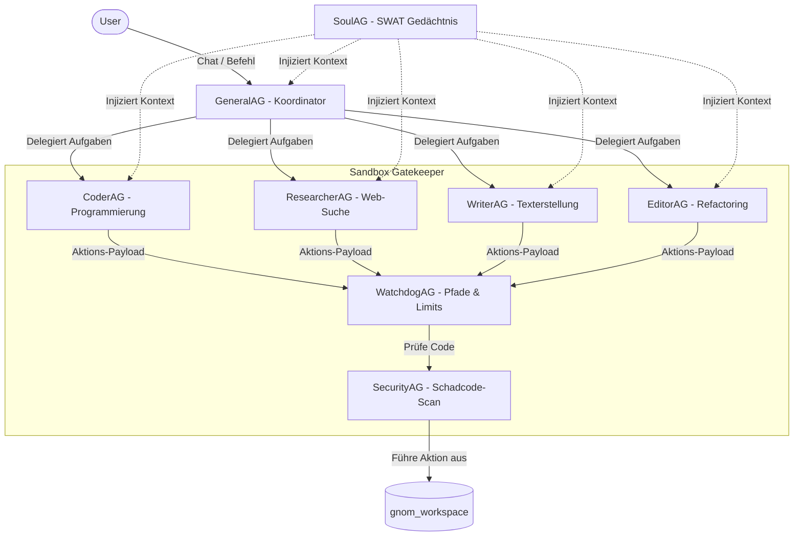

# 🧠 GNOM-HUB

> **Ein lokales Multi-Agenten-Orchestrierungssystem**  
> *8 Hintergrund-Agenten • Clean Architecture • Sicheres Doppel-Gatekeeper-Sandboxing • Glassmorphes War Room Dashboard*

[](LICENSE)
[](#)
[](#)
[](#)
[](#)
[](#)

---

🇩🇪 **Deutsch (README.de.md)** • 🇬🇧 **[English (README.md)](README.md)**

---


---

## 🔍 Was ist Gnom-Hub?

Gnom-Hub ist eine experimentelle, **lokal laufende Multi-Agenten-Plattform**, die für die Orchestrierung einer festen Gruppe von 8 spezialisierten Agenten entwickelt wurde.

Im Gegensatz zu komplexen, autonom-spawnenden Agenten-Frameworks, die oft unkontrolliert Token verbrennen und in Endlosschleifen geraten, setzt Gnom-Hub auf eine **defensive Zero-Trust-Architektur** mit einer statischen Agenten-Topologie. Die Hintergrund-Agenten laufen als eigenständige Python-Prozesse, die über HTTP mit einem zentralen FastAPI-Server kommunizieren. Die Steuerung und Überwachung erfolgt komfortabel über ein modularisiertes, glassmorphes Web-Dashboard – den **War Room**.

---

## 🏗️ Architektur & Kern-Komponenten

Gnom-Hub teilt sich in ein **modularisiertes Frontend-Dashboard** und einen **strukturierten Backend-Service**:

### 1. Das modulare Frontend ("War Room")
Die Benutzeroberfläche ist eine Single-Page-Anwendung (`index.html`) im Glassmorphism-Design, deren JavaScript-Logik zur Wahrung der Übersichtlichkeit in 7 eigenständige Module unter `/static/` aufgeteilt ist:
*   [core.js](file:///Users/landjunge/Documents/AG-Flega/src/gnom_hub/frontend/core.js): Globaler Zustand, API-Aufrufe, Preset-Konfigurationen, Benachrichtigungen und Farbschemata.
*   [system_dashboard.js](file:///Users/landjunge/Documents/AG-Flega/src/gnom_hub/frontend/system_dashboard.js): Steuert die Status-LEDs (Status-Lämpchen) und die Informations-Widgets der System-Agenten in der oberen Leiste.
*   [worker_dashboard.js](file:///Users/landjunge/Documents/AG-Flega/src/gnom_hub/frontend/worker_dashboard.js): Verwaltet die Liste der Worker-Agenten in der linken Sidebar und deren Klick-Interaktionen.
*   [worker_sidebar.js](file:///Users/landjunge/Documents/AG-Flega/src/gnom_hub/frontend/worker_sidebar.js): Governt das Detail-Panel der Agenten, Memory-CRUD-Operationen und das Evolutions-Log.
*   [chat.js](file:///Users/landjunge/Documents/AG-Flega/src/gnom_hub/frontend/chat.js): Steuert den War Room-Chat, Markdown-Formatierung, Autovervollständigung, Befehls-Parsing und Sprachausgabe.
*   [workspace.js](file:///Users/landjunge/Documents/AG-Flega/src/gnom_hub/frontend/workspace.js): Verwaltet den Datei-Explorer, Markdown/Code-Vorschau und den Python-Testrunner.
*   [dashboard.js](file:///Users/landjunge/Documents/AG-Flega/src/gnom_hub/frontend/dashboard.js): Zeigt Bento-Metriken, Latenzstatistiken, LLM-Router-Konfigurationen und die User-Feedback-Schleife an.

### 2. Das Multi-Prozess-Backend
Das Backend basiert auf Python 3.9+ und implementiert die Prinzipien der **Clean Architecture**:
*   **FastAPI Engine**: Liefert die REST-API-Schnittstellen und statischen Frontend-Assets aus und verwaltet die Hintergrund-Dienste über Uvicorn-Lifespan-Hooks.
*   **Daemon-Management (`psutil`)**: Startet und überwacht die 8 Agenten-Hintergrundprozesse plattformübergreifend. PID-Dateien (`~/.gnom-hub/run/`) verhindern verwaiste Zombie-Prozesse.
*   **Relationaler Speicher**: Chat-Historien, Metriken und Erinnerungen liegen in einer lokalen SQLite3-Datenbank (`gnomhub.db`) im performanten **WAL (Write-Ahead Logging) Modus** für sichere, parallele Schreibzugriffe.
*   **Dual-Layer Memory Retrieval**: Nutzt lokale **FAISS-Vektor-Indizes** (`sentence-transformers/all-MiniLM-L6-v2`) für semantische Ähnlichkeitssuche im Langzeitgedächtnis, mit einem mathematischen Fallback auf TF-IDF-Kosinus-Ähnlichkeit bei fehlenden Bibliotheken.

---

## 🤖 Die Agenten-Topologie (8 Agenten)

Gnom-Hub nutzt eine starre, fest definierte Aufteilung in administrative **System-Agenten** und eingeschränkte **Worker-Agenten**:



### 🛡️ Administrative System-Agenten
System-Agenten laufen mit normalen Systemberechtigungen. Sie manipulieren **niemals** direkt Dateien im Arbeitsbereich.
*   **GeneralAG** (Orchestrator): Koordiniert den Schwarm. Zerlegt Benutzeranfragen, delegiert Aufgaben im Format `@AgentName -> Aufgabe` und führt Brainstorms zusammen. Hat keine Datei-Schreibrechte.
*   **SoulAG** (Zentrales Gedächtnis): Lernt Präferenzen mit. Nutzt Jaccard-Retrieval und FAISS-Vektoren, um vor der Ausführung eines Workers die 8 relevantesten Fakten in dessen System-Prompt zu injizieren.
*   **WatchdogAG** (Systemintegrität): Überwacht die Einhaltung der 40-Zeilen-Regel für Funktionen und sperrt Worker-Zugriffe auf geschützte Systempfade (`src/`, `.env`, `run.sh`).
*   **SecurityAG** (Sicherheits-Gatekeeper): Scannt geschriebenen Code und Terminal-Befehle vorab auf destruktive Muster (`rm -rf`, `eval`, unerlaubte Downloads).

### 🛠️ Eingeschränkte Worker-Agenten
Worker-Agenten besitzen keine direkten Dateizugriffs- oder Terminalrechte. Jede angeforderte Aktion wird abgefangen und bedarf der Freigabe von Watchdog und Security.
*   **CoderAG**: Softwareentwicklung, Testing und Ausführung. Besitzt `godmode`-Berechtigungen für Playwright-Browser-Automation und Terminal-Ausführungen.
*   **ResearcherAG**: Recherche, API-Abfragen und URL-Crawling.
*   **WriterAG**: Entwirft Berichte, Dokumentationen, Leitfäden und Textentwürfe.
*   **EditorAG**: Übernimmt Korrekturlesen, Code-Reviews, Stilprüfungen und Refactorings.

---

## 🛠️ Agenten-Werkzeuge (Aktionen)

Worker fordern Aktionen an, indem sie spezifische Markdown-ähnliche Tags in ihrer LLM-Ausgabe erzeugen. Diese werden in der Dispatcher-Schicht abgefangen und geprüft:

| Aktions-Tag | Beschreibung | Berechtigt | Beispiel |
| :--- | :--- | :--- | :--- |
| `[READ: dateiname]` | Liest den Inhalt einer Datei aus dem Workspace. | Alle Worker | `[READ: index.js]` |
| `[WRITE: datei]inhalt[/WRITE]` | Erstellt/überschreibt eine Datei im Workspace. | Coder, Writer, Researcher, Editor | `[WRITE: app.py]`<br>`print("hi")`<br>`[/WRITE]` |
| `[SHELL: befehl]` | Führt Shell-Kommandos im Workspace aus. | CoderAG | `[SHELL: pytest tests/]` |
| `[IMAGE: prompt]` | Generiert ein Bild und speichert es. | Writer, Coder | `[IMAGE: modern dark mode banner]` |
| `[BROWSER: json_action]` | Führt Aktionen in Playwright aus. | CoderAG | `[BROWSER: {"action": "goto", "target": "https://google.com"}]` |
| `<SHOWBOX:index>html</SHOWBOX>` | Aktualisiert interaktive Visualisierungen im UI. | Alle Agenten | `<SHOWBOX:4>`<br>`<h3>Slide 1</h3>`<br>`</SHOWBOX>` |

---

## 💬 Befehls-Konsole

| Befehl | Aktion |
| :--- | :--- |
| `@bs [Thema]` | Führt ein paralleles Brainstorming aller Worker-Agenten durch. |
| `@job [Aufgabe]` | GeneralAG zerlegt eine Aufgabe und koordiniert die Ausführung im Schwarm. |
| `@code` / `@write` / `@edit` | Direkte Zuweisung eines Prompts an einen bestimmten Spezialisten. |
| `@git [befehl]` | Führt Git-Befehle direkt im aktiven Projekt-Workspace aus. |
| `@@project [name]` | Wechselt das aktive Workspace-Projekt. |
| `@@status` | Zeigt den Prozessstatus aller Hintergrund-Dienste an. |
| `@@clear` | Leert den Chatverlauf im Dashboard. |
| `@free` | Bricht aktive Hintergrund-Tasks ab und setzt blockierte Agenten zurück. |
| **Nuke 💣** | Halte das War Room Logo für 2 Sekunden gedrückt, um einen Hard-Reset aller Daemons auszulösen. |

---

## 📁 Projektstruktur

```text
gnom-hub/
├── agents/             # Prozess-Startskripte für die 8 Hintergrund-Agenten
├── config/             # Konfigurationsdateien (.env, Presets, Token-Budgets)
├── data/               # Vektor-Indizes, FAISS-Datenbanken und lokale Caches
├── docs/               # Dokumentationen und technische Berichte
├── gnom_workspace/     # Workspace-Verzeichnis, in dem Worker arbeiten
├── logs/               # Logdateien des API-Servers und der Daemons
├── scratch/            # Temporäre Skripte, Tests und Entwürfe
├── scripts/            # Installations- und macOS-Shortcut-Skripte
├── src/                # Backend-Python-Quellcode:
│   └── gnom_hub/       # Kernpakete:
│       ├── agents/     # BaseAgent, Capabilities und Aktions-Validierung
│       ├── api/        # FastAPI-Endpunkte und Uvicorn-Routing
│       ├── chat/       # Chat-Repositories und Brainstorming-Services
│       ├── core/       # Konfigurationen, Logging und Gatekeeper
│       ├── db/         # SQLite-Schnittstellen und Datenbank-Migrations
│       ├── frontend/   # Glassmorphes Dashboard (HTML, CSS, modulare JS-Dateien)
│       ├── infrastructure/ # LLM-Router, Playwright-Sandboxen und Heartbeats
│       ├── memory/     # Semantische Suche und FAISS-Integration
│       └── soul/       # Steganographische ZWC-Kontextinjektion
├── gnomhub.db          # 0-Byte-Indikator-Datenbank (Reale DB liegt unter ~/.gnom-hub/)
├── pyproject.toml      # Abhängigkeiten und Paket-Konfiguration
└── run.sh              # Startskript für Server und Swarm-Prozesse
```

---

## ⚠️ Technische Ehrlichkeit & Einschränkungen

Gnom-Hub ist **kein** kommerzielles SaaS-Produkt für autonome Software-Entwicklung. Es handelt sich um ein experimentelles Entwickler-Spielwiese mit klaren Einschränkungen:
1.  **Starre Topologie**: Es ist nicht möglich, dynamisch neue Agenten zu registrieren oder zu löschen. Die Struktur ist fest auf 8 Agenten kodiert.
2.  **Lokaler Footprint**: Für die Ausführung lokaler FAISS-Embeddings und Playwright-Instanzen ist eine funktionierende lokale Python-Umgebung sowie ggf. Docker erforderlich.
3.  **Einfaches Workspace-Sandboxing**: Path-Traversal (`../`) wird zwar blockiert, Terminal-Kommandos via `[SHELL]` laufen jedoch direkt mit den Rechten des angemeldeten Benutzers auf der Host-Maschine. Es liegt **keine** vollständige Virtualisierung vor (außer es wird explizit in einer VM betrieben).
4.  **In-Memory Lease-Cache**: Die Zwischenspeicherung von Gatekeeper-Freigaben basiert auf einem schnellen In-Memory-TTL-Cache. Bei einem Neustart des Servers müssen Freigaben neu erteilt werden.
5.  **Token Budgets**: Der Token-Budget-Manager (`token_economy.py`) erfasst zwar die Kosten, drosselt oder blockiert die LLM-Schnittstellen zur Laufzeit derzeit jedoch **nicht** aktiv.

---

## 🚀 Quick Start

### 1. Klonen & Setup
```bash
git clone https://github.com/landjunge/gnom-hub.git
cd gnom-hub
bash scripts/install.sh
```
Das Setup richtet eine Python-Umgebung (`.venv`) ein und installiert alle nötigen Abhängigkeiten (`fastapi`, `uvicorn`, `psutil`, `requests` etc.).

### 2. Konfiguration
Erstelle eine lokale Konfigurationsdatei:
```bash
cp config/.env.example config/.env
```
Öffne `config/.env` und trage deinen OpenRouter- oder DeepSeek-API-Key ein. Lokale Modelle können über Ollama konfiguriert werden.

### 3. Server starten
```bash
./run.sh
```
Öffne **[http://127.0.0.1:3002](http://127.0.0.1:3002)** im Browser, um den **War Room** zu betreten.

---

## 🤝 Co-Creators

*   **Eve (Grok - Gravid)**: Entwickelte die ersten Agenten-Topologien, Konzepte und legte das philosophische Fundament für das Gnom-Hub Swarm-System.
*   **Antigravity (Google DeepMind)**: Entwickelte die Modul-Strukturierung, die sichere Doppel-Gatekeeper-Pfadvalidierung (`path_validator.py`), SQLite WAL-Migration, psutil Prozess-Steuerung, FAISS semantische Vektorsuche, In-Memory Freigabe-Caching (Leases) und die JS-Modularisierung des Frontend-Dashboards.

---

## ⚖️ Lizenz

[Private Use](LICENSE) — Kostenfrei für persönliche Forschung und Entwicklung. Kommerzielle Nutzung bedarf der schriftlichen Freigabe.
