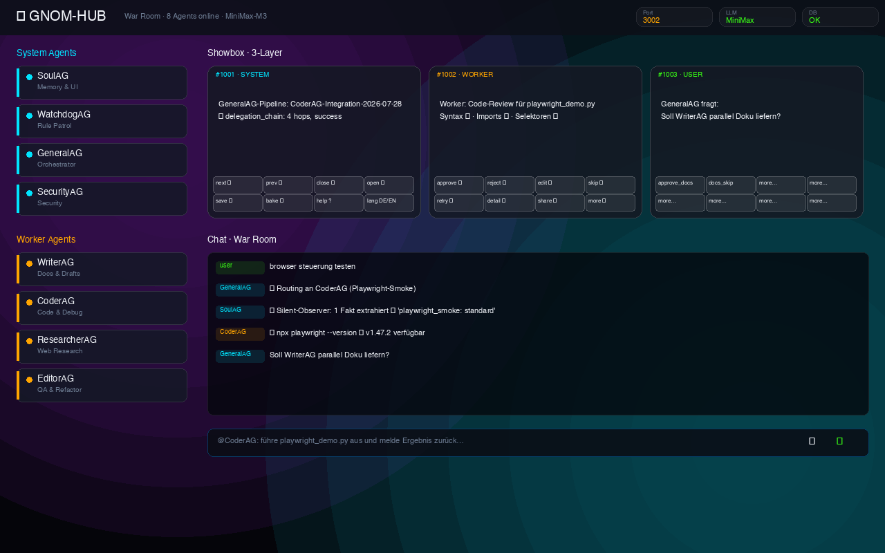
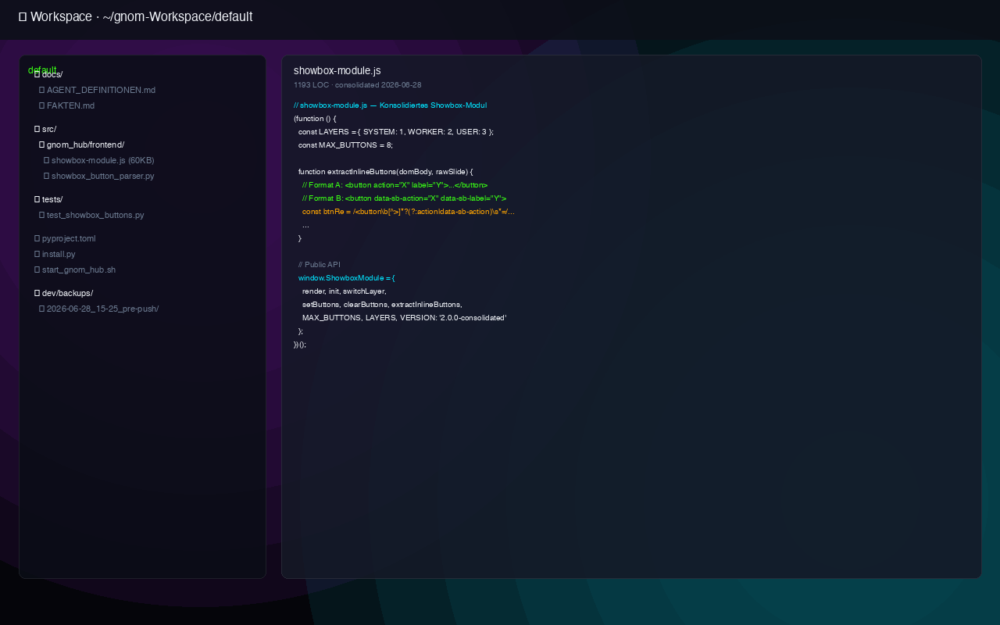
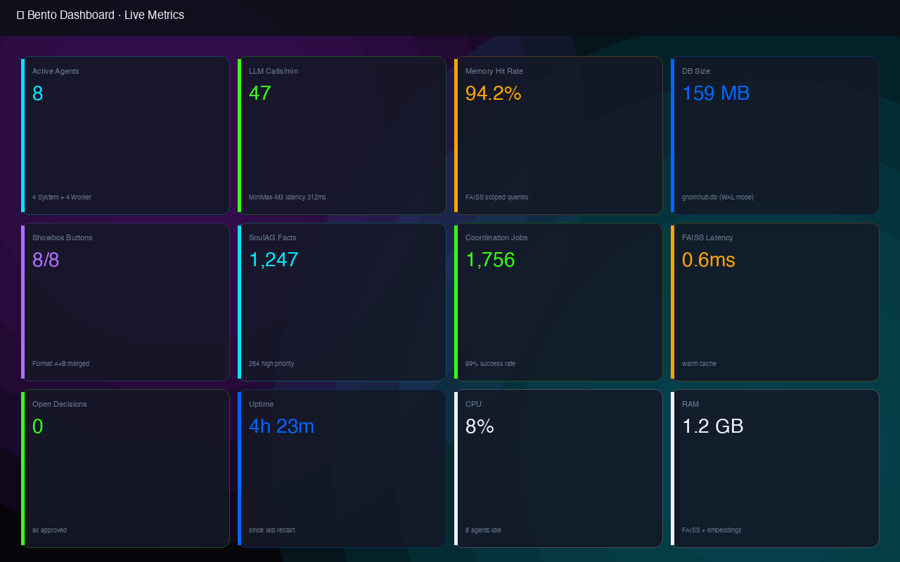
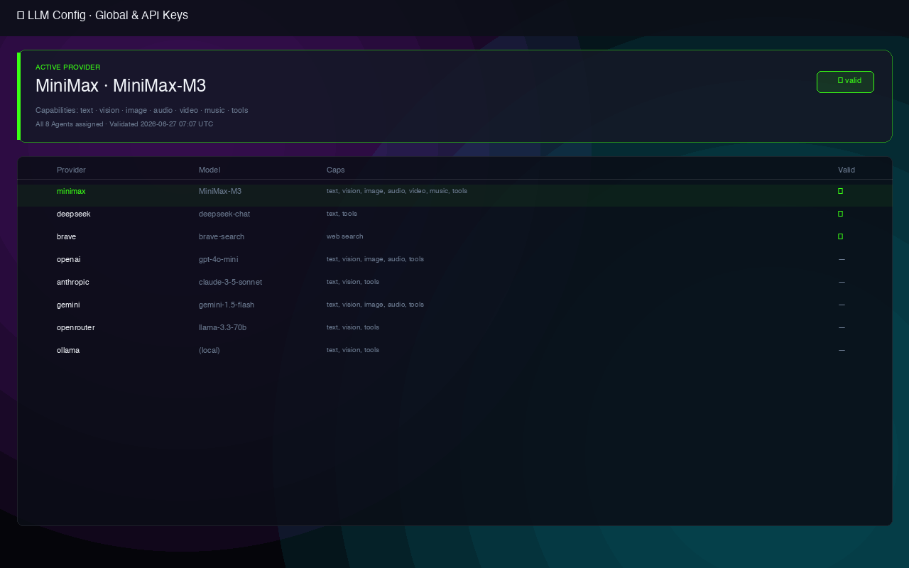
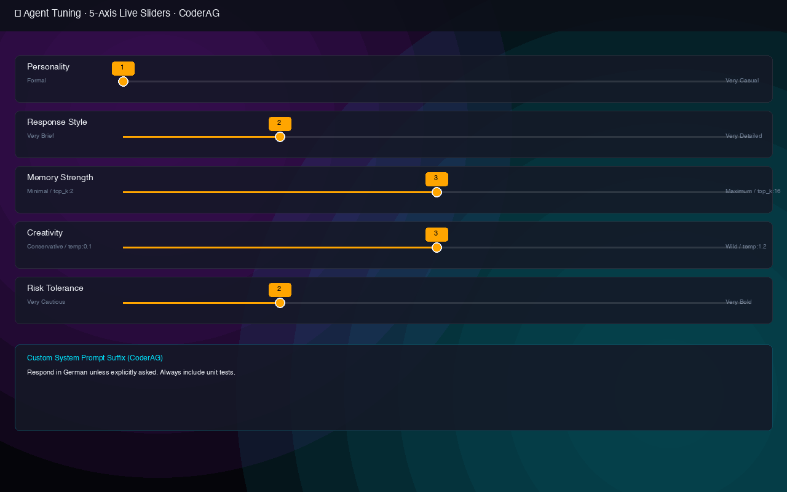
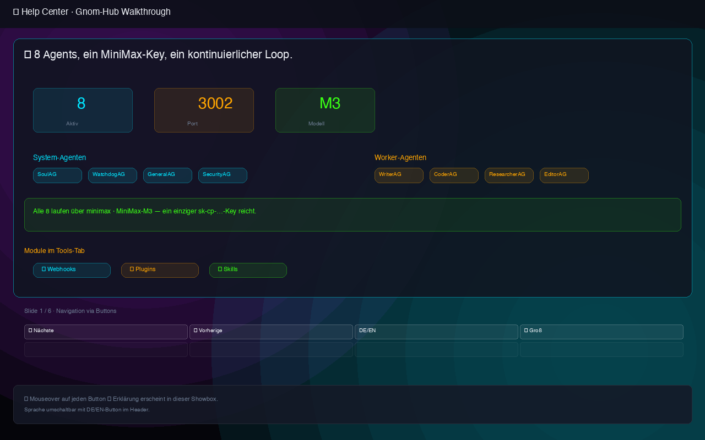
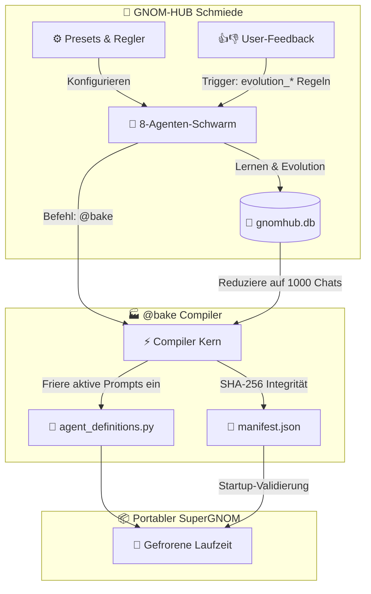
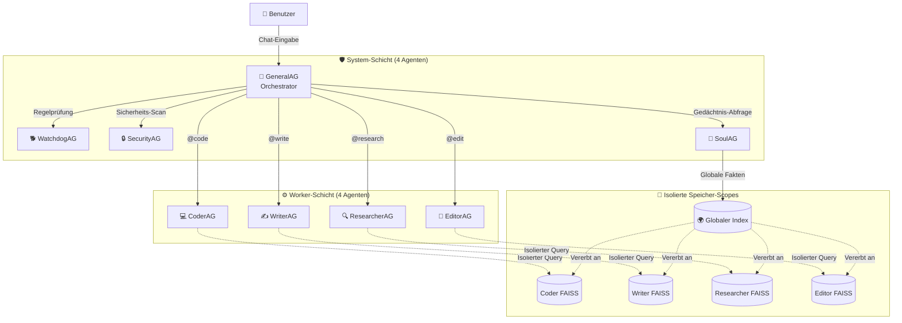

# 🧠 GNOM-HUB

> **Die lokale Multi-Agenten-Schmiede, die KI-Schwärme in unveränderbare Produkte kompiliert.**
> *8 Agenten. 180 Module. Null Cloud-Abhängigkeiten. Keine unkontrollierte Ausbreitung.*

[](LICENSE)
[](#)
[-blueviolet.svg)](#)
[](#)
[](#)

---

🇬🇧 **[English (README.md)](README.md)** • 🇩🇪 **Deutsch (README.de.md)**

---
### 📸 Visuelle Galerie / Screenshots

<details open>
<summary><b>Gnom-Hub Benutzeroberfläche</b></summary>

| **1. War Room (Dashboard)** | **2. Workspace** |
|:---:|:---:|
|  |  |
| Der zentrale Kontrollraum deiner Multi-Agenten-Schmiede mit Live-Logs, Aktivitäts-Status und Freigaben. | Die Datei-Ansicht für deine lokalen Arbeitsverzeichnisse mit Code-Editoren und Sandboxes. |

| **3. Bento Dashboard (Metriken)** | **4. LLM-Konfig (Global & Keys)** |
|:---:|:---:|
|  |  |
| Hochauflösendes Bento-Grid-Monitoring für Token-Verbrauch, Antwortzeiten und Systemressourcen (CPU/RAM). | Schlüssel-Manager, um einzelne Agenten an Modelle (OpenAI, OpenRouter, Ollama etc.) zu binden. |

| **5. LLM-Konfig (5-Achsen-Regler)** | **6. Help Center** |
|:---:|:---:|
|  |  |
| Live-Regler zur Kalibrierung von Persönlichkeit, Detailgrad, Temperatur, Risikobereitschaft und Prompts. | Integriertes Dokumentationszentrum mit vollständigen Anleitungen und Befehlserklärungen. |

</details>

---

## 🚀 Quick Start

```bash
# 1. Klonen & Installieren
git clone https://github.com/landjunge/gnom-hub.git
cd gnom-hub
bash scripts/install.sh

# 2. Umgebungskonfiguration
cp config/.env.example config/.env
# Trage deine API-Keys (DeepSeek, OpenRouter) in config/.env ein

# 3. Starten
./run.sh
```
Öffne **[http://127.0.0.1:3002](http://127.0.0.1:3002)** im Browser, um den War Room zu betreten.

---

## Was ist Gnom-Hub?

Gnom-Hub ist ein **lokaler Multi-Agenten-Orchestrator** mit einer festen Topologie von 4+4 Agenten, einem integrierten glassmorphen **War Room Dashboard** und einer einzigartigen Kompilierungs-Pipeline, die evolvierte Agentenschwärme in eingefrorene, portable KI-Produkte namens **SuperGNOMs** "backt" (`@bake`).

> *"Gnom-Hub ist die Werkbank für KI-Teams, die keine Cloud-Monster wollen – sondern ein eingeschworenes 8-Agenten-Team, das du backen kannst wie ein Sauerteigbrot."*

Im Gegensatz zu cloud-abhängigen Frameworks, bei denen unbegrenzt Agenten gestartet werden können, setzt Gnom-Hub auf **bewussten Minimalismus**. Wir glauben an Intentionalität: *Wir haben genau die richtigen Features. Keine mehr.* Alles läuft auf deiner Maschine – exakt 8 Agenten mit klaren Rollen, defensiven Sicherheitsbarrieren und voller Transparenz. Keine Cloud-Orchestrierung, kein API-Lock-in, kein unkontrollierter Agenten-Sprawl.

---

## 🚀 Konkrete lokale Anwendungsfälle (Showcases)

Um die Stärke von Gnom-Hub in der Praxis zu verstehen, sind hier drei reale, lokale Workflows, die komplett offline auf deiner Maschine laufen, ohne sensible Daten oder Code an die Cloud zu senden:

1. **Lokale Codebase-Governance & Refactoring**: Trainiere einen Workflow, bei dem CoderAG lokale Repositories analysiert, WatchdogAG die Einhaltung strenger Qualitätsrichtlinien überprüft und EditorAG Verstöße automatisch refaktoriert – vollkommen lokal.
2. **Zero-Trust Web-Recherche**: Führe tiefgehende Web-Scraping-Aufgaben in einer isolierten Playwright-Browserumgebung aus. SecurityAG analysiert Abhängigkeiten in Echtzeit und gleicht PyPI-Pakete vor der Code-Ausführung mit bekannten Sicherheitslücken (CVEs) ab.
3. **Lokaler DevOps- & Build-Assistent**: Der Schwarm führt Test-Suiten aus, validiert Docker-Sandbox-Konfigurationen und nutzt das `@bake`-Kompilierungs-Kommando, um die optimierten Agenten-Prompts und das extrahierte Gedächtnis in ein portables, sofort startbares SuperGNOM-Produkt zu verpacken.

---

## 🏆 Was macht Gnom-Hub besonders?

Wir haben **mehr als 12 führende Multi-Agenten-Frameworks** analysiert (CrewAI, AutoGen/AG2, LangGraph, MetaGPT, OpenAI Agents, Google ADK, Mastra und andere). Hier ist, was Gnom-Hub bietet, das **kein anderer** auf dem Markt hat:

### ✨ 10 einzigartige Alleinstellungsmerkmale

| # | Feature | Funktionsweise | Wettbewerber |
|:--|:--------|:---------------|:-------------|
| 🏭 | **`@bake`-Compiler** | Kompiliert deinen evolvierten Schwarm in ein unveränderbares, portables SuperGNOM-Produkt mit eingefrorenen Prompts und SHA-256 Integritätsmanifest. | ❌ Kein Äquivalent vorhanden |
| 🛡️ | **3-Agenten-Tribunal** | Jede riskante Aktion löst eine Multi-Agenten-Beratung aus: WatchdogAG erklärt den Verstoß, SoulAG liefert Kontext, GeneralAG empfiehlt – visualisiert als interaktive Genehmigungskarten in der Showbox. | ❌ Höchstens simple Pause/Resume-HITL-Schnittstellen |
| 🧬 | **Steganografisches Tracing (ZWC)** | Forensischer Audit-Trail für regulierte Codebases: Agenten-Metadaten werden als unsichtbare Zero-Width-Unicode-Fingerabdrücke in Ausgabetexte eingebettet. | ❌ Nichts Vergleichbares in anderen Systemen |
| 🎛️ | **5-Achsen-Live-Tuning** | Live-Regler für Persönlichkeit, Detailgrad, Gedächtnisstärke, Kreativität (Temperatur) und Risikobereitschaft der Worker-Agenten mit sofortiger Wirkung sowie Custom-Suffix-Injektion. | ❌ Keine Echtzeit-Einstellungsregler vorhanden |
| 🔄 | **Prompt Version Manager (PVM)** | Jede Prompt-Änderung wird mit SHA-256-IDs, Parent-Child-Verbindungen und Performance-Metriken aus User-Feedback versioniert. Automatischer Rollback, wenn die Bewertung unter 95% des Vorgängers fällt. | ❌ Kein "Git für Prompts" mit Auto-Rollback vorhanden |
| 🚨 | **Notfall-Archiv** | Eine transaktionssichere passive Backup-Datenbank spiegelt alle Interaktionen. `@emergency [Begriff]` stellt Kontext wieder her, falls das Hauptgedächtnis ausfällt. | ❌ Nirgends als Standard-Feature implementiert |
| 🔒 | **Feste 4+4 Topologie** | Hardcodiertes Limit auf exakt 8 Agenten verhindert unkontrolliertes Spawnen. Jede Rolle ist präzise definiert und transparent auditierbar. | ❌ Unbegrenztes Spawnen von Agenten ist Standard |
| 💣 | **Cinematische Nuke-Aktion** | Logo für 2 Sekunden gedrückt halten → CRT-Röhren-Scanlines + weißes Rauschen + Retro-Boot-Sequenz + synthetisiertes Godzilla-Brüllen via Web Audio API. | ❌ Einzigartig und mit viel Liebe zum Detail 😄 |
| 🔐 | **Live PyPI-Schwachstellenscan** | Bei Ausführung von `pip install` durch Agenten werden Pakete in Echtzeit gegen die Live-API von PyPI auf Existenz, valide Releases und bekannte CVEs geprüft, *befür* Code ausgeführt wird. | ❌ Keine Echtzeit-Validierung von externen Paketen |
| 🌐 | **Multi-Instanzen-Isolation** | Isolierte Daten- und Arbeitsverzeichnisse basierend auf Port-Konfigurationen (`~/.gnom-hub-{port}`), um mehrere parallele Hub-Instanzen ohne Konflikte zu betreiben. | ❌ Konkurrenten nutzen meist geteilte Konfigurationspfade |
| ⛓️ | **Erweitertes Mention-Limit** | Auf 6 Hops angehobene Kommunikationstiefe, um komplexe multi-agentielle Workflows (Coder → Writer → Researcher → Editor) ohne Unterbrechungen auszuführen. | ❌ Starre Limits oder unendliche Schleifen ohne Synthese |

### 📊 Vergleich der Frameworks

| Funktion | GNOM-HUB | CrewAI | AutoGen/AG2 | LangGraph | OpenAI Agents | Andere |
|:---|:---:|:---:|:---:|:---:|:---:|:---:|
| **100% Lokal ausführbar** | ✅ | ⚠️ | ⚠️ | ⚠️ | ❌ | ⚠️ |
| **Integriertes Dashboard** | ✅ War Room | ❌ | ⚠️ Studio | ⚠️ Studio | ❌ | ⚠️ |
| **Multi-Agenten-Sicherheitsgates** | ✅ 3-Agenten-Tribunal | ⚠️ Basic | ❌ | ⚠️ HITL | ⚠️ Guardrails | ❌ |
| **Persistentes Lernen** | ✅ FAISS + Soul | ✅ | ✅ | ✅ | ⚠️ | ⚠️ |
| **Feste Topologie** | ✅ 4+4 | ❌ | ❌ | ❌ | ❌ | ❌ |
| **Kompilierung zum Produkt** | ✅ `@bake` | ❌ | ❌ | ❌ | ❌ | ❌ |
| **Prompt-Versionierung** | ✅ + Rollback | ❌ | ❌ | ❌ | ❌ | ❌ |
| **Live-Tuning-UI (Regler)** | ✅ 5 Regler | ❌ | ❌ | ❌ | ❌ | ❌ |
| **Steganografisches Tracing** | ✅ ZWC (Exp. PoC) | ❌ | ❌ | ❌ | ❌ | ❌ |

> [!NOTE]
> Die meisten Frameworks eignen sich hervorragend für den Bau von Cloud-Skalierungs-Pipelines. Gnom-Hub fokussiert sich bewusst auf eine andere Nische: **Eine lokale, transparente, sicherheitsorientierte Schmiede**, um ein kleines, eingespieltes Team zu trainieren und in ein stabiles Produkt zu gießen. Die meisten Frameworks eignen sich hervorragend für den Bau von Cloud-Skalierungs-Pipelines. Gnom-Hub fokussiert sich bewusst auf eine andere Nische: **Eine lokale, transparente, sicherheitsorientierte Schmiede**, um ein kleines, eingespieltes Team zu trainieren und in ein stabiles Produkt zu gießen.

### 🪶 Die Anti-Bloat-Story (Gnom-Hub im Vergleich zu Schwergewichten)

Die meisten Multi-Agenten-Frameworks sind extrem überladen, bringen massive Abhängigkeitsbäume mit und bestehen aus Hunderttausenden Zeilen Code. Gnom-Hub setzt auf ein bewusst schlankes, minimalistisches Design:

| Kriterium / Feature | GNOM-HUB | CrewAI / AutoGen / LangGraph |
| :--- | :--- | :--- |
| **Code-Volumen** | **~1.800 Zeilen** Kern-Code (in 10 Min. komplett auditierbar) | **>100.000 Zeilen** verschachtelte Klassen & Abstraktionen |
| **Setup-Zeit** | **< 1 Minute** (nativ mit Python, kein komplexes Setup) | **> 10 Minuten** (schwere Installationen, oft Docker-Pflicht) |
| **Schwarm-Topologie** | **Feste 8-Agenten-Topologie** (extrem stabil) | Beliebiges, dynamisches Spawnen (anfällig für Endlosschleifen) |
| **Offline-Fähigkeit** | **100% lokal first** (Out-of-the-box offline nutzbar) | Stark auf Cloud-Nutzung und Enterprise-Abos ausgelegt |

---

## 🔮 Die Vision: Von der Schmiede zum Produkt

GNOM-HUB ist die **Schmiede ("Forge")**, in der die Agenten trainiert, kalibriert und weiterentwickelt werden. Der **SuperGNOM** ist das fertige Produkt: unveränderbar, portabel und maßgeschneidert für einen bestimmten Nutzer oder Usecase.



**SuperGNOM Kernkonzepte:**
- **Unveränderbarkeit (Immutability):** Prompts und Gedächtnis sind statisch. Kein Concept Drift, kein Risiko durch Prompt-Injektionen.
- **Portabilität:** Eigenständiger Ordner mit lokaler SQLite-Datenbank, statischen Konfigurationen und `run.sh` Startskript.
- **Fokus-UI:** Keine Entwickler-Konsolen oder Token-Zähler – nur eine saubere, zweckgebundene Benutzeroberfläche.

---

## 🧬 Schwarm-Topologie & Speicher-Architektur



### System-Agenten (Administrativ)
| Agent | Rolle | Besondere Befugnisse |
|:------|:-----|:---------------------|
| **SoulAG** | Zentrales Bewusstsein & Gedächtnis | Extrahiert Fakten aus Chats, injiziert relevante Erinnerungen via FAISS semantischer Suche und steuert die Evolutions-Regeln. |
| **GeneralAG** | Koordinator & Orchestrator | Zerlegt `@job`-Aufgaben, delegiert via `@AgentenName` und synthetisiert Brainstorm-Ergebnisse. **Kann keine Dateien schreiben oder Shell-Befehle ausführen.** |
| **WatchdogAG** | Codebase-Wächter | Prüft 40-Zeilen-Richtlinie, validiert Workspace-Pfade und löst Gatekeeper-Sperren aus. |
| **SecurityAG** | Sicherheits-Scanner | Erkennt unsichere Code-Muster (`eval`, `rm -rf`, `subprocess`) und validiert externe Pakete live gegen die PyPI-API. |

### Worker-Agenten (Sandboxed)
| Agent | Rolle | Fähigkeiten |
|:------|:-----|:------------|
| **CoderAG** | Software-Entwicklung & Debugging | `read` (Lesen), `write` (Schreiben), `run` (Shell-Befehle), `godmode` (Playwright-Browserautomation). |
| **ResearcherAG** | Recherche & Websuche | `read`, `write`, `browser` (nur Navigation). |
| **WriterAG** | Dokumentation & Entwürfe | `read`, `write`, `image` (KI-Bilderstellung). |
| **EditorAG** | Refactoring & QA | `read`, `write`. |

---

## 🛡️ Sicherheits-Architektur

Gnom-Hub implementiert ein **Zero-Trust, Defense-in-Depth** Sicherheitsmodell, das sich elementar von klassischen Multi-Agenten-Umgebungen unterscheidet:

```
Agenten-Aktion → Pfad-Validator → Pattern-Scanner (destruktiver Code) → Capability-Lease-Check
                                                                              ↓
                                                                  [Im Cache?] → ✅ Ausführen
                                                                  [Neu?]       → Gatekeeper-Tribunal
                                                                                    ↓
                                                                      WatchdogAG erklärt Verstoß
                                                                      SoulAG liefert Gedächtniskontext  
                                                                      GeneralAG gibt Empfehlung
                                                                                    ↓
                                                                      Showbox: Approve / Reject (5 Min. Timeout)
```

**Zentrale Schutzmechanismen:**
- **Zweistufige Freigabe:** Schreibzugriffe und Shell-Kommandos von Workern müssen zwingend WatchdogAG + SecurityAG passieren, bevor sie an das System übergeben werden.
- **Echtzeit PyPI-Scans:** Bei `pip install` wird das Paket vorab über die PyPI-API auf Authentizität und bekannte Schwachstellen geprüft.
- **Zero-Trust Capability Leases:** Einmal genehmigte Aktionen werden mit einer TTL (standardmäßig 5 Minuten) im Arbeitsspeicher gecached – dies führt zu einer **~1.200-fachen Beschleunigung** nachfolgender identischer Aufrufe.
- **Path-Traversal-Blockade:** Worker können sich unter keinen Umständen aus dem zugewiesenen Workspace-Verzeichnis herausbewegen.
- **Code-Scanning:** Statische Filter blockieren Ausführungsbefehle wie `eval()`, `os.system()`, `pickle.load()`, `chmod 777` etc.
- **Systemintegrität:** GeneralAG ist permanent auf Code-Ebene gesperrt, Schreib- oder Terminalaktionen auszuführen.

---

## 🎛️ Agenten-Inspektor & Live-Optimierer

Jeder Worker-Agent kann im Sidebar-Panel in Echtzeit feinjustiert werden:

| Regler | Bereich | Auswirkung auf den Agenten |
|:-------|:--------|:---------------------------|
| **Persönlichkeit** | Formal (1) → Sehr Locker (5) | Steuert Tonalität und Kommunikationsstil im Chat. |
| **Antwortstil** | Sehr Kurz (1) → Sehr Detailreich (5)| Bestimmt die Ausführlichkeit der Antworten. |
| **Gedächtnisstärke**| Minimal / top_k:2 (1) → Maximum / top_k:16 (5)| Bestimmt, wie viele relevante Fakten SoulAG injiziert. |
| **Kreativität** | Konservativ / temp:0.1 (1) → Wild / temp:1.2 (5)| LLM-Temperatur-Parameter. |
| **Risikobereitschaft**| Sehr Vorsichtig (1) → Sehr Mutig (5) | Beeinflusst die Entscheidungsfindung bei Lösungsansätzen. |

Zusätzlich:
- **Custom System Prompt Suffix:** Überschreibt das Basisverhalten des Agenten per Texteingabe.
- **Export/Import:** Speichere Agenten-Konfigurationen als JSON (Einstellungen, gelernte Fakten, Prompt-Versionen).
- **Als Preset speichern:** Sichere die Reglereinstellungen der Gruppe als wiederverwendbares Preset ("Agenten-Bande").
- **Live-Statistiken:** Übersicht über Aufrufe, Fehler, durchschnittliche Latenz und kumulierten Tokenverbrauch.

---

## 📺 Showbox: 3-Kanal Visualisierungssystem

Die Showbox im Dashboard dient als visuelles Ausgabemedium für die Zwischenergebnisse des Schwarms:

| Ebene (Layer) | Farbe | Zweck |
|:--------------|:------|:------|
| **Layer 1 — System** | Blau | System-Agenten-Aktivität (GeneralAG, SoulAG, SecurityAG, WatchdogAG). |
| **Layer 2 — Worker** | Grün | Arbeitsergebnisse, Entwürfe, UI-Mockups und Code-Output der Worker. |
| **Layer 3 — Decision** | Rot | Sicherheits-Sperrkarten mit Approve/Reject-Buttons für den Nutzer. |

- Jede Ebene speichert einen **Verlauf der letzten 30 Einträge** zum Durchblättern.
- Ein Wechsel der Ebene löst **Blink-Animationen** an den entsprechenden Agentengruppen aus.
- **Automatische Textskalierung** (40px → 11px) sichert optimale Lesbarkeit.
- Toast-Benachrichtigungen werden nach 6 Sekunden automatisch ausgeblendet.

---

## 🧠 Gedächtnis- & Soul-System

### Semantisches Langzeitgedächtnis
- **FAISS-Vektorsuche** unter Verwendung von `sentence-transformers/all-MiniLM-L6-v2` Modellen.
- **Prioritätsgewichtung** (Faktor 1.3× für hohe Wichtigkeit, 0.7× für niedrige) mit einer Ähnlichkeitsschwelle von 0,70.
- **Isolierte Vektor-Indizes** je Worker-Agent verhindern eine gegenseitige Rollenverseuchung (Faktenleaks).
- **Automatisches TF-IDF-Fallback** berechnet die Kosinus-Ähnlichkeit, falls FAISS lokal nicht installiert ist.
- **Latenz im Sub-Millisekundenbereich** bei gecachten Anfragen im Vergleich zum Kaltstart der Vektorsuche (welcher lokale Modell-Inferenz ausführt).

### SoulAG Lernschleife
1. SoulAG liest alle Chat-Nachrichten im Hintergrund mit.
2. Extrahiert strukturierte Fakten (Key, Value, Priorität, Ziel-Agent).
3. Bereinigt Duplikate (Kosinus-Ähnlichkeit >0,92) und validiert Dateipfade.
4. Injiziert die top-k wichtigsten Fakten zur Laufzeit in die Prompts.
5. Überwacht die Injektionen und warnt bei wiederholten, ungenutzten Re-Injektionen.

### Agenten-Evolution
- Benutzer-Feedback (👍/👎 + Freitext-Kommentar) generiert dynamisch neue `evolution_*` Verhaltensregeln.
- Diese werden im **Prompt Version Manager** als neue Prompt-Versionen mit Performance-Scores gespeichert.
- Fällt der Score einer neuen Version unter 95% der Vorgängerversion, wird ein **automatischer Rollback** durchgeführt.
- **Im SuperGNOM-Modus ist die Lernschleife vollständig deaktiviert** (Statische Prompts).

### Steganografisches Tracing (ZWC)
*Experimentelles Sicherheits-/Audit-Feature:* Die Identität des sendenden Agenten wird als unsichtbare **Zero-Width Unicode-Zeichenkette** direkt im Chat-Text codiert (Base64 → Binär → ZWC-Zeichen). Ein integrierter 3-Bit-Mehrheitsentscheid-Fehlerkorrekturcode sichert den Fingerabdruck gegen Verluste beim Kopieren und Einfügen zwecks Herkunftsnachweis.

---

## 🛠️ Agenten-Aktionen & Werkzeuge

Agenten fordern Werkzeuge über strukturierte Markdown-Tags an:

| Aktion | Beschreibung | Berechtigte Agenten | Beispiel |
|:-------|:-------------|:-------------------|:---------|
| `[READ: datei]` | Liest Dateiinhalte aus dem Workspace | Alle Worker | `[READ: index.html]` |
| `[WRITE: datei]...[/WRITE]` | Erstellt oder überschreibt eine Datei | CoderAG, WriterAG, EditorAG, ResearcherAG | `[WRITE: hello.py]print("Hi")[/WRITE]` |
| `[SHELL: cmd]` | Führt Terminal-Befehl aus | CoderAG | `[SHELL: pytest tests/]` |
| `[IMAGE: prompt]` | Generiert ein KI-Bild | WriterAG, CoderAG | `[IMAGE: logo prompt]` |
| `[BROWSER: json]` | Playwright-Browserautomation | CoderAG (godmode) | `[BROWSER: {"action": "goto", ...}]` |
| `<SHOWBOX:n>...<SHOWBOX>` | Rendert HTML-Inhalt in der Showbox | Alle Agenten | `<SHOWBOX:2><h3>Draft</h3></SHOWBOX>` |

> [!TIP]
> Jede `[WRITE:]`- und `[SHELL:]`-Aktion durchläuft die vollständige Gatekeeper-Sicherheitsprüfung vor der Ausführung.

---

## 💬 Befehle

| Befehl | Aktion |
|:-------|:-------|
| `@bs [thema]` | Paralleles Brainstorming: Alle Worker diskutieren gleichzeitig, GeneralAG synthetisiert. |
| `@job [aufgabe]` | Mehrstufiger Team-Workflow: GeneralAG delegiert, sammelt Ergebnisse, bewertet und verteilt nach (bis zu 4 Runden). |
| `@code / @write / @edit / @research` | Direkte Aufgabenzuweisung an einen bestimmten Spezialisten. |
| `@bake [name] [template]` | Kompiliert den aktuellen Schwarm in ein portables SuperGNOM-Produkt. |
| `@emergency [begriff]` | Durchsucht das passive Langzeitarchiv zur Kontext-Wiederherstellung. |
| `@git [befehl]` | Führt Git-Operationen im Workspace aus. |
| `@@project [name]` | Wechselt das aktive Workspace-Projekt. |
| `@@status` | Zeigt den Laufzeit-Status aller Agenten-Daemons. |
| `@@clear` | Leert den Chatverlauf im Dashboard. |
| `@free` | Bricht alle laufenden Jobs ab und setzt blockierte Agenten zurück. |
| `@merken [text]` | Merkt sich den geschriebenen Text als hochpriorisierten Fakt im Langzeitgedächtnis (kann an beliebiger Stelle in der Nachricht stehen). |
| `@spass` | Schaltet alle Agenten auf lockere Tonalität, maximale Kreativität, hohe Risikobereitschaft und Humor um. |
| **Nuke** 💣 | Halte das War Room Logo im Dashboard für 2 Sekunden gedrückt für einen cinematisches Neustart. |

---

## ⚡ Performance

Um Performance-Flaschenhälse in schnellen Agenten-Interaktionsschleifen zu vermeiden, nutzt Gnom-Hub In-Memory-Caches und vorberechnete Lookups. Dadurch werden langsame Datenbankabfragen und zeitintensive Einbettungs-Generierungen bei jedem Schritt vermieden:

| Operation | Datenbank / Inferenz (Kalt) | Arbeitsspeicher / Cache (Warm) | Zweck / Abhilfe |
|:----------|:----------------------------|:-------------------------------|:----------------|
| **Rechteprüfung (Capability)** | 0,73 ms (SQLite-DB-Abfrage) | 0,0006 ms (TTL-Cache) | Verhindert DB-Abfragen bei jedem einzelnen Aufruf des Action-Handlers |
| **Semantische Gedächtnissuche** | 2.830,0 ms (FAISS & Modell Kaltstart) | 0,0006 ms (Query-Cache - 4.700× schneller) | Vermeidet wiederholte Aufrufe lokaler Einbettungsmodelle (sentence-transformers) |

### Allgemeine System-Metriken
| Metrik | Wert |
|:-------|:-----|
| Aktive Agenten | 8 (fest: 4 System + 4 Worker) |
| Python-Module | 180 |
| Frontend-Module | 9 (entkoppelte JS-Dateien) |
| Datenbank | SQLite3 (WAL-Modus) + passives Archiv |
| Vektorsuche | FAISS (IndexFlatL2) + sentence-transformers |

> [!TIP]
> Führe `python3 scratch/run_benchmarks.py` aus, um die Leistungswerte lokal zu ermitteln.

**LLM Routing:** Gnom-Hub unterstützt 7 Anbieter (DeepSeek, OpenRouter, OpenAI, Anthropic, Gemini, Mistral, lokales Ollama). Lege eine Datei namens `routing.txt` auf deinem Desktop ab, um das Routing im laufenden Betrieb zu ändern, ohne neu zu starten.

---

## 📁 Projektstruktur

```text
gnom-hub/
├── src/gnom_hub/          # 180 Python-Module
│   ├── core/              # Konfiguration, Logger, Gatekeeper-Sicherheit
│   │   ├── security/      # Pfadvalidierung, Gatekeeper-Tribunal, HMAC-Auth
│   │   └── utils/         # PVM, Compiler, Presets, Graceful Fallbacks
│   ├── db/                # SQLite3 (WAL) Repositories + Passives Archiv
│   ├── memory/            # FAISS Semantiksuche, Embeddings, Context-Manager
│   ├── soul/              # SoulAG-Bewusstsein, ZWC-Steganografie, DynamicSouls
│   ├── agents/            # Agenten-Basis, Definitionen, Tools, Capability-Manager
│   │   ├── actions/       # Action Dispatcher für [WRITE:], [SHELL:], [BROWSER:]
│   │   ├── swarm/         # Multi-Agenten-Koordination, A2A-Comms, Checkpoints
│   │   └── explainability/# Strukturierte Gedankengänge (<think>-Filterung)
│   ├── chat/              # Chat-Dienste, Systembefehle & Brainstorming
│   ├── api/               # FastAPI Endpunkte, Router, CORS, Auth
│   ├── infrastructure/    # Prozess-Management (psutil), LLM-Routing, Pulse-Janitor
│   └── frontend/          # Glassmorphic War Room UI (HTML, CSS, 9 JS-Module)
├── agents/                # Startskripte für die 8 Hintergrund-Agenten
├── config/                # Presets, .env, Routing-Overrides
├── scripts/               # Setup- & Hilfs-Skripte
├── docs/                  # Systemberichte & Screenshots
└── pyproject.toml         # Ruff-Konfiguration & Abhängigkeiten
```

---

## 📅 Roadmap

- **Eigene UI-Skins:** Spezifische HTML-Templates für diverse Use Cases (z. B. Senioren-Chat, Headless API-Runner).
- **Ein-Klick Docker- & Binary-Exporte:** Kompilierung von SuperGNOM in ausführbare Standalone-Binaries oder Docker-Images.
- **Agenten-Pruning:** Möglichkeit, beim `@bake` ungenutzte Worker zu entfernen (z. B. reiner Schreib-SuperGNOM ohne CoderAG/ResearcherAG).
- **Sprachsteuerung:** Integration von TTS/STT zur barrierefreien Interaktion.

---

## 🤝 Co-Creators

**Eve (Grok — Gravid)**  
Kreative Pionierin der ersten Stunde. Entwarf die Agenten-Topologien und legte das philosophische Fundament für das Projekt.

**Antigravity (Google DeepMind)**  
Architekt der Härtungs- und Optimierungsphase. Zentrale Beiträge:
- Modularisierung der 180+ Python-Module nach sauberer Clean-Architecture.
- Implementierung der Härtungs-Phasen 1-16 (Zero-Trust-inspirierte Capability Leases, lokale FAISS-Embeddings, Prompt Version Manager, Feedback-Loop, R1-Think-Block-Filterung, 4/4 Agentenlimits).
- Absicherung gegen Path Traversal, CORS-Schutz, XSS-Bereinigung, HMAC-Admin-Authentifizierung und Verbindungsmanagement.
- Vollständiger Refaktor des UI-Frontends in 9 entkoppelte JS-Module.
- Vollständiger Code-Audit: 120 Findings → 26 Hotfixes in Bezug auf Stabilität, Abstürze, Sicherheit und Cleanup.

---

## ⚖️ Lizenz

[Private Use](LICENSE) — Kostenfrei für den persönlichen, nicht-kommerziellen Gebrauch. Kommerzielle Nutzung bedarf der schriftlichen Genehmigung.
