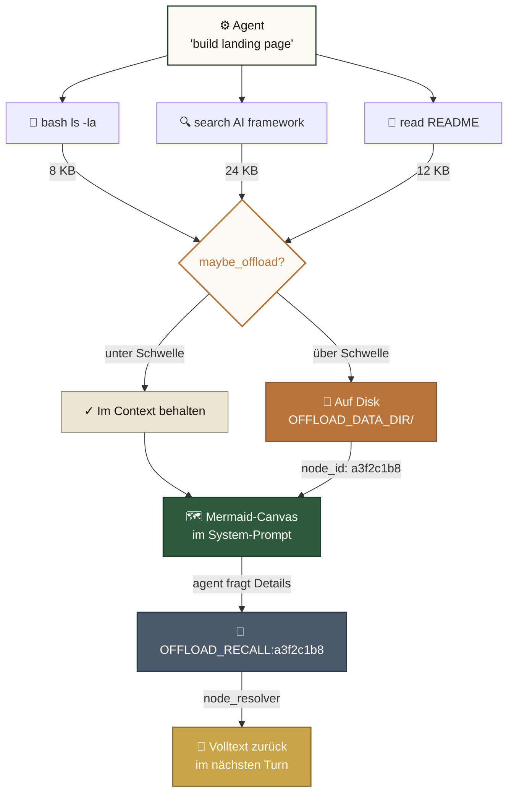
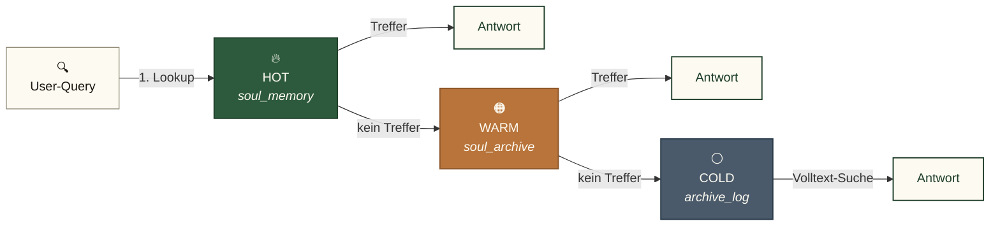
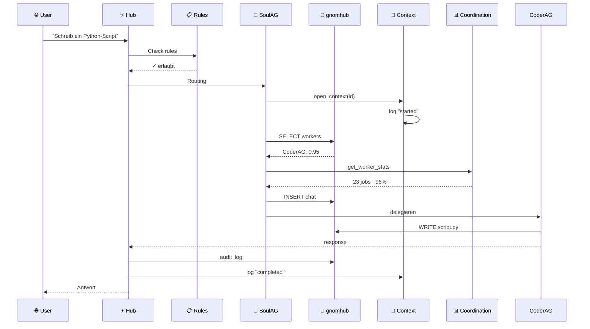
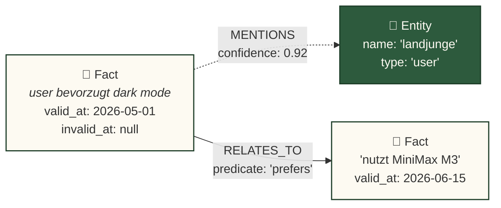

# 🧠 Gnom-Hub

> **Die lokale Multi-Agenten-Schmiede.**
> *8 Agenten · Symbolischer Kurzzeitspeicher · Geschichteter Langzeitspeicher · Null Cloud-Abhängigkeit.*

[](LICENSE)
[](#-tests)
[](#)
[-blueviolet.svg)](#-agenten-übersicht)
[](#-speicher-architektur)
[](#-showbox--output-layer-mit-klickbaren-buttons)
[](#)

🇬🇧 **[English (README.md)](README.md)** • 🇩🇪 **Deutsch**

---

## Was ist Gnom-Hub?

Gnom-Hub ist ein **lokales Multi-Agenten-Backend** mit Web-UI. Acht spezialisierte Agenten (4 Worker + 4 System) arbeiten über einen zentralen FastAPI-Server zusammen. Alles läuft auf `localhost`, persistiert in SQLite, und hat **keine Cloud-Abhängigkeit** für den Core-Betrieb.

**Kernidee:** die Agenten ertrinken nicht in ihrer eigenen Tool-Output-Historie. Gnom-Hub übernimmt ein Konzept aus der [TencentDB Agent Memory](docs/tencentdb-comparison.md)-Forschung: ein **symbolischer Kurzzeitspeicher** (Mermaid-Canvas + node_id Drill-Down) komprimiert lange Tool-Outputs in kompakte Symbole, und ein **geschichteter Langzeitspeicher** hält häufig genutztes Wissen (L0 Konversation → L3 Persona) griffbereit.

---

## 🎯 Was kannst du mit Gnom-Hub bauen?

Out-of-the-box, ohne weiteres Setup nach `python3 install.py`:

- 🧑‍💻 **Coding-Pipeline** — `CoderAG` schreibt den PR, `EditorAG` poliert, `WriterAG` dokumentiert
- 🎨 **Landing-Page aus README** — interaktive Demo-Seite mit allen 8 Agent-Cards ([`docs/golden-tests.md`](docs/golden-tests.md))
- 🎥 **Demo-Video** — Playwright + TTS + Screencapture als Marketing-Material
- 🔬 **Brainstorm-Session** — `@@bs <Frage>` triggert Multi-Agent-Decomposition in Sub-Tasks
- 📊 **TKG Memory-Inspector** — Live-Visualisierung des Wissensgraphen in der Agent-Inspector-Sidebar
- 🐝 **War-Room** — Live-Koordination zwischen mehreren Agenten im gleichen Chat-Thread
- 🔊 **Voice-In / Voice-Out** — TTS-Provider-Chain (MiniMax → OpenAI → ElevenLabs) mit Browser-Fallback
- 🛡️ **Self-Healing** — `WatchdogAG` startet hängende Agenten neu, recovered failed tasks automatisch

Die **8 Agent-Cards** die du in der Landing-Page siehst sind exakt die Agenten die im Hub laufen:

| Card | Typ | Rolle |
|------|-----|-------|
| **SoulAG** | System | Orchestrator + TKG-Fakt-Extraktor (stiller Beobachter) |
| **GeneralAG** | System | Dirigent für direkten User-Chat, Multi-Cap-Fallback |
| **WatchdogAG** | System | Self-Healing, Heartbeat, Stuck-Task-Recovery |
| **SecurityAG** | System | Pfad/Shell-Permissions, Write-Audit |
| **CoderAG** | Worker | Code-Generierung, `[WRITE:]`-Actions, Refactoring |
| **WriterAG** | Worker | Lange Texte, Blog-Posts, Doku |
| **EditorAG** | Worker | Korrekturlesen, Style-Cleanup, Formatierung |
| **ResearcherAG** | Worker | Web-Suche, GitHub-Recherche, Fact-Gathering |

Die Runtime-Konsole zeigt alle 8 Cards mit Live-`status` + `last_seen`. Der Hub startet nicht sauber ohne dass alle 8 heartbeat'en.

---

## 🚀 Schnellstart

```bash
# 1. Klonen und installieren
git clone https://github.com/landjunge/gnom-hub.git
cd gnom-hub
python3 install.py

# 2. Hub starten (öffnet Browser auf Port 3002)
./start_gnom_hub.sh

# 3. Health-Check
curl http://localhost:3002/api/health
# → {"status":"ok"}

# 4. Stoppen
./stop_gnom_hub.sh
```

**Browser:** `http://localhost:3002` — Single-Page-App mit Chat, Agent-Dashboards, Showbox (Präsentations-Layer).

---

## 🧭 Routing & Orchestrierung

Jede User-Message landet beim **deterministischen Capability-Resolver** in `src/gnom_hub/agents/swarm/capability_resolver.py` (557 LOC). Er klassifiziert nach Capability-Keyword (DE + EN) und dispatcht:

| Capability | Ziel | Trigger |
|---|---|---|
| `chat` / direkte User-Message | `GeneralAG` (Default seit 2026-07-02) | User tippt in Chat |
| `coding`, `bash`, `refactor` | `CoderAG` | Mention `@CoderAG` oder Keyword |
| `writing`, `blog`, `docs` | `WriterAG` | Mention `@WriterAG` oder Keyword |
| `editing`, `proofread` | `EditorAG` | Mention `@EditorAG` oder Keyword |
| `web_research`, `github_recherche` | `ResearcherAG` | `@@research`, `@@github` |
| `permissions`, `grant`, `revoke` | `SecurityAG` | Admin-Request |
| `stale`, `failed`, `recover` | `WatchdogAG` | Auto-routed von der Engine |

**SoulAG** bleibt stiller Beobachter — sie extrahiert TKG-Fakten aus jeder Message, antwortet aber nicht mehr direkt auf User-Chat (würde leere Replies produzieren). Die Retry-Chain `GeneralAG → SoulAG` aktiviert sich wenn GeneralAG keine Capability hat (ehrlicher "no agent" Status, kein vorgetäuschter "completed"-Toast).

---

## 🏗️ Architektur

```
┌─────────────────────────────────────────────────────────────┐
│  Browser (index.html + 9 JS-Module)                        │
└────────────────────────┬────────────────────────────────────┘
                         │ HTTP/WS
┌────────────────────────▼────────────────────────────────────┐
│  FastAPI-Hub (src/gnom_hub/api) — 30 Router, 220+ Endpoints │
│  ├─ chat         ├─ llm_agents    ├─ showbox                │
│  ├─ llm_keys     ├─ llm_models    ├─ audio (TTS, STT)       │
│  ├─ agents       ├─ state         ├─ workflows              │
│  └─ ...          (offload via action_handlers eingebunden)  │
└────────────────────────┬────────────────────────────────────┘
                         │
┌────────────────────────▼────────────────────────────────────┐
│  8 Agenten (src/gnom_hub/agents)                            │
│  Worker:  CoderAG · WriterAG · EditorAG · ResearcherAG       │
│  System:  SoulAG · GeneralAG · SecurityAG · WatchdogAG      │
│  Routing: deterministischer Capability-Resolver (557 LOC)   │
└────────────────────────┬────────────────────────────────────┘
                         │
┌────────────────────────▼────────────────────────────────────┐
│  LLM-Router (Provider-Fallback-Kette)                       │
│  MiniMax → OpenAI-Compat → DeepSeek → Ollama (lokal)        │
│  + Key-Reconciler aus ~/Desktop/api_keys.txt                │
└─────────────────────────────────────────────────────────────┘
```

---

## 🧠 Speicher-Architektur (TencentDB-inspiriert)

Zwei komplementäre Speicher-Layer, beide **rein lokal**:

### 1. Symbolischer Kurzzeitspeicher (Context-Offload)

Lange Tool-Outputs (Bash-Ergebnisse, Such-Treffer, Datei-Inhalte) werden **auf Disk ausgelagert**. Der Agent-Kontext behält nur einen **Mermaid-Canvas** mit `node_id`-Referenzen:



Volltext abrufen: `[OFFLOAD_RECALL:<node_id>]` in der Agent-Antwort.

**Warum:** reduziert Token-Verbrauch bei langen Tasks um bis zu ~60%, verhindert Context-Bloat, hält das Agent-Reasoning lesbar.

### 2. Geschichteter Langzeitspeicher (3-Layer-SQLite)



Embeddings nutzen **FAISS** (wenn torch + faiss verfügbar) mit **TF-IDF** als deterministischem CPU-Fallback (keine GPU nötig).

---

## 🎭 Showbox — Output-Layer mit klickbaren Buttons

Showbox ist das zentrale Runtime-Output-Medium. Statt toter Text-Antworten bekommen User ein **3-Layer-System** mit klickbaren Slides die echte Aktionen auslösen:

- **System-Layer** — Hub-interne Status (Routing-Entscheidungen, Audit-Events)
- **Worker-Layer** — Agent-generierte Slides aus `CoderAG`, `WriterAG`, `EditorAG`
- **User-Layer** — Persistente Präsentationen im User-Workspace

**Mechanik:** Inline-`<button action="...">`-Tags in Agent-Responses werden von `extract_inline_buttons()` in `src/gnom_hub/db/showbox_repo.py` in das `buttons[]` JSON-Feld extrahiert. Das Frontend (`src/gnom_hub/frontend/showbox-buttons.js:extractInlineButtons`) rendert sie als klickbares Grid das `POST /api/chat {target, content}` triggert.

```
POST /api/showbox/presentations              # Slide speichern
GET  /api/themes                             # aktive Themes + Slides
PUT  /api/showbox/{id}/buttons               # Button-Layout updaten
```

**Beispiel-Agent-Output:**

```html
<showbox theme="code_review" title="PR #42">
  <slide title="Diff-Übersicht">3 Files · +127 −42</slide>
  <button action="approve" target="coderag">✓ Approve & Merge</button>
  <button action="request_changes">⚠ Request Changes</button>
</showbox>
```

**Buttons sind nicht optional** — jede Showbox die mit `<button>`-Tags gespeichert wird MUSS durch `buttons[]` round-trippen. Das ist ein Spec-tragendes Detail (siehe `db/showbox_repo.py:extract_inline_buttons`).

---

## 🧬 Temporal Knowledge Graph (TKG) — Phase 1 Migration

Phase 1 führt eine graph-basierte Speicher-Schicht ein, die den bestehenden geschichteten SQLite-Speicher ergänzt. Ein **Temporal Knowledge Graph (TKG)** speichert Fakten und Entitäten als Knoten, mit bitemporalen Relationen als Kanten und Embedding-basierter Ähnlichkeitssuche.

- **Backend:** [KuzuDB](https://kuzudb.com/) (embedded, rein lokal, keine Cloud) für Produktion; In-Memory-Backend für Tests. Auswahl via `MEMORY_BACKEND` in `.env`.
- **Adapter:** ein schlankes `memory_tkg.adapter`-Modul stellt `store_memory`, `retrieve_relevant`, `get_recent_facts`, `add_mention` und `save_soul_fact_smart` bereit — 1:1 zur Legacy-API, damit Callsites schrittweise migrieren können.
- **Migrations-Status:** `SoulAG` und `ContextManager.add_fact` laufen auf dem neuen Adapter. `save_soul_fact_smart` bleibt für Jaccard-Dedup-Callsites erhalten; das neue `has_similar_fact` (Cosine ≥ 0.85) ersetzt es, sobald der Embedder stabil läuft.
- **Tests:** `tests/test_memory_tkg.py` — 10 Tests, parametrisiert über beide Backends.

---

## 👥 Agenten-Übersicht

| Agent | Rolle | Verantwortlichkeit |
|-------|-------|--------------------|
| **SoulAG** | Orchestrator | Routet User-Intent an den richtigen Worker, überwacht Soul-Invariants |
| **GeneralAG** | Multi-Capability | Generischer Fallback für unspezialisierte Tasks, hält Worker-Performance-Stats |
| **WatchdogAG** | Self-Healing | Startet abgestürzte Agenten neu, überwacht Heartbeats, recovered stuck tasks |
| **SecurityAG** | Permissions | Gewährt/entzogen Pfad- + Shell-Permissions, auditiert jeden Write |
| **CoderAG** | Code-Worker | Code-Generierung, Refactoring, Debugging, `[WRITE:]`-Actions |
| **WriterAG** | Text-Worker | Lange Texte, Blog-Posts, Dokumentation |
| **EditorAG** | Polish-Worker | Korrekturlesen, Style-Cleanup, Formatierung |
| **ResearcherAG** | Research-Worker | Web-Suche, GitHub-Recherche, Fact-Gathering |

---

## 🗄️ Datenbank-Architektur

Der Hub nutzt **6 spezialisierte SQLite-Datenbanken** in `~/.gnom-hub-3003/data/`. Jede hat genau eine Verantwortung — kein Multi-Tenant-Chaos, keine geteilten Tabellen. So fließt eine User-Anfrage durch sie hindurch:



### Wie ein Hub-Start die Datenbank behandelt

```mermaid
graph TD
    S["🚀 Hub-Start"]:::start --> C{"schema_migrations<br/>existiert?"}:::decision
    C -->|leere DB| F["🌱 Fresh-Mode<br/>alle ausführen"]:::fresh
    C -->|Legacy-Tabellen| B["🔄 Bootstrap-Mode<br/>alle als 'applied'<br/>SQL re-executed"]:::bootstrap
    C -->|vorhanden| N["✓ Normal-Mode<br/>nur pending"]:::normal
    F --> M["📋 schema_migrations<br/>6 rows"]:::end
    B --> M
    N --> M
    M --> END["⚡ Hub ready"]:::end

    classDef start fill:#fdfaf2,stroke:#1a1810,stroke-width:1.5px,color:#1a1810
    classDef decision fill:#fdfaf2,stroke:#b8743a,stroke-width:2px,color:#b8743a
    classDef fresh fill:#ebe4d2,stroke:#8a8470,stroke-width:1px,color:#1a1810
    classDef bootstrap fill:#b8743a,stroke:#8a5529,stroke-width:1.5px,color:#fdfaf2
    classDef normal fill:#2d5a3d,stroke:#1d3d28,stroke-width:1.5px,color:#fdfaf2
    classDef end fill:#1d3d28,stroke:#1a1810,stroke-width:1.5px,color:#fdfaf2
```

Der **Bootstrap-Modus** macht das System resilient: Legacy-DBs ohne `schema_migrations`-Tabelle kriegen alle Migrationen re-applied mit Toleranz für `ALTER TABLE ADD COLUMN` auf existierenden Spalten — so verpassen alte DBs nie stillschweigend neue Spalten.

> **Diagram-Quellen** leben in [`docs/diagrams/`](docs/diagrams/). Siehe [`docs/diagrams/README.md`](docs/diagrams/README.md) für die Design-Palette und wie du sie bearbeitest.

---

## 💾 Datenbank-Layout (6 SQLite-Files)

| DB | Zweck | Tabellen |
|----|-------|----------|
| `gnomhub.db` | Haupt-Hub — Agents, Chat, Soul-Memory, Showbox, Audit, Security, Workflows | 32 |
| `passive_archive.db` | Langzeit-Archiv passiver Beobachtungen | 1 |
| `soul_passive.db` | Archivierte Soul-Memory-Einträge (niedrige Priorität) | 1 |
| `context.db` | Task-Context-Lifecycle (active/completed/failed) | 2 |
| `coordination.db` | Worker-Performance-Stats, Job-History, Delegation-Rules | 3 |
| `rules.db` | Blockade-Regeln (allow/block Paths, Commands) | 1 |

**Bootstrap-Migrations** sind idempotent: Legacy-DBs kriegen alle Migrationen re-applied mit Toleranz für `ALTER TABLE ADD COLUMN` auf existierenden Spalten.

---


## 🕸️ Speicher-Visualisierung (TKG-Inspector)

Das TKG ist über die Memory-Endpoints in `src/gnom_hub/api/endpoints/memory_search.py` + `memory_crud.py` inspizierbar und wird im Agent-Inspector des Dashboards als Mermaid-Graph gerendert:

```
GET  /api/memory/search?q=<text>          # Cosine-Similarity-Suche über Fakten
POST /api/memory                          # Fakt für einen Agenten anhängen
GET  /api/agents/{a_id}/memory            # letzte 100 Messages eines Agenten
GET  /api/agents/{a_id}/memory/count      # Gesamtanzahl Messages
PUT  /api/memory/{m_id}                   # Content eines Fakts aktualisieren
DELETE /api/memory/{m_id}                 # einzelnen Fakt löschen
DELETE /api/agents/{a_id}/memory          # gesamten Speicher eines Agenten leeren
POST /api/soul/save                       # Smart-Dedup-Save in soul_memory.db
GET  /api/soul/all/{agent_name}           # Fakten für Agent (inkl. system)
```

Ein TKG-Knoten trägt **bitemporale** Gültigkeit — `valid_at` (Fakt gilt ab) und `invalid_at` (null = noch gültig):



Die Agent-Inspector-Sidebar (`src/gnom_hub/frontend/worker_sidebar.js:411`) rendert das Mermaid-SVG und lässt den User auf einen Knoten klicken, um `text` und bitemporale Timestamps zu sehen.

---

## 🧩 Workflow-Engine

Workflows sind First-Class-Objekte: eine Kette von `task`s mit `depends_on`-Edges, dispatcht via Capability-Resolution. Endpoints in `src/gnom_hub/api/endpoints/workflows.py` (217 Zeilen), Engine in `src/gnom_hub/agents/swarm/workflow_engine.py` (518 Zeilen):

```
POST /api/workflows                       # Workflow erstellen + starten
GET  /api/workflows                       # alle Workflows listen
GET  /api/workflows/{workflow_id}         # Detail-View: Workflow + Tasks
```

**Beispiel — 3-Task-Workflow mit Dependency-Chain:**

```bash
curl -X POST http://localhost:3002/api/workflows \
  -H 'Content-Type: application/json' \
  -d '{
    "name": "research-and-write",
    "tasks": [
      {"task_id": "research", "capability": "web_research",
       "input_template": "Recherche: {topic}", "depends_on": []},
      {"task_id": "outline",  "capability": "writing",
       "input_template": "Outline für: {research}", "depends_on": ["research"]},
      {"task_id": "draft",    "capability": "writing",
       "input_template": "Artikel aus {outline} (Quelle: {research})",
       "depends_on": ["outline"]}
    ]
  }'
```

Tasks mit `depends_on` werden erst dispatcht, wenn **alle** ihre Dependency-Tasks `completed` sind. Die Interpolation `{task_id}` (und `{task_id:field}` für nested JSON) injiziert das vorherige Task-Result in den `input_template` des nächsten Tasks.

---

## 💡 Brainstorm-Modus

Trigger mit `@@bs <Frage>` im Chat. **GeneralAG** ist der alleinige Koordinator: analysiert, zerlegt, und dispatcht Sub-Tasks an die passenden Worker via `dispatch()` in `src/gnom_hub/chat/brainstorm/brainstorm.py`:

```
User:   @@bs Wie können wir die Onboarding-Zeit halbieren?
                                       ↓
GeneralAG:  Analysiert → zerlegt in 3 Subtasks
                                       ↓
   @ResearcherAG → "Recherche: aktuelle Onboarding-Patterns in SaaS"
   @CoderAG      → "Bau einen 2-Schritt-Wizard mit Progress-Indicator"
   @WriterAG     → "Schreibe einen 200-Word Onboarding-Email-Teaser"
                                       ↓
GeneralAG:  Sammelt Worker-Results, fasst zusammen in <SHOWBOX:1>
```

`@@bs` injiziert einen `[BRAINSTORM-AUFTRAG]`-System-Prompt der GeneralAG sagt, **selbst keine Inhalte zu schreiben**, sondern via `@WorkerAG → Task`-Zeilen zuzuweisen. Die Worker-Chain wird als `war-room/brainstorm`-Messages gepostet und via `get_chat_history()` zurück-aggregiert.

`@@workflow` ist ein Geschwister-Trigger der die Capability-Chain explizit in der `workflows`-Tabelle festhält (siehe 🧩 oben) statt Free-Form-Dispatch.

---

## 🔊 Audio-Pipeline (TTS / STT)

Voice-In und Voice-Out via `src/gnom_hub/api/endpoints/audio.py` (52 Zeilen) und den Engines in `src/gnom_hub/core/utils/audio_{tts,stt}.py`:

```
POST /api/audio/tts                       # Text → MP3 (audio/mpeg)
POST /api/audio/stt                       # Audio-Upload → transkribierter Text
```

**TTS — Provider-Fallback-Chain** (gelesen aus `llm_service_tts` im State):

| Provider | Endpoint | Wann |
|----------|----------|------|
| `minimax` | `api.minimax.io/v1/audio/speech` (OpenAI-kompatibel) | Default wenn `minimax` aktiver TTS-Service ist |
| `openai-tts` | `api.openai.com/v1/audio/speech` | Wenn `openai-tts` aktiv ist |
| `elevenlabs` | `api.elevenlabs.io/v1/text-to-speech/{voice_id}` | Fallback / wenn `ELEVENLABS_API_KEY` gesetzt ist |

1-Minuten-Cache pro `(provider + voice + text)` blockiert Spammy-Re-Calls. Wenn **kein Provider** liefern kann, gibt der Endpoint JSON `{"fallback":"speech_synthesis", "text": "..."}` zurück, so dass das Frontend auf Browser Web Speech API umschaltet.

**STT — Local-First, Cloud-Fallback:**

| Pfad | Engine | Wann |
|------|--------|------|
| Lokal | `faster-whisper` (`tiny`, `int8`) | Immer zuerst; nutzt `get_language()` für Zielsprache |
| Cloud | OpenAI `whisper-1` | Wenn lokal scheitert UND `OPENAI_API_KEY` gesetzt ist |
| Frontend | Browser Web Speech | Wenn beide scheitern → `{"text":"", "fallback":"web_speech"}` |

Agent-Voices werden per Call aufgelöst: hat der Request `agent_id`, wird die `voice_id` des Agenten aus der DB geholt und an den TTS-Provider übergeben.

---

## 🐝 Swarm-Kommunikation

Agenten dispatchen via `src/gnom_hub/agents/swarm/swarm_comms.py` (919 Zeilen, `MAX_DEPTH=15`, `MAX_CONCURRENT=8`, `MAX_QUEUE_DEPTH=100`) aneinander. Jede Inter-Agent-Message ist eine Zeile in `agent_messages` mit `pending → processing → completed`-Lifecycle und Event-basiertem Wakeup (kein Polling).

**Dispatch-Entry-Point:**

```python
from gnom_hub.agents.swarm.swarm_comms import dispatch_mention, ack_message, nack_message

# Nachricht an einen Agenten senden
dispatch_mention(
    sender="CoderAG",
    text="@EditorAG bitte code-review für PR #42",
    context_id="default",
    db_path=str(DB_PATH),
    current_depth=0,
)

# Bei Annahme
ack_message(msg_id=42, db_path=str(DB_PATH))

# Bei Fehler (3 Retries mit exponentiellem Backoff: 3s, 6s, 12s)
nack_message(msg_id=42, db_path=str(DB_PATH), reason="timeout")
```

**`@@research`-Broadcast** — `src/gnom_hub/api/endpoints/chat_legacy.py:230` broadcastet an alle `online | busy` Worker außer dem System-Trio `(soulag, generalag, watchdogag)`:

```python
# chat_legacy.py — handle_research()
worker_targets = [
    a for a in active_agents
    if a["name"].lower() not in {"soulag", "generalag", "watchdogag"}
    and a["status"] in {"online", "busy"}
]
for a in worker_targets:
    dispatch_mention("user", f"@@research {q}", project, str(DB_PATH), 0,
                     target_agent=a["name"])
```

**Self-Healing:** `recover_stuck_messages(db_path, timeout=300.0)` (Zeile 733) läuft periodisch — jede Message die > 5 Min in `processing` hängt wird re-queued für Retry, gekappt bei `RETRY_MAX = 3`.

---

## 📂 Workspace-Konzept

Der Agent-Workspace liegt in `~/gnom-Workspace/<active-project>/` — **port-unabhängig**, so dass Files Instanz-Wechsel überleben (z.B. heute auf Port 3002, morgen auf 3003 zum Testen). Verwaltet von `src/gnom_hub/api/endpoints/workspace.py` (158 Zeilen):

```
GET  /api/workspace                       # Dateien im aktiven Projekt listen
GET  /api/workspace/{filename}            # Datei lesen (UTF-8)
GET  /api/workspace/{filename}/serve      # als HTML rendern
GET  /api/workspace/{filename}/raw        # als Attachment downloaden
POST /api/workspace/{filename}/run        # .py-Datei ausführen (15s Timeout)
GET  /api/workspace/config                # aktueller Workspace-Pfad + Default
PUT  /api/workspace/config                # Workspace ändern (validiert: absolut, nicht /etc|/usr|...)
POST /api/workspace/config/reset          # auf ~/gnom-Workspace Default zurücksetzen
GET  /api/project                         # Name des aktuell aktiven Projekts
```

**Pfad-Validierung:** `_safe_path()` (workspace.py:27) blockt Traversal-Attacken — `(workspace / filename).resolve()` muss mit `workspace.resolve()` starten. Der PUT-Config-Handler blockt zusätzlich System-Prefixes (`/etc`, `/usr`, `/var`, `/proc`, `/sys`, `/boot`, `/lib`, `/sbin`, `/bin`, `/private/etc`, `/private/var`).

**Workspace vs `~/.gnom-hub/`:**

| | `~/gnom-Workspace/<project>/` | `~/.gnom-hub/data/` |
|---|---|---|
| Zweck | Agent-Outputs (HTML, Code, Videos) | SQLite-DBs + PID-Files + Audio-Cache |
| Port | **UNABHÄNGIG** — gleicher Pfad auf jedem Port | Port-abhängig (`~/.gnom-hub-3003/` etc.) |
| Backups | User-Verantwortung (eigene Projekt-Arbeit) | Immutable Backup, nie gelöscht |
| Mutabilität | Agenten erstellen/editieren frei | Hub-managed; Offload-Dir auto-pruned |

Aktives Projekt liegt in `state["active_project"]` und wird via `SQLiteStateRepository.get_active_project()` aufgelöst. Projekt-Wechsel via API tauscht den Workspace-Root ohne Hub-Neustart.

---

## 🧪 Tests

```bash
# Komplette Suite (660+ grün, pre-existing numpy/FAISS-Failures ignoriert)
python3 -m pytest tests/ --ignore=tests/test_faiss_lock.py

# Nur die neuen tencentdb-agent-memory Tests (35 Tests)
python3 -m pytest tests/test_offload.py tests/test_routing.py

# Smoke gegen laufenden Hub
curl http://localhost:3002/api/health
curl http://localhost:3002/api/agents
```

**Test-Coverage-Highlights:**
- `tests/test_offload.py` — 14 Tests: Mermaid-Canvas, node_id-Resolution, Path-Traversal-Defense, Atomic-Writes
- `tests/test_routing.py` — 21 Tests: deterministische Capability-Resolution, Fallback-Chains, Deutsch/Englisch-Keywords
- `tests/test_security_suite.py` — Permission-Grants, denied Writes, Godmode-Audit

**Aktive Test-Statistik:** 526 passed + 25 skipped. Pre-existing Failures (`numpy 2.x`, `FAISS ABI`, `/private/var` Pfad-Validierung, `data/presets/default/` fehlt, `security_permissions`-Schema fehlt, `security injection-validator` per Mandat disabled) sind auf `master` dokumentiert und nicht Teil dieser Phase. Drift-Log in [`docs/FEATURE_INVENTORY.md`](docs/FEATURE_INVENTORY.md).

---

## 🔧 Konfiguration

```bash
# .env (lebt in config/.env)
MINIMAX_API_KEY=sk-...
BRAVE_SEARCH_API_KEY=BSA...
DEEPSEEK_API_KEY=sk-...
ELEVENLABS_API_KEY=sk-...     # optional, für TTS-Fallback

# Optional: Context-Offload aktivieren
GNOM_HUB_OFFLOAD_ENABLED=true
```

**LLM-Key-Quelle:** der Key-Reconciler liest beim Start aus `~/Desktop/api_keys.txt`, so kannst du API-Keys in deinen Desktop-Notes halten statt sie zu committen.

---

## 📁 Projekt-Struktur

```
gnom-hub/
├── src/gnom_hub/                    # 207 Python-Module
│   ├── api/                         # FastAPI-Endpoints (30 Router)
│   ├── agents/                      # 8 Agenten + Routing + Swarm
│   ├── memory/                      # Offload, Mermaid-Canvas, Embeddings, FAISS
│   │   ├── offload.py              # Context-Offload-Mechanik
│   │   ├── mermaid_canvas.py       # Mermaid-Symbolgraph
│   │   └── node_resolver.py        # node_id Drill-Down
│   ├── soul/                        # SoulAG + Memory-Layers
│   ├── db/                          # 6 SQLite-Connections + Migrations
│   ├── showbox/                     # Präsentations-Layer + Buttons[]
│   ├── audio/                       # TTS (ElevenLabs + Provider-Fallback)
│   ├── chat/                        # Chat-Router + Brainstorm
│   └── infrastructure/              # Hub-App, Logging, Process-Manager
├── tests/                           # 47 Test-Files, 660+ Tests grün
├── docs/                            # Architektur-Doku
│   ├── tencentdb-comparison.md      # Memory-Architecture-Referenz
│   └── ARCHITECTURE.md              # Verifizierte Architektur (nicht das Marketing)
├── config/.env                      # Lokale Config (nicht committen)
├── install.py                       # Cross-Platform-Installer
├── start_gnom_hub.sh                # Hub-Launcher (Port 3002)
└── stop_gnom_hub.sh                 # Hub-Stopper
```

---

## 📚 Mehr Lesen

- [`docs/ARCHITECTURE.md`](docs/ARCHITECTURE.md) — verifizierte Architektur (sync mit Code)
- [`docs/tencentdb-comparison.md`](docs/tencentdb-comparison.md) — wie unser Speicher-System zur TencentDB-Agent-Memory-Forschung mappt
- [`audit/02-functional-tests.md`](audit/02-functional-tests.md) — letzter Functional-Test-Sweep
- [`README.md`](README.md) — diese Datei auf Englisch

---

## 📜 Lizenz

Private Nutzung. Siehe [LICENSE](LICENSE).
