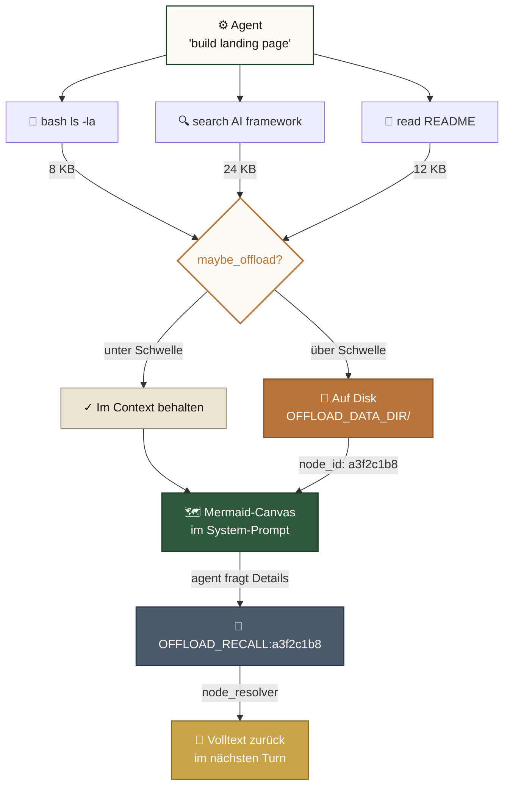
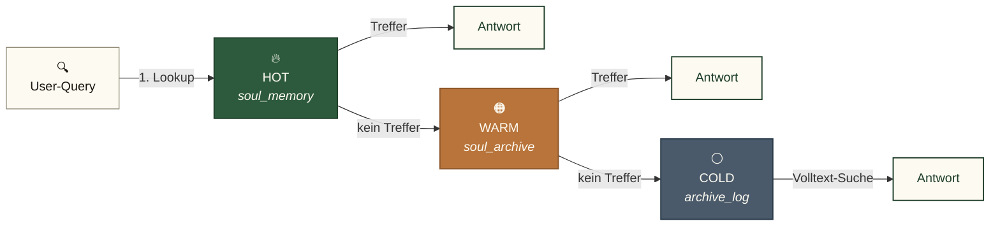
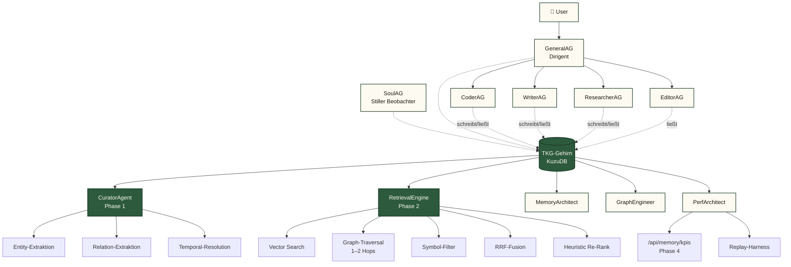
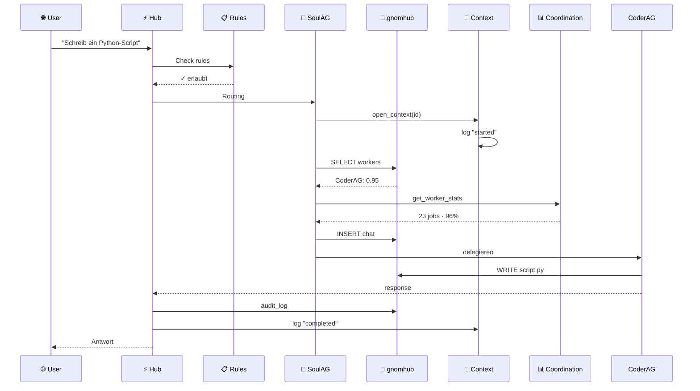

# 🧠 Gnom-Hub

> **Die lokale Multi-Agenten-Schmiede.**
> *8 Agenten · Symbolischer Kurzzeitspeicher · Geschichteter Langzeitspeicher · Null Cloud-Abhängigkeit.*

[](LICENSE)
[](#-tests)
[](#)
[-blueviolet.svg)](#-agenten-übersicht)
[](#-speicher-architektur)
[](#)

🇬🇧 **[English (README.md)](README.md)** • 🇩🇪 **Deutsch**

---

## Was ist Gnom-Hub?

Gnom-Hub ist ein **lokales Multi-Agenten-Backend** mit Web-UI. Acht spezialisierte Agenten (4 Worker + 4 System) arbeiten über einen zentralen FastAPI-Server zusammen. Alles läuft auf `localhost`, persistiert in SQLite, und hat **keine Cloud-Abhängigkeit** für den Core-Betrieb.

**Kernidee:** die Agenten ertrinken nicht in ihrer eigenen Tool-Output-Historie. Gnom-Hub übernimmt ein Konzept aus der [TencentDB Agent Memory](docs/tencentdb-comparison.md)-Forschung: ein **symbolischer Kurzzeitspeicher** (Mermaid-Canvas + node_id Drill-Down) komprimiert lange Tool-Outputs in kompakte Symbole, und ein **geschichteter Langzeitspeicher** hält häufig genutztes Wissen (L0 Konversation → L3 Persona) griffbereit.

---

## 🚀 Schnellstart

```bash
# 1. Klonen und installieren
git clone https://github.com/landjunge/gnom-hub.git
cd gnom-hub
python3 install.py

# 2. Hub starten (öffnet Browser auf Port 3002)
./start_gnom_hub.sh

# 3. Health-Check
curl http://localhost:3002/api/health
# → {"status":"ok"}

# 4. Stoppen
./stop_gnom_hub.sh
```

**Browser:** `http://localhost:3002` — Single-Page-App mit Chat, Agent-Dashboards, Showbox (Präsentations-Layer).

---

## 🏗️ Architektur

```
┌─────────────────────────────────────────────────────────────┐
│  Browser (index.html + 9 JS-Module)                        │
└────────────────────────┬────────────────────────────────────┘
                         │ HTTP/WS
┌────────────────────────▼────────────────────────────────────┐
│  FastAPI-Hub (src/gnom_hub/api) — 30 Router, 220+ Endpoints │
│  ├─ chat         ├─ llm_agents    ├─ showbox                │
│  ├─ llm_keys     ├─ llm_models    ├─ audio (TTS, STT)       │
│  ├─ agents       ├─ state         ├─ workflows              │
│  └─ ...          (offload via action_handlers eingebunden)  │
└────────────────────────┬────────────────────────────────────┘
                         │
┌────────────────────────▼────────────────────────────────────┐
│  8 Agenten (src/gnom_hub/agents)                            │
│  Worker:  CoderAG · WriterAG · EditorAG · ResearcherAG       │
│  System:  SoulAG · GeneralAG · SecurityAG · WatchdogAG      │
│  Routing: deterministischer Capability-Resolver (557 LOC)   │
└────────────────────────┬────────────────────────────────────┘
                         │
┌────────────────────────▼────────────────────────────────────┐
│  LLM-Router (Provider-Fallback-Kette)                       │
│  MiniMax → OpenAI-Compat → DeepSeek → Ollama (lokal)        │
│  + Key-Reconciler aus ~/Desktop/api_keys.txt                │
└─────────────────────────────────────────────────────────────┘
```

---

## 🧠 Speicher-Architektur (TencentDB-inspiriert)

Zwei komplementäre Speicher-Layer, beide **rein lokal**:

### 1. Symbolischer Kurzzeitspeicher (Context-Offload)

Lange Tool-Outputs (Bash-Ergebnisse, Such-Treffer, Datei-Inhalte) werden **auf Disk ausgelagert**. Der Agent-Kontext behält nur einen **Mermaid-Canvas** mit `node_id`-Referenzen:



Volltext abrufen: `[OFFLOAD_RECALL:<node_id>]` in der Agent-Antwort.

**Warum:** reduziert Token-Verbrauch bei langen Tasks um bis zu ~60%, verhindert Context-Bloat, hält das Agent-Reasoning lesbar.

### 2. Geschichteter Langzeitspeicher (3-Layer-SQLite)



Embeddings nutzen **FAISS** (wenn torch + faiss verfügbar) mit **TF-IDF** als deterministischem CPU-Fallback (keine GPU nötig).

---

## 🧬 Temporal Knowledge Graph (TKG) — v4 Brain

**Status:** Phase 0–4 implementiert. **52/52 TKG-Tests grün.** Live-Benchmark: **Hybrid TKG schlägt Vector-only um +25 Prozentpunkte** (70% → 95% Precision@5 auf 100 Facts / 20 Queries, deterministischer Seed).

### Architektur

Das TKG-Gehirn sitzt zwischen Agenten-Schicht und Storage-Schicht. Jeder Fact hat `valid_at` + `invalid_at` (bitemporal), jede Mention verlinkt einen Fact mit einer Entity, und Retrieval fusioniert Vector + Graph + Symbolic via Reciprocal Rank Fusion (RRF).



### Phasen

| Phase | Modul | Zweck |
|-------|-------|-------|
| 0 | `kuzu_backend.py` + `graph_schema.cypher` | Embedded Graph-DB mit HNSW-Vector-Index |
| 1 | `curator_agent.py`, `entity_extractor.py`, `temporal_resolver.py` | Aktive LLM-Wissens-Kurierung |
| 2 | `retrieval_engine.py`, `reranker.py`, `subgraph_serializer.py` | Hybrid Vector + Graph + Symbolic mit RRF |
| 3 | 5 Agent-Rollen in `config/agents/` | `MemoryArchitect`, `GraphEngineer`, `CuratorAgent`, `RetrievalEngineer`, `PerfArchitect` |
| 4 | `kpi_repository.py`, `benchmark/replay_harness.py`, `/api/memory/kpis` | KPI-Tracking + Replay + A/B-Switch |

### Benchmark (echte Zahlen, deterministischer Seed 42)

```
VECTOR:    14/20 (70%)    5.6ms   (Baseline: nur Cosine)
HYBRID+:   19/20 (95%)  108.3ms   (mit Gold-Symbols)
HYBRID:    19/20 (95%)   88.0ms   (ehrlich, ohne Symbols)
```

Reproduzieren: `python3 scripts/benchmark_hybrid_vs_vector.py`
Canary-Test: `pytest tests/test_tkg_brain_correctness.py` (asserted `hybrid > vector`, schlägt sofort fehl falls das Gehirn regressiert)

### Demos (im Browser öffnen)

- `scripts/tkg_brain_demo.py` — Phase 0+1, 6 Entities + 4 Facts → Mermaid-Graph
- `scripts/tkg_curator_demo.py` — Phase 1, 3 Messages → Entities + Relations
- `scripts/tkg_retrieval_demo.py` — Phase 2, 3 Queries + Mermaid-Subgraph

Output: `~/gnom-Workspace/default/tkg_*.html`

### Migrations-Status

- **Backend:** [KuzuDB](https://kuzudb.com/) (embedded, rein lokal, keine Cloud) für Produktion; In-Memory-Backend für Tests. Auswahl via `MEMORY_BACKEND` in `.env`.
- **Adapter:** `memory_tkg.adapter` stellt `store_memory`, `retrieve_relevant`, `get_recent_facts`, `add_mention`, `save_soul_fact_smart` bereit — 1:1 zur Legacy-API, damit Callsites schrittweise migrieren können.
- **Live:** `SoulAG` und `ContextManager.add_fact` laufen auf dem neuen Adapter. `save_soul_fact_smart` bleibt für Jaccard-Dedup-Callsites erhalten; `has_similar_fact` (Cosine ≥ 0.85) ersetzt es, sobald der Embedder stabil läuft.
- **Tests:** `tests/test_memory_tkg.py` (10) + `tests/test_memory_tkg_phase2.py` (26) + `tests/test_kpi_repository.py` (14) + `tests/test_tkg_brain_correctness.py` (2) = **52 Tests, alle grün**.

---

## 👥 Agenten-Übersicht

| Agent | Rolle | Verantwortlichkeit |
|-------|-------|--------------------|
| **SoulAG** | Orchestrator | Routet User-Intent an den richtigen Worker, überwacht Soul-Invariants |
| **GeneralAG** | Multi-Capability | Generischer Fallback für unspezialisierte Tasks, hält Worker-Performance-Stats |
| **WatchdogAG** | Self-Healing | Startet abgestürzte Agenten neu, überwacht Heartbeats, recovered stuck tasks |
| **SecurityAG** | Permissions | Gewährt/entzogen Pfad- + Shell-Permissions, auditiert jeden Write |
| **CoderAG** | Code-Worker | Code-Generierung, Refactoring, Debugging, `[WRITE:]`-Actions |
| **WriterAG** | Text-Worker | Lange Texte, Blog-Posts, Dokumentation |
| **EditorAG** | Polish-Worker | Korrekturlesen, Style-Cleanup, Formatierung |
| **ResearcherAG** | Research-Worker | Web-Suche, GitHub-Recherche, Fact-Gathering |

---

## 🗄️ Datenbank-Architektur

Der Hub nutzt **6 spezialisierte SQLite-Datenbanken** in `~/.gnom-hub-3003/data/`. Jede hat genau eine Verantwortung — kein Multi-Tenant-Chaos, keine geteilten Tabellen. So fließt eine User-Anfrage durch sie hindurch:



### Wie ein Hub-Start die Datenbank behandelt

```mermaid
graph TD
    S["🚀 Hub-Start"]:::start --> C{"schema_migrations<br/>existiert?"}:::decision
    C -->|leere DB| F["🌱 Fresh-Mode<br/>alle ausführen"]:::fresh
    C -->|Legacy-Tabellen| B["🔄 Bootstrap-Mode<br/>alle als 'applied'<br/>SQL re-executed"]:::bootstrap
    C -->|vorhanden| N["✓ Normal-Mode<br/>nur pending"]:::normal
    F --> M["📋 schema_migrations<br/>6 rows"]:::end
    B --> M
    N --> M
    M --> END["⚡ Hub ready"]:::end

    classDef start fill:#fdfaf2,stroke:#1a1810,stroke-width:1.5px,color:#1a1810
    classDef decision fill:#fdfaf2,stroke:#b8743a,stroke-width:2px,color:#b8743a
    classDef fresh fill:#ebe4d2,stroke:#8a8470,stroke-width:1px,color:#1a1810
    classDef bootstrap fill:#b8743a,stroke:#8a5529,stroke-width:1.5px,color:#fdfaf2
    classDef normal fill:#2d5a3d,stroke:#1d3d28,stroke-width:1.5px,color:#fdfaf2
    classDef end fill:#1d3d28,stroke:#1a1810,stroke-width:1.5px,color:#fdfaf2
```

Der **Bootstrap-Modus** macht das System resilient: Legacy-DBs ohne `schema_migrations`-Tabelle kriegen alle Migrationen re-applied mit Toleranz für `ALTER TABLE ADD COLUMN` auf existierenden Spalten — so verpassen alte DBs nie stillschweigend neue Spalten.

> **Diagram-Quellen** leben in [`docs/diagrams/`](docs/diagrams/). Siehe [`docs/diagrams/README.md`](docs/diagrams/README.md) für die Design-Palette und wie du sie bearbeitest.

---

## 💾 Datenbank-Layout (6 SQLite-Files)

| DB | Zweck | Tabellen |
|----|-------|----------|
| `gnomhub.db` | Haupt-Hub — Agents, Chat, Soul-Memory, Showbox, Audit, Security, Workflows | 32 |
| `passive_archive.db` | Langzeit-Archiv passiver Beobachtungen | 1 |
| `soul_passive.db` | Archivierte Soul-Memory-Einträge (niedrige Priorität) | 1 |
| `context.db` | Task-Context-Lifecycle (active/completed/failed) | 2 |
| `coordination.db` | Worker-Performance-Stats, Job-History, Delegation-Rules | 3 |
| `rules.db` | Blockade-Regeln (allow/block Paths, Commands) | 1 |

**Bootstrap-Migrations** sind idempotent: Legacy-DBs kriegen alle Migrationen re-applied mit Toleranz für `ALTER TABLE ADD COLUMN` auf existierenden Spalten.

---

## 🧪 Tests

```bash
# Komplette Suite (660+ grün, pre-existing numpy/FAISS-Failures ignoriert)
python3 -m pytest tests/ --ignore=tests/test_faiss_lock.py

# Nur die neuen tencentdb-agent-memory Tests (35 Tests)
python3 -m pytest tests/test_offload.py tests/test_routing.py

# Smoke gegen laufenden Hub
curl http://localhost:3002/api/health
curl http://localhost:3002/api/agents
```

**Test-Coverage-Highlights:**
- `tests/test_offload.py` — 14 Tests: Mermaid-Canvas, node_id-Resolution, Path-Traversal-Defense, Atomic-Writes
- `tests/test_routing.py` — 21 Tests: deterministische Capability-Resolution, Fallback-Chains, Deutsch/Englisch-Keywords
- `tests/test_security_suite.py` — Permission-Grants, denied Writes, Godmode-Audit

---

## 🔧 Konfiguration

```bash
# .env (lebt in config/.env)
MINIMAX_API_KEY=sk-...
BRAVE_SEARCH_API_KEY=BSA...
DEEPSEEK_API_KEY=sk-...
ELEVENLABS_API_KEY=sk-...     # optional, für TTS-Fallback

# Optional: Context-Offload aktivieren
GNOM_HUB_OFFLOAD_ENABLED=true
```

**LLM-Key-Quelle:** der Key-Reconciler liest beim Start aus `~/Desktop/api_keys.txt`, so kannst du API-Keys in deinen Desktop-Notes halten statt sie zu committen.

---

## 📁 Projekt-Struktur

```
gnom-hub/
├── src/gnom_hub/                    # 207 Python-Module
│   ├── api/                         # FastAPI-Endpoints (30 Router)
│   ├── agents/                      # 8 Agenten + Routing + Swarm
│   ├── memory/                      # Offload, Mermaid-Canvas, Embeddings, FAISS
│   │   ├── offload.py              # Context-Offload-Mechanik
│   │   ├── mermaid_canvas.py       # Mermaid-Symbolgraph
│   │   └── node_resolver.py        # node_id Drill-Down
│   ├── soul/                        # SoulAG + Memory-Layers
│   ├── db/                          # 6 SQLite-Connections + Migrations
│   ├── showbox/                     # Präsentations-Layer + Buttons[]
│   ├── audio/                       # TTS (ElevenLabs + Provider-Fallback)
│   ├── chat/                        # Chat-Router + Brainstorm
│   └── infrastructure/              # Hub-App, Logging, Process-Manager
├── tests/                           # 47 Test-Files, 660+ Tests grün
├── docs/                            # Architektur-Doku
│   ├── tencentdb-comparison.md      # Memory-Architecture-Referenz
│   └── ARCHITECTURE.md              # Verifizierte Architektur (nicht das Marketing)
├── config/.env                      # Lokale Config (nicht committen)
├── install.py                       # Cross-Platform-Installer
├── start_gnom_hub.sh                # Hub-Launcher (Port 3002)
└── stop_gnom_hub.sh                 # Hub-Stopper
```

---

## 📚 Mehr Lesen

- [`docs/ARCHITECTURE.md`](docs/ARCHITECTURE.md) — verifizierte Architektur (sync mit Code)
- [`docs/tencentdb-comparison.md`](docs/tencentdb-comparison.md) — wie unser Speicher-System zur TencentDB-Agent-Memory-Forschung mappt
- [`audit/02-functional-tests.md`](audit/02-functional-tests.md) — letzter Functional-Test-Sweep
- [`README.md`](README.md) — diese Datei auf Englisch

---

## 📜 Lizenz

Private Nutzung. Siehe [LICENSE](LICENSE).
