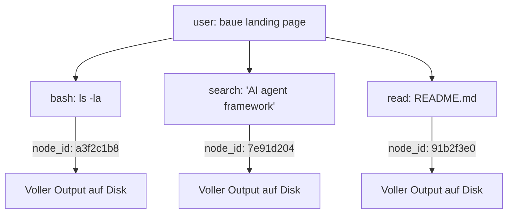

# 🧠 Gnom-Hub

> **Die lokale Multi-Agenten-Schmiede.**
> *8 Agenten · Symbolischer Kurzzeitspeicher · Geschichteter Langzeitspeicher · Null Cloud-Abhängigkeit.*

[](LICENSE)
[](#-tests)
[](#)
[-blueviolet.svg)](#-agenten-übersicht)
[](#-speicher-architektur)
[](#)

🇬🇧 **[English (README.md)](README.md)** • 🇩🇪 **Deutsch**

---

## Was ist Gnom-Hub?

Gnom-Hub ist ein **lokales Multi-Agenten-Backend** mit Web-UI. Acht spezialisierte Agenten (4 Worker + 4 System) arbeiten über einen zentralen FastAPI-Server zusammen. Alles läuft auf `localhost`, persistiert in SQLite, und hat **keine Cloud-Abhängigkeit** für den Core-Betrieb.

**Kernidee:** die Agenten ertrinken nicht in ihrer eigenen Tool-Output-Historie. Gnom-Hub übernimmt ein Konzept aus der [TencentDB Agent Memory](docs/tencentdb-comparison.md)-Forschung: ein **symbolischer Kurzzeitspeicher** (Mermaid-Canvas + node_id Drill-Down) komprimiert lange Tool-Outputs in kompakte Symbole, und ein **geschichteter Langzeitspeicher** hält häufig genutztes Wissen (L0 Konversation → L3 Persona) griffbereit.

---

## 🚀 Schnellstart

```bash
# 1. Klonen und installieren
git clone https://github.com/landjunge/gnom-hub.git
cd gnom-hub
python3 install.py

# 2. Hub starten (öffnet Browser auf Port 3002)
./start_gnom_hub.sh

# 3. Health-Check
curl http://localhost:3002/api/health
# → {"status":"ok"}

# 4. Stoppen
./stop_gnom_hub.sh
```

**Browser:** `http://localhost:3002` — Single-Page-App mit Chat, Agent-Dashboards, Showbox (Präsentations-Layer).

---

## 🏗️ Architektur

```
┌─────────────────────────────────────────────────────────────┐
│  Browser (index.html + 9 JS-Module)                        │
└────────────────────────┬────────────────────────────────────┘
                         │ HTTP/WS
┌────────────────────────▼────────────────────────────────────┐
│  FastAPI-Hub (src/gnom_hub/api) — 30 Router, 220+ Endpoints │
│  ├─ chat         ├─ llm_agents    ├─ showbox                │
│  ├─ llm_keys     ├─ llm_models    ├─ audio (TTS, STT)       │
│  ├─ agents       ├─ state         ├─ workflows              │
│  └─ ...          (offload via action_handlers eingebunden)  │
└────────────────────────┬────────────────────────────────────┘
                         │
┌────────────────────────▼────────────────────────────────────┐
│  8 Agenten (src/gnom_hub/agents)                            │
│  Worker:  CoderAG · WriterAG · EditorAG · ResearcherAG       │
│  System:  SoulAG · GeneralAG · SecurityAG · WatchdogAG      │
│  Routing: deterministischer Capability-Resolver (557 LOC)   │
└────────────────────────┬────────────────────────────────────┘
                         │
┌────────────────────────▼────────────────────────────────────┐
│  LLM-Router (Provider-Fallback-Kette)                       │
│  MiniMax → OpenAI-Compat → DeepSeek → Ollama (lokal)        │
│  + Key-Reconciler aus ~/Desktop/api_keys.txt                │
└─────────────────────────────────────────────────────────────┘
```

---

## 🧠 Speicher-Architektur (TencentDB-inspiriert)

Zwei komplementäre Speicher-Layer, beide **rein lokal**:

### 1. Symbolischer Kurzzeitspeicher (Context-Offload)

Lange Tool-Outputs (Bash-Ergebnisse, Such-Treffer, Datei-Inhalte) werden **auf Disk ausgelagert**. Der Agent-Kontext behält nur einen **Mermaid-Canvas** mit `node_id`-Referenzen:



Volltext abrufen: `[OFFLOAD_RECALL:<node_id>]` in der Agent-Antwort.

**Warum:** reduziert Token-Verbrauch bei langen Tasks um bis zu ~60%, verhindert Context-Bloat, hält das Agent-Reasoning lesbar.

### 2. Geschichteter Langzeitspeicher (3-Layer-SQLite)

```
HOT  → gnomhub.db → soul_memory          (74 Zeilen, indiziert, <1s Lookup)
WARM → soul_passive.db → soul_archive     (26 Zeilen, niedrigere Priorität)
COLD → passive_archive.db → archive_log  (93 Zeilen, Volltextsuche)
```

Embeddings nutzen **FAISS** (wenn torch + faiss verfügbar) mit **TF-IDF** als deterministischem CPU-Fallback (keine GPU nötig).

---

## 👥 Agenten-Übersicht

| Agent | Rolle | Verantwortlichkeit |
|-------|-------|--------------------|
| **SoulAG** | Orchestrator | Routet User-Intent an den richtigen Worker, überwacht Soul-Invariants |
| **GeneralAG** | Multi-Capability | Generischer Fallback für unspezialisierte Tasks, hält Worker-Performance-Stats |
| **WatchdogAG** | Self-Healing | Startet abgestürzte Agenten neu, überwacht Heartbeats, recovered stuck tasks |
| **SecurityAG** | Permissions | Gewährt/entzogen Pfad- + Shell-Permissions, auditiert jeden Write |
| **CoderAG** | Code-Worker | Code-Generierung, Refactoring, Debugging, `[WRITE:]`-Actions |
| **WriterAG** | Text-Worker | Lange Texte, Blog-Posts, Dokumentation |
| **EditorAG** | Polish-Worker | Korrekturlesen, Style-Cleanup, Formatierung |
| **ResearcherAG** | Research-Worker | Web-Suche, GitHub-Recherche, Fact-Gathering |

---

## 💾 Datenbank-Layout (6 SQLite-Files)

| DB | Zweck | Tabellen |
|----|-------|----------|
| `gnomhub.db` | Haupt-Hub — Agents, Chat, Soul-Memory, Showbox, Audit, Security, Workflows | 32 |
| `passive_archive.db` | Langzeit-Archiv passiver Beobachtungen | 1 |
| `soul_passive.db` | Archivierte Soul-Memory-Einträge (niedrige Priorität) | 1 |
| `context.db` | Task-Context-Lifecycle (active/completed/failed) | 2 |
| `coordination.db` | Worker-Performance-Stats, Job-History, Delegation-Rules | 3 |
| `rules.db` | Blockade-Regeln (allow/block Paths, Commands) | 1 |

**Bootstrap-Migrations** sind idempotent: Legacy-DBs kriegen alle Migrationen re-applied mit Toleranz für `ALTER TABLE ADD COLUMN` auf existierenden Spalten.

---

## 🧪 Tests

```bash
# Komplette Suite (660+ grün, pre-existing numpy/FAISS-Failures ignoriert)
python3 -m pytest tests/ --ignore=tests/test_faiss_lock.py

# Nur die neuen tencentdb-agent-memory Tests (35 Tests)
python3 -m pytest tests/test_offload.py tests/test_routing.py

# Smoke gegen laufenden Hub
curl http://localhost:3002/api/health
curl http://localhost:3002/api/agents
```

**Test-Coverage-Highlights:**
- `tests/test_offload.py` — 14 Tests: Mermaid-Canvas, node_id-Resolution, Path-Traversal-Defense, Atomic-Writes
- `tests/test_routing.py` — 21 Tests: deterministische Capability-Resolution, Fallback-Chains, Deutsch/Englisch-Keywords
- `tests/test_security_suite.py` — Permission-Grants, denied Writes, Godmode-Audit

---

## 🔧 Konfiguration

```bash
# .env (lebt in config/.env)
MINIMAX_API_KEY=sk-...
BRAVE_SEARCH_API_KEY=BSA...
DEEPSEEK_API_KEY=sk-...
ELEVENLABS_API_KEY=sk-...     # optional, für TTS-Fallback

# Optional: Context-Offload aktivieren
GNOM_HUB_OFFLOAD_ENABLED=true
```

**LLM-Key-Quelle:** der Key-Reconciler liest beim Start aus `~/Desktop/api_keys.txt`, so kannst du API-Keys in deinen Desktop-Notes halten statt sie zu committen.

---

## 📁 Projekt-Struktur

```
gnom-hub/
├── src/gnom_hub/                    # 207 Python-Module
│   ├── api/                         # FastAPI-Endpoints (30 Router)
│   ├── agents/                      # 8 Agenten + Routing + Swarm
│   ├── memory/                      # Offload, Mermaid-Canvas, Embeddings, FAISS
│   │   ├── offload.py              # Context-Offload-Mechanik
│   │   ├── mermaid_canvas.py       # Mermaid-Symbolgraph
│   │   └── node_resolver.py        # node_id Drill-Down
│   ├── soul/                        # SoulAG + Memory-Layers
│   ├── db/                          # 6 SQLite-Connections + Migrations
│   ├── showbox/                     # Präsentations-Layer + Buttons[]
│   ├── audio/                       # TTS (ElevenLabs + Provider-Fallback)
│   ├── chat/                        # Chat-Router + Brainstorm
│   └── infrastructure/              # Hub-App, Logging, Process-Manager
├── tests/                           # 47 Test-Files, 660+ Tests grün
├── docs/                            # Architektur-Doku
│   ├── tencentdb-comparison.md      # Memory-Architecture-Referenz
│   └── ARCHITECTURE.md              # Verifizierte Architektur (nicht das Marketing)
├── config/.env                      # Lokale Config (nicht committen)
├── install.py                       # Cross-Platform-Installer
├── start_gnom_hub.sh                # Hub-Launcher (Port 3002)
└── stop_gnom_hub.sh                 # Hub-Stopper
```

---

## 📚 Mehr Lesen

- [`docs/ARCHITECTURE.md`](docs/ARCHITECTURE.md) — verifizierte Architektur (sync mit Code)
- [`docs/tencentdb-comparison.md`](docs/tencentdb-comparison.md) — wie unser Speicher-System zur TencentDB-Agent-Memory-Forschung mappt
- [`audit/02-functional-tests.md`](audit/02-functional-tests.md) — letzter Functional-Test-Sweep
- [`README.md`](README.md) — diese Datei auf Englisch

---

## 📜 Lizenz

Private Nutzung. Siehe [LICENSE](LICENSE).
