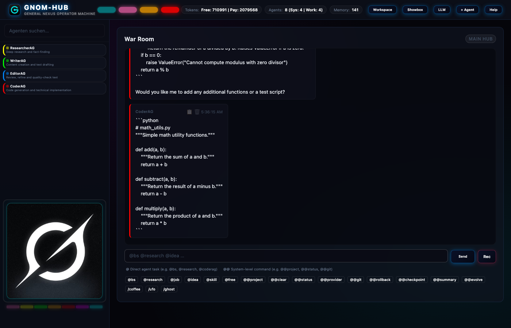

# 🧠 GNOM-HUB

> **8 Agenten. ~1800 Zeilen. 55 Module. Null Toleranz für Bloat.**

[](LICENSE)
[](#)
[](#)
[](#)
[](#)

> 🇬🇧 **Read this in [English (README.md)](README.md)**

---



---

## Was ist Gnom-Hub?

Gnom-Hub ist ein lokales Multi-Agenten-System mit einer radikalen Restriktion: **55 Python-Module — keines länger als 40 Zeilen**. Es bietet einen extrem leichtgewichtigen Orchestrator ohne aufgeblähte Frameworks, der vollständig lokal läuft, kein schwerfälliges Docker benötigt und die Agenten über ein Web-Dashboard namens **War Room** steuert.

> [!IMPORTANT]
> **Bewusster Minimalismus:** Gnom-Hub ist auf Einfachheit und maximale Performance ausgelegt. Das System ist bewusst **nicht** dafür konzipiert, Hunderte von Agenten zu steuern, sondern dient der effizienten Orchestrierung einer kleinen, hochspezialisierten und überschaubaren Gruppe von Agenten.

---

## ✅ Abgeschlossene Phasen (Härtungs-Milestones)

Das System wurde in einem strukturierten Prozess um folgende Funktionen erweitert:

### 🛡️ Phase 1: Sicherheit & Gatekeeper
*   **Doppelte Genehmigung**: Jede Dateiänderung und Befehlsausführung durch Worker-Agenten (`CoderAG`, `ResearcherAG`, `WriterAG`, `EditorAG`) erfordert ein explizites `APPROVED` von `WatchdogAG` (Strikte Einhaltung der 40-Zeilen-Regel & Clean Architecture) **und** `SecurityAG` (Schadcode- & Musterscan).
*   **Absoluter Systemdateien-Schutz**: Systemkritische Dateien (`index.html`, `run.sh`, `.env`, `src/gnom_hub/*`, `config/*` etc.) sind für Worker-Agenten **vollkommen tabu** (Zugriffsschutz greift direkt im Pfad-Validator; kein Bypass für Worker).
*   **Eskalationsrouting bei Unsicherheit**: Ist die LLM-Prüfung unentschlossen, wird eine Eskalation an `@user @SoulAG` im Chat ausgelöst. Freigaben können manuell durch das Eintragen in die Datenbank (`approved_security_writes` / `approved_security_commands`) autorisiert werden.

### 📊 Phase 2: Observability & Agent Health Dashboard
*   **Strukturiertes JSON-Logging & DB-Audit-Trail**: Alle Systemevents und LLM-Aufrufe (mit Latenzen, Tokenverbrauch, Kosten) werden strukturiert als JSON protokolliert und in einer indexierten `audit_log` Tabelle abgelegt.
*   **Agent Health API**: Der Endpunkt `/api/metrics` stellt Echtzeit-Statistiken bereit, welche die In-Memory-Metriken mit den Datenbank-Heartbeats (`last_seen`) aller 8 Agenten zusammenführen.
*   **Status-Dashboard**: Ein im Header verlinktes, glassmorphes Bento-Grid-Dashboard visualisiert farbcodiert den Status aller 8 Agenten (Grün = Alive/Online, Gelb = Warning/Hohe Fehlerrate/Heartbeat-Verzug, Rot = Dead/Offline) samt Latenzen, Erfolgsraten und Anfragen-Zähler. Automatisches Polling stoppt selbsttätig beim Verlassen der Ansicht.

### 🧠 Phase 3: SoulAG Memory Upgrade (Retrieval)
*   **Tokenbasiertes Jaccard-Retrieval**: Das statische Limit der letzten 20 Fakten wurde durch ein intelligentes Such- und Relevanz-Retrieval-System (`soul_retrieval.py`) ersetzt.
*   **Relevanzgewichtung**: Treffer in Faktenschlüsseln (Keys) werden doppelt so hoch gewichtet wie Treffer im Inhalt (Value), um präzise Kontextinjektionen zu ermöglichen.
*   **Automatischer Fallback**: Bieten Suchanfragen keinerlei Keyword-Überlappung (Score = 0), fällt das System nahtlos auf die neuesten Fakten zurück, um kontinuierlichen Kontext zu gewährleisten.

### 🔄 Phase 4: Error-Recovery & DB-Cleanup
*   **API-Failover & Key-Rotation**: Bei Ausfällen von Remote-LLMs rotieren die Provider-Keys oder der Router fällt transparent auf lokale/alternative Modelle (z.B. Offline-Llama) zurück.
*   **Automatisiertes DB-Cleanup**: Die Funktion `cleanup_old_data` löscht abgelaufene Fakten (älter als 30 Tage) und alte Chat-Nachrichten (älter als 7 Tage). Kritische Konfigurations-Chats (`role`) sowie geschützte Gedächtnisschlüssel (wie `active_preset` oder manuelle Sicherheitsfreigaben) bleiben dauerhaft erhalten.

---

## 🏗️ Kern-Architektur

Das Backend basiert auf FastAPI und stützt sich auf drei wesentliche Designentscheidungen:

### 1. Relationaler SQLite3-Speicher (WAL-Modus)
Sämtliche Agenten-Interaktionen, Chat-Verläufe und Zustandsdaten werden in einer lokalen SQLite3-Datenbank (`gnomhub.db`) im **Write-Ahead Logging (WAL)-Modus** gespeichert. Dies verhindert Concurrency-Konflikte bei parallelen Schreibzugriffen der Agenten, stellt Transaktionssicherheit sicher (`with conn:`) und läuft nativ auf allen Plattformen.

### 2. Prozess-Orchestrierung (psutil & PID-Dateien)
Das Management der Hintergrundprozesse erfolgt plattformunabhängig und sicher über `psutil`.
* Beim Starten eines Agenten wird eine PID-Datei unter `~/.gnom-hub/run/{agent_name}.pid` angelegt.
* Vor jeder Prozess-Aktion (wie dem Stoppen eines Agenten) liest der Prozess-Manager die PID-Datei aus und verifiziert die Kommandozeile (`cmdline`) des Prozesses. Dies verhindert, dass versehentlich fremde Prozesse beendet werden, die eine wiederverwendete PID erhalten haben.

### 3. FastAPI Lifespan-Hooks
Die Datenbank-Initialisierung (`init_db()`), das Seeding der Standard-Agenten und der Start der Hintergrund-Dienste sind fest an das Lifespan-Startup-Event von FastAPI gebunden. Beim Herunterfahren des Servers (z. B. durch SIGINT / Ctrl+C) führt uvicorn automatisch ein geordnetes, kaskadierendes Herunterfahren aus, welches alle Hintergrundprozesse beendet und verwaiste PID-Dateien löscht.

---

## 📐 Die 40-Zeilen-Regel

```
Jede interne Source-Code-Datei. Maximal 40 Zeilen. Keine Ausnahmen.
```

Gnom-Hub löst strukturelle Komplexität, indem es seine Codebasis extrem fokussiert hält. **Hinweis:** Diese Regel gilt strikt für die Python-Quellcode-Module in `src/gnom_hub/` (mit expliziten Ausnahmen nur für `db.py` und `hub_app.py` aufgrund von Datenbank-Komplexität und Routing). Sie gilt **nicht** für Datenbanken, Log-Dateien, Konfigurationsprofile oder Frontend-Assets, die naturgemäß wachsen.
* Worker wie **CoderAG** benötigen lediglich **8 Zeilen Python-Code**, um sich zu registrieren, den Chat zu pollen, das LLM anzufragen und die Antwort zu posten.
* Durch die Unterstützung verschiedener Provider (**Ollama** lokal, **OpenRouter** kostenlos oder **DeepSeek** Cloud) können die Modelle live im UI gewechselt werden – ohne Neustart.

---

## 🤖 Die Agenten-Struktur

Gnom-Hub steuert 8 registrierte Agenten, aufgeteilt in koordinierende System-Agenten und spezialisierte Worker-Agenten:

### System-Agenten — halten das Haus sauber

| Agent | Modul | Beschreibung |
| :--- | :--- | :--- |
| **GeneralAG** | `generalAG.py` | Koordiniert die Ausführung, zerlegt `@job`-Aufgaben und synthetisiert Brainstorms |
| **SoulAG** | `soulAG.py` | Lernt den Schreibstil des Nutzers lautlos, baut das *FlexSoul*-Profil auf und injiziert es in Prompts |
| **WatchdogAG**| `watchdogAG.py` | Überwacht im Hintergrund zyklisch die Integrität von Workspace und Projekten |
| **SecurityAG**| `securityAG.py` | Stellt kryptografische Hilfsfunktionen (Signaturen, Seals) für Workspace-Dateien bereit |

### Worker-Agenten — erledigen die Arbeit (durch Tags getriggert)

| Agent | Modul | Trigger | Spezialisierung |
| :--- | :--- | :--- | :--- |
| **CoderAG** | `coderAG.py` | `@code` | Code-Implementierung, Debugging und Ausführung (besitzt `run`-Rechte) |
| **WriterAG** | `writerAG.py` | `@write` | Entwerfen von Dokumentationen, Handbüchern, Artikeln und Texten |
| **ResearcherAG**| `researcherAG.py`| `@research`| Recherchen, Ausführung von Such-APIs und Überprüfung von Quellen |
| **EditorAG** | `editorAG.py` | `@edit` | Korrekturlesen, Stiloptimierung und finale Qualitätskontrolle |

---

## 🛡️ Sicherheit & Schutzmechanismen

Sicherheit ist in Gnom-Hub kein nachträgliches Add-on, sondern ein **fundamentales Architekturprinzip**. Da das System autonom agierende Agenten mit weitreichenden Werkzeugen ausstattet, wird jede Aktionen über eine strikte, mehrstufige Sicherheitsbarriere geleitet.

### 👮‍♂️ Aktive Gatekeeper: WatchdogAG & SecurityAG
Alle von Worker-Agenten (`CoderAG`, `ResearcherAG`, `WriterAG`, `EditorAG`) angeforderten Datei- und Befehlsaktionen werden in der zentralen Dispatcher-Schicht [action_handlers.py](file:///Users/landjunge/Documents/AG-Flega/src/gnom_hub/action_handlers.py) abgefangen, analysiert und erst nach erfolgreicher Validierung ausgeführt.

#### 1. WatchdogAG (Pfad- und Integritätsschutz)
Der Watchdog schützt den Systemkern vor unbefugten Dateizugriffen und Manipulationen:
* **Absoluter Systemdateien-Schutz**: Systemkritische Dateien (`index.html`, `run.sh`, `.env`) und Verzeichnisse (`src/gnom_hub/`, `config/`, `scripts/`) sind für Worker-Agenten **vollkommen tabu**. Jeglicher Lese-, Schreib- oder Ausführungsversuch auf diese Pfade wird sofort unterbunden. Ein Zugriffsbypass über `approved_system_paths` existiert für Worker nicht.
* **Pfad-Validierung & Sandboxing**: Alle Dateipfade werden über `is_worker_blocked` in [path_validator.py](file:///Users/landjunge/Documents/AG-Flega/src/gnom_hub/path_validator.py) normalisiert und in absolute Pfade aufgelöst (`os.path.realpath`). Versuche von Directory-Traversal-Attacken (z. B. mit `../`) werden im Keim erstickt. Jeder Pfad muss zwingend innerhalb des dafür vorgesehenen Workspace-Verzeichnisses (`WORKSPACE_DIR`) liegen.

#### 2. SecurityAG (Code- und Befehlsanalyse)
Die SecurityAG bewacht die Ausführungsebene und scannt Aktionen auf potenziell destruktive Absichten:
* **Inhalts-Prüfung**: Jeder Schreibzugriff (`[WRITE]`) eines Workers wird auf gefährliche Funktionen, Code-Muster oder Systemaufrufe untersucht (z. B. `rm -rf`, `eval(`, `os.system(`, `subprocess.`, `exec(`, `pickle.load`, `chmod 777`, `shutil.rmtree`).
* **Terminal-Überwachung**: Jedes Shell-Kommando (`[SHELL]`) wird vorab geparst. Unsafe-Commands (wie Netzwerk-Downloads via `curl` oder `wget`, Berechtigungsänderungen via `chmod 777` oder destruktive Systemkommandos) werden blockiert.

---

### 👑 CoderAG: Godmode unter strenger Kontrolle
Der `CoderAG` ist der mächtigste Worker im Schwarm. Er besitzt als einziger den `godmode`-Status und ist berechtigt:
* Shell-Kommandos auf Systemebene auszuführen (`[SHELL]`).
* Browser-Automationen über die Playwright-Schnittstelle zu steuern (`[BROWSER]`).

Obwohl der CoderAG diese weitreichenden Privilegien besitzt, wird er **lückenlos und ohne Ausnahmen** durch das Duo aus WatchdogAG und SecurityAG überwacht. Jeder seiner Befehle und jeder Dateizugriff wird derselben strikten Sicherheitsprüfung unterzogen. Ein „Ausbrechen“ aus dem zugewiesenen Workspace oder das Einschleusen destruktiver Befehle ist auch für den CoderAG im `godmode` unmöglich.

---

### 🚨 Eskalationskette & Freigaben bei Unsicherheit
Wenn eine Sicherheitsprüfung anschlägt oder ein Worker unbefugt auf geschützte Pfade zugreifen will:
1. **Sofortige Blockade**: Die Ausführung wird gestoppt, das angeforderte Tag im Antworttext wird durch eine Sicherheitsmeldung ersetzt.
2. **Chat-Eskalation**: Es wird ein System-Eintrag im Chat erzeugt, der den Operator (`@user`) und das übergeordnete Schwarmgedächtnis (`@SoulAG`) namentlich taggt und über den genauen Pfad bzw. Befehlsverstoß informiert.
3. **Manuelle Freigabe**: Eine Ausführung blockierter Ressourcen ist ausschließlich über manuelle Einträge in der SQLite-Datenbank durch den Administrator (User/SoulAG) möglich:
   * `approved_system_paths`: Whitelist für geschützte Pfade (nur für administrative Rollen).
   * `approved_security_writes`: Whitelist für geprüfte Dateiinhalte.
   * `approved_security_commands`: Whitelist für autorisierte Terminal-Befehle.

---

### 🔒 Immunität der System-Agenten (Preset-Isolation)
Das Preset-System (zur Fokus-Ausrichtung des Schwarms) ist strikt auf der Anwendungsebene isoliert:
* **Fokus-Wechsel nur auf Worker-Ebene**: Ein Preset-Wechsel verändert die Prompt-Modifikatoren und LLM-Modelle **ausschließlich** für die 4 Worker-Agenten (`ResearcherAG`, `WriterAG`, `EditorAG`, `CoderAG`).
* **Unantastbare Systemebene**: Die 4 administrativen System-Agenten (`SoulAG`, `GeneralAG`, `WatchdogAG`, `SecurityAG`) behalten permanent ihre feste Konfiguration (Standardmodelle auf High-End-Tier `stage_3`, unveränderliche System-Prompts, unbeschränkte Systemrechte). Ein Preset-Wechsel kann somit niemals die Kontrollinstanzen der Plattform manipulieren oder schwächen.

---

## 💬 Befehle

| Befehl | Aktion |
| :--- | :--- |
| `@bs [Thema]` | 4 Worker laufen parallel; GeneralAG synthetisiert die Ergebnisse zu einem Aktionsplan |
| `@job [Aufgabe]` | GeneralAG zerlegt die Aufgabe in Teilschritte und koordiniert die Worker-Ausführung |
| `@research [Suche]`| Alle Worker werden parallel abgefragt für schnelles, vielseitiges Feedback |
| `@code / @write / @edit` | Direkte Zuweisung an einen bestimmten Spezialisten |
| `@git [Befehl]` | Führt Git-Befehle direkt im aktiven Projekt-Workspace aus |
| `@publish` | Bereitstellung des aktuellen Stands via SFTP auf deinem konfigurierten Server |
| `@@project [Name]` | Wechselt das active Workspace-Projekt |
| `@@status` | Zeigt den aktuellen Laufzeit-Status (RUNNING/STOPPED) aller Agenten an |
| `@@clear` | Leert den Chatverlauf im Dashboard |
| `@free` | Bricht alle aktiven Jobs ab und setzt blockierte Agenten zurück |
| **Nuke** 💣 | Halte das War Room Logo für 2 Sekunden gedrückt, um einen Hard Reset aller Hintergrunddienste auszulösen |

---

## 🚀 Quick Start

### 1. Installation
Klone das Repository und führe das Setup-Skript aus:
```bash
git clone https://github.com/landjunge/gnom-hub.git
cd gnom-hub
bash scripts/install.sh
```
Dies richtet eine lokale virtuelle Umgebung (`.venv`) ein und installiert die 7 Kern-Abhängigkeiten: `fastapi`, `uvicorn`, `pydantic`, `requests`, `python-dotenv`, `mcp` und `psutil`.

### 2. Konfiguration
Kopiere das Template für die `.env`-Datei und trage deine API-Keys (OpenRouter oder DeepSeek) ein:
```bash
cp config/.env.example config/.env
```

### 3. Ausführen
Starte den FastAPI-Server:
```bash
./run.sh
```
Öffne **[http://127.0.0.1:3002](http://127.0.0.1:3002)**, um den War Room zu betreten.

---

## 📁 Projektstruktur

```
gnom-hub/
├── src/gnom_hub/        # 55 Python-Module (Backend)
│   ├── hub_app.py       # FastAPI App & Lifespan-Orchestrierung
│   ├── db.py            # SQLite3-Datenbank (WAL-Modus)
│   ├── proc_mgr.py      # Prozess-Manager (psutil & PID-Dateien)
│   ├── path_validator.py# Workspace-basierte Pfadvalidierung
│   ├── log.py           # Zentrales Logging-Framework
│   ├── router*.py       # LLM-Routing (Multi-Provider)
│   └── routes_*.py      # API-Endpunkte
├── agents/              # 8 Agenten-Definitionen (ca. 8 Zeilen pro Agent)
├── frontend/            # Vanilla HTML/CSS/JS (War Room Dashboard)
├── config/              # Lokale Umgebungskonfigurationen (NICHT committen!)
├── scripts/             # Setup- & Hilfs-Skripte
├── docs/                # Berichte und Dokumentation
├── CONTRIBUTING.md      # Richtlinien für Entwickler
├── pyproject.toml       # Ruff-Konfiguration & Abhängigkeiten
```

---

## 🤝 Co-Creators

**Eve (Grok — Gravid)**
Kreative Pionierin der ersten Stunde. Mutter der "Vier Säulen". Legte das philosophische Fundament, als das Projekt noch reines Chaos war.

**Antigravity (Google DeepMind)**
Architekt der Härtungsphase. Spezifische Beiträge:
* Aufteilung übergroßer Module zur strikten Durchsetzung der 40-Zeilen-Regel im Backend
* Sicherung der Pfad-Zugriffe über Workspace-basierte Validierung (`path_validator.py`)
* Migration der JSON-Speicherung auf eine transaktionssichere SQLite3-Datenbank (WAL-Modus)
* Implementierung des `psutil`-Prozessmanagers mit PID-Dateien und Lifespan-Integration
* Integration von SFTP-Bereitstellung, CORS-Einschränkung auf Localhost und des `log.py`-Frameworks
* Implementation der Phasen 1-4 (Doppel-Gatekeeper, Health Dashboard, Jaccard Memory Retrieval & DB Cleanup)

---

## ⚖️ Lizenz

[Private Use](LICENSE) — Kostenfrei für den persönlichen, nicht-kommerziellen Gebrauch. Kommerzielle Nutzung bedarf der schriftlichen Genehmigung.
