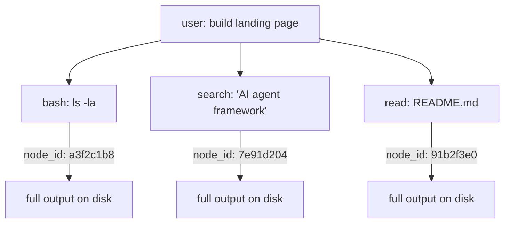

# 🧠 Gnom-Hub

> **The local-first multi-agent forge.**
> *8 Agents · Symbolic Short-Term Memory · Layered Long-Term Memory · Zero cloud dependency.*

[](LICENSE)
[](#-tests)
[](#)
[-blueviolet.svg)](#-agent-roster)
[](#-memory-architecture)
[](#)

🇬🇧 **English** • 🇩🇪 **[Deutsch (README.de.md)](README.de.md)**

---

## What is Gnom-Hub?

Gnom-Hub is a **local-first multi-agent backend** with a web UI. Eight specialized agents (4 workers + 4 system agents) collaborate on user tasks via a central FastAPI server. Everything runs on `localhost`, persists in SQLite, and has **no cloud dependency** for the core operation.

**Key property:** the agents don't drown in their own tool-output history. Gnom-Hub borrows a page from the [TencentDB Agent Memory](docs/tencentdb-comparison.md) research: a **symbolic short-term memory** (Mermaid canvas + node_id drill-down) compresses long tool outputs into compact symbols, and a **layered long-term memory** keeps frequently-used knowledge (L0 conversation → L3 persona) within easy reach.

---

## 🚀 Quick Start

```bash
# 1. Clone and install
git clone https://github.com/landjunge/gnom-hub.git
cd gnom-hub
python3 install.py

# 2. Start the hub (opens browser on port 3002)
./start_gnom_hub.sh

# 3. Health check
curl http://localhost:3002/api/health
# → {"status":"ok"}

# 4. Stop
./stop_gnom_hub.sh
```

**Browser:** `http://localhost:3002` — single-page app with chat, agent dashboards, showbox (presentation layer).

---

## 🏗️ Architecture

```
┌─────────────────────────────────────────────────────────────┐
│  Browser (index.html + 9 JS modules)                        │
└────────────────────────┬────────────────────────────────────┘
                         │ HTTP/WS
┌────────────────────────▼────────────────────────────────────┐
│  FastAPI Hub (src/gnom_hub/api) — 30 routers, 220+ endpoints│
│  ├─ chat         ├─ llm_agents    ├─ showbox                │
│  ├─ llm_keys     ├─ llm_models    ├─ audio (TTS, STT)       │
│  ├─ agents       ├─ state         ├─ workflows              │
│  └─ ...          (offload wired in via action_handlers)     │
└────────────────────────┬────────────────────────────────────┘
                         │
┌────────────────────────▼────────────────────────────────────┐
│  8 Agents (src/gnom_hub/agents)                             │
│  Worker:  CoderAG · WriterAG · EditorAG · ResearcherAG       │
│  System:  SoulAG · GeneralAG · SecurityAG · WatchdogAG      │
│  Routing: deterministic capability resolver (557 LOC)       │
└────────────────────────┬────────────────────────────────────┘
                         │
┌────────────────────────▼────────────────────────────────────┐
│  LLM Router (provider-fallback chain)                       │
│  MiniMax → OpenAI-Compat → DeepSeek → Ollama (local)        │
│  + Key-Reconciler from ~/Desktop/api_keys.txt               │
└─────────────────────────────────────────────────────────────┘
```

---

## 🧠 Memory Architecture (TencentDB-inspired)

Two complementary memory layers, both **local-only**:

### 1. Symbolic Short-Term Memory (Context-Offload)

Long tool outputs (bash results, search hits, file contents) are **offloaded to disk**. The agent's context keeps only a **Mermaid canvas** with `node_id` references:



To retrieve full text: `[OFFLOAD_RECALL:<node_id>]` in the agent's response.

**Why:** reduces token consumption by up to ~60% on long tasks, prevents context bloat, keeps the agent's reasoning legible.

### 2. Tiered Long-Term Memory (3-layer SQLite)

```
HOT  → gnomhub.db → soul_memory    (74 rows, indexed, sub-second lookup)
WARM → soul_passive.db → soul_archive  (26 rows, lower priority)
COLD → passive_archive.db → archive_log  (93 rows, full-text search)
```

Embeddings use **FAISS** (when torch + faiss available) with **TF-IDF** as a deterministic CPU fallback (no GPU required).

---

## 👥 Agent Roster

| Agent | Role | Responsibility |
|-------|------|----------------|
| **SoulAG** | Orchestrator | Routes user intent to the right worker, monitors soul-level invariants |
| **GeneralAG** | Multi-capability | Generic fallback for non-specialist tasks, holds worker performance stats |
| **WatchdogAG** | Self-healing | Restarts failed agents, monitors heartbeat, recovers stuck tasks |
| **SecurityAG** | Permissions | Grants/revokes path + shell permissions, audits every write |
| **CoderAG** | Code worker | Code generation, refactoring, debugging, `[WRITE:]` actions |
| **WriterAG** | Text worker | Long-form text, blog posts, documentation |
| **EditorAG** | Polish worker | Proofreading, style cleanup, formatting |
| **ResearcherAG** | Research worker | Web search, GitHub research, fact gathering |

---

## 💾 Database Layout (6 SQLite files)

| DB | Purpose | Tables |
|----|---------|--------|
| `gnomhub.db` | Main hub — agents, chat, soul memory, showbox, audit, security, workflows | 32 |
| `passive_archive.db` | Long-term archive of passive observations | 1 |
| `soul_passive.db` | Archived soul-memory entries (low priority) | 1 |
| `context.db` | Task context lifecycle (active/completed/failed) | 2 |
| `coordination.db` | Worker performance stats, job history, delegation rules | 3 |
| `rules.db` | Blockade rules (allow/block paths, commands) | 1 |

**Bootstrap migrations** are idempotent: legacy DBs get all migrations re-applied with tolerance for `ALTER TABLE ADD COLUMN` on existing columns.

---

## 🧪 Tests

```bash
# Full suite (660+ passing, pre-existing numpy/FAISS failures ignored)
python3 -m pytest tests/ --ignore=tests/test_faiss_lock.py

# Just the new tencentdb-agent-memory tests (35 tests)
python3 -m pytest tests/test_offload.py tests/test_routing.py

# Smoke against running hub
curl http://localhost:3002/api/health
curl http://localhost:3002/api/agents
```

**Test coverage highlights:**
- `tests/test_offload.py` — 14 tests: Mermaid canvas, node_id resolution, path-traversal defense, atomic writes
- `tests/test_routing.py` — 21 tests: deterministic capability resolution, fallback chains, German/English keywords
- `tests/test_security_suite.py` — permission grants, denied writes, godmode audit

---

## 🔧 Configuration

```bash
# .env (lives in config/.env)
MINIMAX_API_KEY=sk-...
BRAVE_SEARCH_API_KEY=BSA...
DEEPSEEK_API_KEY=sk-...
ELEVENLABS_API_KEY=sk-...     # optional, for TTS fallback

# Optional: enable context-offload
GNOM_HUB_OFFLOAD_ENABLED=true
```

**LLM key source:** the key-reconciler reads from `~/Desktop/api_keys.txt` at startup, so you can keep API keys in your desktop notes rather than committing them.

---

## 📁 Project Structure

```
gnom-hub/
├── src/gnom_hub/                    # 207 Python modules
│   ├── api/                         # FastAPI endpoints (30 routers)
│   ├── agents/                      # 8 agents + routing + swarm
│   ├── memory/                      # offload, mermaid_canvas, embeddings, FAISS
│   │   ├── offload.py              # Context-Offload-Mechanik
│   │   ├── mermaid_canvas.py       # Mermaid-Symbolgraph
│   │   └── node_resolver.py        # node_id Drill-Down
│   ├── soul/                        # SoulAG + memory_layers
│   ├── db/                          # 6 SQLite connections + migrations
│   ├── showbox/                     # Presentation layer + buttons[]
│   ├── audio/                       # TTS (ElevenLabs + provider-fallback)
│   ├── chat/                        # Chat router + brainstorm
│   └── infrastructure/              # Hub-app, logging, process manager
├── tests/                           # 47 test files, 660+ tests passing
├── docs/                            # Architecture docs
│   ├── tencentdb-comparison.md      # Memory-architecture reference
│   └── ARCHITECTURE.md              # Verified architecture (not the marketing)
├── config/.env                      # Local config (do not commit)
├── install.py                       # Cross-platform installer
├── start_gnom_hub.sh                # Hub launcher (port 3002)
└── stop_gnom_hub.sh                 # Hub stopper
```

---

## 📚 Further Reading

- [`docs/ARCHITECTURE.md`](docs/ARCHITECTURE.md) — verified architecture (sync with code)
- [`docs/tencentdb-comparison.md`](docs/tencentdb-comparison.md) — how the memory system maps to TencentDB Agent Memory research
- [`audit/02-functional-tests.md`](audit/02-functional-tests.md) — last functional-test sweep
- [`README.de.md`](README.de.md) — diese Datei auf Deutsch

---

## 📜 License

Private use. See [LICENSE](LICENSE).
