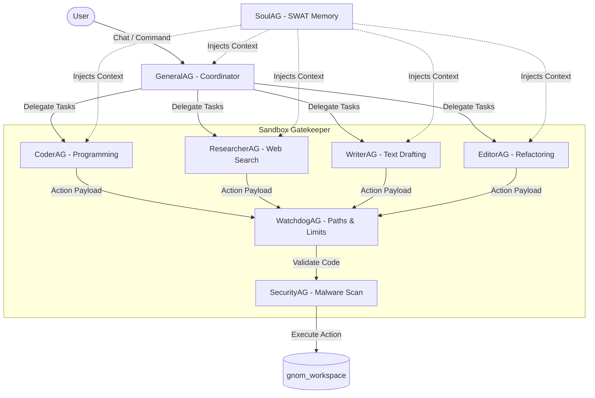

# 🧠 GNOM-HUB

> **A Local-First Multi-Agent Orchestration Playground**  
> *8 Background Agents • Clean Architecture • Secure Double-Gatekeeper Sandboxing • Glassmorphic War Room Dashboard*

[](LICENSE)
[](#)
[](#)
[](#)
[](#)
[](#)

---

🇬🇧 **English (README.md)** • 🇩🇪 **[Deutsch (README.de.md)](README.de.md)**

---


---

## 🔍 What is Gnom-Hub?

Gnom-Hub is an experimental, **local-first multi-agent playground** designed to orchestrate a fixed team of 8 specialized agents. 

Unlike heavy, auto-spawning agent frameworks that suffer from token-burn and uncontrolled recursion, Gnom-Hub implements a **defensive, zero-trust architecture** with a static agent topology. Background agents operate as separate processes, communicating with a central FastAPI hub, while a clean, modular, glassmorphic web dashboard (the **War Room**) provides real-time monitoring, manual approvals, and interactive brainstorming tools.

---

## 🚀 Key Features

Gnom-Hub combines robust multi-process orchestration with an interactive web interface. Key features include:

*   **Intelligent & Flexible Agent Routing**:
    The central LLM router dynamically routes queries to the most suitable model (e.g., DeepSeek-Reasoner, Claude, GPT). In case of API outages or network limits, it falls back transparently to configured local models (like offline Llama via Ollama) to keep the swarm moving.
*   **Layer-Based Visual Showbox System**:
    The dashboard's Showbox displays work results, text drafts, and UI mockups in real-time across interactive layers. Each layer has a distinct color code and triggers a temporary flash effect (highlighting borders) on the corresponding agent group (Worker sidebar or System top-bar) upon switching, providing immediate visual feedback on the source of the data.
*   **Fully Modularized Frontend**:
    The glassmorphic web dashboard has been refactored from a massive monolithic file into 7 specialized JavaScript modules. This guarantees a clean separation of concerns (decoupling chat, workspace, bento metrics, and status LEDs) and simplifies codebase maintenance.
*   **Shared Semantic Long-Term Memory**:
    All agents share a persistent SQLite database. SoulAG monitors chats, extracts relevant facts, and dynamically injects the top 8 most relevant entries into worker prompts via FAISS semantic search (falling back to TF-IDF cosine-similarity math if libraries are missing) to prevent repetitive mistakes.
*   **Structured Brainstorming Mode (`@bs`)**:
    The `@bs [topic]` command triggers a coordinated swarm debate. All worker agents analyze the problem in parallel brainstorm states, while GeneralAG consolidates and filters the answers into a single, structured action plan.
*   **Bento-Grid Live Status Dashboard**:
    Provides real-time visibility into swarm health. The glassmorphic Bento-Grid displays active daemon statuses (heartbeats polled via `/api/metrics`), latency charts, token expenditure, and incorporates an interactive user feedback panel.

---

## 🏗️ Architecture & Core Components

Gnom-Hub is split into a **modular frontend dashboard** and a **structured backend service**:

### 1. The Modular Frontend ("War Room")
The frontend is a single-page glassmorphic UI (`index.html`) driven by a clean, decoupled JavaScript architecture. The logic is separated into 7 distinct modules served under `/static/`:
*   [core.js](file:///Users/landjunge/Documents/AG-Flega/src/gnom_hub/frontend/core.js): Global state, API handlers, active preset configurations, custom notifications, and color schemes.
*   [system_dashboard.js](file:///Users/landjunge/Documents/AG-Flega/src/gnom_hub/frontend/system_dashboard.js): Controls the top-bar status lights (LED indicators) and detail modules for System Agents.
*   [worker_dashboard.js](file:///Users/landjunge/Documents/AG-Flega/src/gnom_hub/frontend/worker_dashboard.js): Renders the left-sidebar list of Worker Agents and processes interaction events.
*   [worker_sidebar.js](file:///Users/landjunge/Documents/AG-Flega/src/gnom_hub/frontend/worker_sidebar.js): Governs the detail drawer, memory CRUD operations, and evolution/self-improvement logs.
*   [chat.js](file:///Users/landjunge/Documents/AG-Flega/src/gnom_hub/frontend/chat.js): Manages the main chat logs, speech synthesis, tag autocompletion, markdown parsing, and command execution.
*   [workspace.js](file:///Users/landjunge/Documents/AG-Flega/src/gnom_hub/frontend/workspace.js): Governs the file explorer, markdown/code previewers, and Python test runners.
*   [dashboard.js](file:///Users/landjunge/Documents/AG-Flega/src/gnom_hub/frontend/dashboard.js): Displays bento-grid metrics, latency trackers, active LLM router configurations, and the user feedback loop.

### 2. The Multi-Process Backend
The backend utilizes Python 3.9+ and is built upon **Clean Architecture** principles:
*   **FastAPI Engine**: Serves the REST API, hosts the static assets, and drives the background processes using `uvicorn` lifespan hooks.
*   **Daemon Management (`psutil`)**: Launches and monitors the 8 background agents plattform-independently, using PID files (`~/.gnom-hub/run/`) to prevent zombie processes.
*   **Relational Storage**: All chat histories, metadata, and memory logs are persisted in a local SQLite3 database (`gnomhub.db`) configured in **WAL (Write-Ahead Logging) Mode** to guarantee transaction safety during concurrent writes.
*   **Dual-Layer Memory Retrieval**: Uses local **FAISS vectors** (`sentence-transformers/all-MiniLM-L6-v2`) to search and retrieve long-term context, falling back gracefully to TF-IDF cosine-similarity math if libraries are missing.

---

## 🤖 The Swarm Topology (8 Agents)

Gnom-Hub operates a fixed, rigid topology divided into administrative **System Agents** and task-restricted **Worker Agents**:



### 🛡️ Administrative System Agents
System agents run with native system permissions and monitor the platform. They **never** edit files directly inside the workspace.
*   **GeneralAG** (Orchestrator): The swarm general. Analyzes user jobs, breaks them down, coordinates worker agent execution, and compiles brainstorm sessions. Restricted from running terminal or filesystem commands.
*   **SoulAG** (Consciousness): Learns preferences silently. Uses Jaccard retrieval and FAISS vector embeddings to inject the top 8 most relevant historical facts into worker prompts before execution.
*   **WatchdogAG** (Integrity Wächter): Enforces the target 40-line code rule for modules and blocks workers from reading or modifying system files (`src/`, `.env`, `run.sh`).
*   **SecurityAG** (Gatekeeper): Performs static analysis of code edits and filters shell commands for dangerous functions (`rm -rf`, `eval`, unauthorized network calls).

### 🛠️ Restricted Worker Agents
Worker agents have no native shell or filesystem permissions. All actions they request are intercepted and must pass the Watchdog + Security double-approval gate.
*   **CoderAG**: Software development, unit testing, and execution. Equipped with `godmode` permissions for sandboxed Playwright browser automation and terminal executions.
*   **ResearcherAG**: Fact-finding, parsing documentations, and crawling target URLs.
*   **WriterAG**: Drafts manuals, handbooks, blog posts, and markdown documentation.
*   **EditorAG**: Performs proofreading, text styling, code reviews, and clean-architecture refactorings.

---

## 🛠️ Agent Actions (Tools)

Workers request tool executions by wrapping payloads in markdown-like tags in their LLM output. These are securely intercepted by the dispatcher layer:

| Action Tag | Description | Allowed To | Example |
| :--- | :--- | :--- | :--- |
| `[READ: filename]` | Reads the contents of a file. | All Workers | `[READ: index.js]` |
| `[WRITE: file]content[/WRITE]` | Writes code or text to the workspace. | Coder, Writer, Researcher, Editor | `[WRITE: app.py]`<br>`print("hi")`<br>`[/WRITE]` |
| `[SHELL: command]` | Runs shell commands within the workspace. | CoderAG | `[SHELL: pytest tests/]` |
| `[IMAGE: prompt]` | Generates an image and saves it. | Writer, Coder | `[IMAGE: modern dark mode banner]` |
| `[BROWSER: json_action]` | Runs a sandboxed Playwright browser. | CoderAG | `[BROWSER: {"action": "goto", "target": "https://google.com"}]` |
| `<SHOWBOX:index>html</SHOWBOX>` | Updates frontend Bento-Grid visualizer cards. | All Agents | `<SHOWBOX:4>`<br>`<h3>Slide 1</h3>`<br>`</SHOWBOX>` |

---

## 💬 Command Console

| Command | Action |
| :--- | :--- |
| `@bs [topic]` | Triggers a parallel brainstorming session among all workers. |
| `@job [task]` | GeneralAG breaks down the task and coordinates the step-by-step swarm execution. |
| `@code` / `@write` / `@edit` | Direct assignment of a prompt to a specific worker agent. |
| `@git [command]` | Executes git operations inside the local workspace. |
| `@@project [name]` | Switches the active workspace project. |
| `@@status` | Displays the runtime status of all background daemons. |
| `@@clear` | Wipes the chat history. |
| `@free` | Resets all active background jobs and busy states. |
| **Nuke 💣** | Press and hold the War Room logo in the UI for 2 seconds to force-restart all background services. |

---

## 📁 Project Directory Layout

```text
gnom-hub/
├── agents/             # Process startup scripts for the 8 background agents
├── config/             # Environment files (.env, presets, capability leases)
├── data/               # Vector index files, FAISS databases, and local caches
├── docs/               # System documentation and developer manuals
├── gnom_workspace/     # Sandbox workspace directory where workers read/write files
├── logs/               # Logfiles for the API server and background daemons
├── scratch/            # Interactive playground, test scripts, and scratchpads
├── scripts/            # Installation, setup, and macOS desktop helper scripts
├── src/                # Backend python package:
│   └── gnom_hub/       # Core packages:
│       ├── agents/     # BaseAgent class, capabilities, and tool validation
│       ├── api/        # FastAPI endpoints and uvicorn routing
│       ├── chat/       # Chat repository and brainstorming orchestrator
│       ├── core/       # Configurations, logging, and action gatekeepers
│       ├── db/         # SQLite interfaces, migrations, and WAL database
│       ├── frontend/   # Glassmorphic UI (HTML, CSS, modular JS files)
│       ├── infrastructure/ # LLM routing, Playwright sandboxes, and heartbeats
│       ├── memory/     # FAISS semantic vector search & embeddings
│       └── soul/       # Steganographic ZWC context injection
├── gnomhub.db          # 0-byte indicator database file (real DB is in ~/.gnom-hub/)
├── pyproject.toml      # Dependency management and project requirements
└── run.sh              # Unified launcher for API server and background swarm
```

---

## ⚠️ Technical Honesty & Limitations

Gnom-Hub is **not** a plug-and-play autonomous commercial SaaS product. It is an experimental developer playground with several constraints:
1.  **Fixed Topology**: You cannot dynamically add, scale, or remove agents. The swarm configuration is hardcoded to exactly 8 agents.
2.  **Local Environment Footprint**: Running FAISS local embeddings and Playwright browser instances requires a functional local Python environment, PyPI packages, and occasionally Docker.
3.  **Basic Workspace Sandboxing**: While path traversal (`../`) is blocked, running commands via `[SHELL]` executes directly on the host machine as the user running the server. It is **not** virtualization-isolated unless configured inside a VM.
4.  **O(1) Lease Cache Bypass**: Bypassing gatekeeper checks via capability leases is based on a fast in-memory database TTL (Time-To-Live). If the server restarts, this cache is lost.
5.  **Token Budgets**: The token budget manager (`token_economy.py`) is implemented and tracks usage, but it does **not** actively throttle or block LLM calls at runtime yet.

---

## 🚀 Quick Start

### 1. Clone & Setup
```bash
git clone https://github.com/landjunge/gnom-hub.git
cd gnom-hub
bash scripts/install.sh
```
The installer initializes a Python virtual environment (`.venv`) and installs the required packages (`fastapi`, `uvicorn`, `psutil`, `requests`, `mcp`, etc.).

### 2. Configure Environment
Create a copy of the example environment file:
```bash
cp config/.env.example config/.env
```
Open `config/.env` and insert your OpenRouter or DeepSeek API key. You can also configure local models via Ollama.

### 3. Start Gnom-Hub
```bash
./run.sh
```
Open **[http://127.0.0.1:3002](http://127.0.0.1:3002)** in your web browser to enter the **War Room** dashboard.

---

## 🤝 Co-Creators

*   **Eve (Grok - Gravid)**: Designed the initial agent topologies, concept ideas, and philosophical direction of Gnom-Hub.
*   **Antigravity (Google DeepMind)**: Implemented code modularization, secure double-gatekeeper path validation (`path_validator.py`), SQLite transaction migration (WAL Mode), psutil process management, FAISS vector embeddings search, capability caching (Leases), and frontend JS modularization.

---

## ⚖️ License

[Private Use](LICENSE) — Free for personal, non-commercial research and development. Commercial usage requires written authorization.