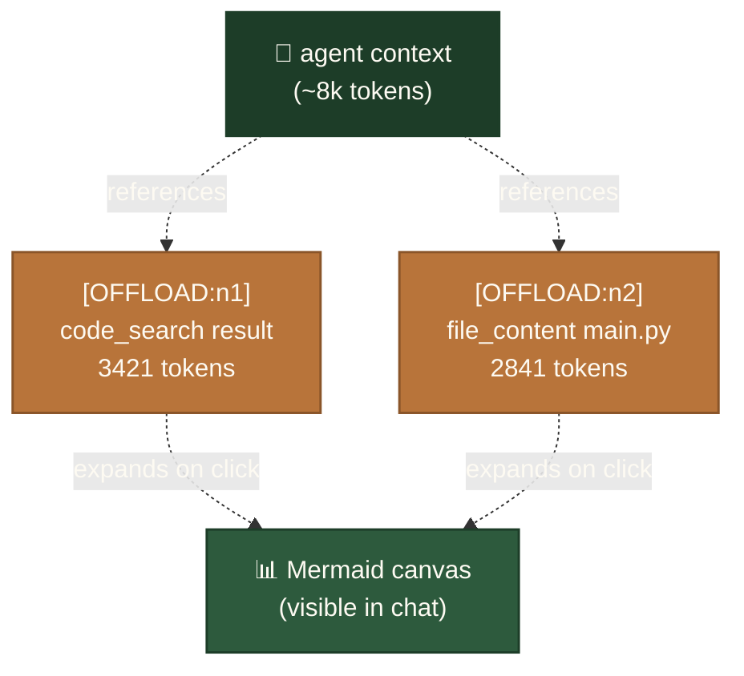
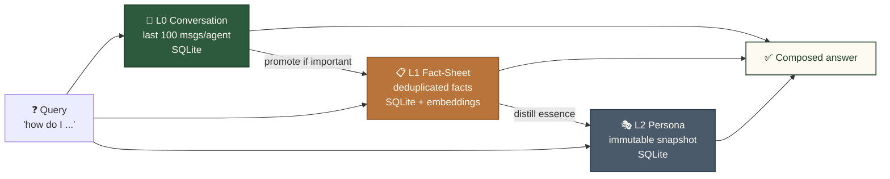
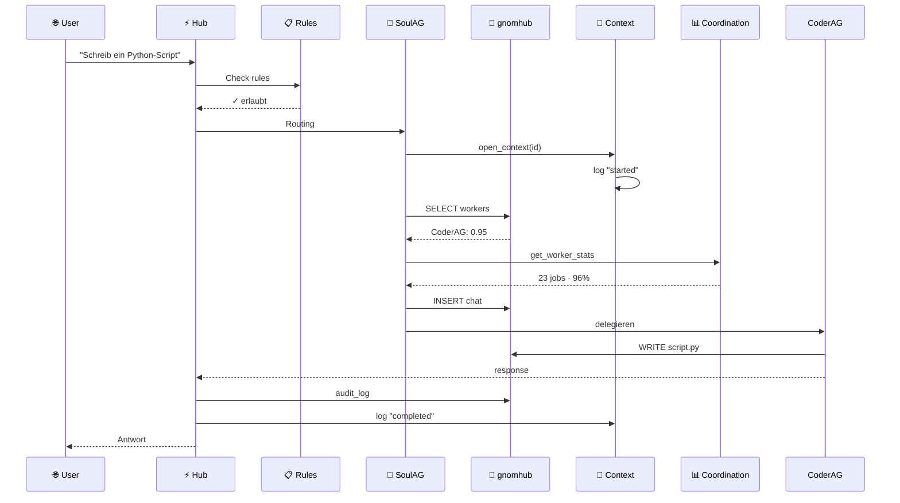
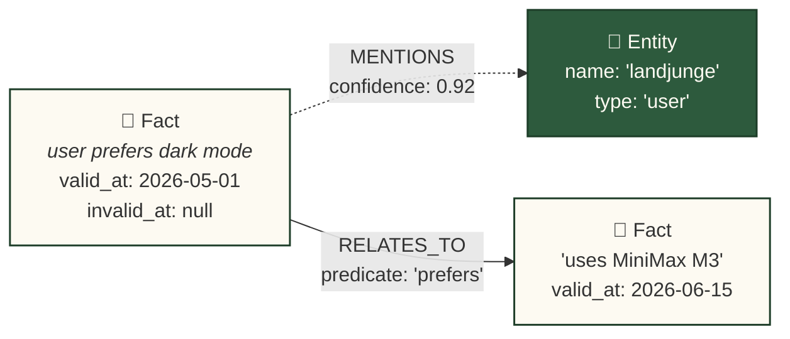

# 🧠 Gnom-Hub

> **The local-first multi-agent forge.**
> *8 Agents · Symbolic Short-Term Memory · Layered Long-Term Memory · Zero cloud dependency.*

[](LICENSE)
[](#-tests)
[](#)
[-blueviolet.svg)](#-agent-roster)
[](#-memory-architecture)
[](#-showbox--output-layer-with-clickable-buttons)
[](#)

🇬🇧 **English** • 🇩🇪 **[Deutsch (README.de.md)](README.de.md)**

---

## What is Gnom-Hub?

Gnom-Hub is a **local-first multi-agent backend** with a web UI. Eight specialized agents (4 workers + 4 system agents) collaborate on user tasks via a central FastAPI server. Everything runs on `localhost`, persists in SQLite, and has **no cloud dependency** for the core operation.

**Key property:** the agents don't drown in their own tool-output history. Gnom-Hub borrows a page from the [TencentDB Agent Memory](docs/tencentdb-comparison.md) research: a **symbolic short-term memory** (Mermaid canvas + node_id drill-down) compresses long tool outputs into compact symbols, and a **layered long-term memory** keeps frequently-used knowledge (L0 conversation → L3 persona) within easy reach.

---

## 🎯 What can you build with Gnom-Hub?

Out-of-the-box, no setup beyond `python3 install.py`:

- 🧑‍💻 **Coding-Pipeline** — `CoderAG` writes the PR, `EditorAG` polishes, `WriterAG` documents
- 🎨 **Landing-Page from README** — interactive demo page with all 8 Agent-Cards ([`docs/golden-tests.md`](docs/golden-tests.md))
- 🎥 **Demo-Video** — Playwright + TTS + Screencapture as marketing material
- 🔬 **Brainstorm-Session** — `@@bs <question>` triggers Multi-Agent decomposition to sub-tasks
- 📊 **TKG Memory-Inspector** — live visualization of the knowledge graph in the Agent-Inspector sidebar
- 🐝 **War-Room** — live coordination between multiple agents in the same chat thread
- 🔊 **Voice-In / Voice-Out** — TTS provider chain (MiniMax → OpenAI → ElevenLabs) with browser fallback
- 🛡️ **Self-Healing** — `WatchdogAG` restarts stuck agents, recovers failed tasks automatically

The **8 Agent-Cards** the user sees in the landing-page are exactly the agents running inside the hub:

| Card | Type | Role |
|------|------|------|
| **SoulAG** | System | Orchestrator + TKG fact-extractor (silent observer) |
| **GeneralAG** | System | Dirigent for direct user-chat, multi-cap fallback |
| **WatchdogAG** | System | Self-healing, heartbeat, stuck-task recovery |
| **SecurityAG** | System | Path/shell permissions, write-audit |
| **CoderAG** | Worker | Code generation, `[WRITE:]` actions, refactoring |
| **WriterAG** | Worker | Long-form text, blog posts, docs |
| **EditorAG** | Worker | Proofreading, style cleanup, formatting |
| **ResearcherAG** | Worker | Web search, GitHub research, fact-gathering |

The runtime-console shows all 8 cards with live `status` + `last_seen`. The hub refuses to start cleanly without all 8 heartbeating.

---

## 🚀 Quick Start

```bash
git clone <your-fork-url>
cd gnom-hub
python3 install.py
./start_gnom_hub.sh
# → Terminal: "Uvicorn running on http://0.0.0.0:3002"
curl http://localhost:3002/api/health
./stop_gnom_hub.sh
```

**Browser:** `http://localhost:3002` — single-page app with chat, agent dashboards, showbox (presentation layer).

---

## 🧭 Routing & Orchestration

Every user-message hits the **deterministic capability-resolver** in `src/gnom_hub/agents/swarm/capability_resolver.py` (557 LOC). It classifies by capability-keyword (EN + DE) and dispatches:

| Capability | Target | Trigger |
|---|---|---|
| `chat` / direct user-message | `GeneralAG` (default since 2026-07-02) | user types into chat |
| `coding`, `bash`, `refactor` | `CoderAG` | mention `@CoderAG` or keyword |
| `writing`, `blog`, `docs` | `WriterAG` | mention `@WriterAG` or keyword |
| `editing`, `proofread` | `EditorAG` | mention `@EditorAG` or keyword |
| `web_research`, `github_recherche` | `ResearcherAG` | `@@research`, `@@github` |
| `permissions`, `grant`, `revoke` | `SecurityAG` | admin request |
| `stale`, `failed`, `recover` | `WatchdogAG` | auto-routed by the engine |

**SoulAG** stays a silent observer — she extracts TKG facts from each message but no longer answers direct user-chat (would produce empty replies). The retry-chain `GeneralAG → SoulAG` activates when GeneralAG has no matching capability (honest "no agent" status, not a fake "completed" toast).

---

## 🏗️ Architecture

```
┌─────────────────────────────────────────────────────────────┐
│  Browser (index.html + 9 JS modules)                        │
└────────────────────────┬────────────────────────────────────┘
                         │ HTTP/WS
┌────────────────────────▼────────────────────────────────────┐
│  FastAPI Hub (src/gnom_hub/api) — 30 routers, 220+ endpoints│
│  ├─ chat         ├─ llm_agents    ├─ showbox                │
│  ├─ agents       ├─ state         ├─ workflows              │
│  └─ ...          (offload wired in via action_handlers)     │
└────────────────────────┬────────────────────────────────────┘
                         │
┌────────────────────────▼────────────────────────────────────┐
│  8 Agents (src/gnom_hub/agents)                             │
│  Worker:  CoderAG · WriterAG · EditorAG · ResearcherAG       │
│  System:  SoulAG · GeneralAG · SecurityAG · WatchdogAG      │
│  Routing: deterministic capability resolver (557 LOC)       │
└────────────────────────┬────────────────────────────────────┘
                         │
┌────────────────────────▼────────────────────────────────────┐
│  LLM Router (provider-fallback chain)                       │
│  MiniMax → OpenAI-Compat → DeepSeek → Ollama (local)        │
│  + Key-Reconciler from ~/Desktop/api_keys.txt               │
└─────────────────────────────────────────────────────────────┘
```

---

## 🧠 Memory Architecture (TencentDB-inspired)

Two complementary memory layers, both **local-only**:

### 1. Symbolic Short-Term Memory (Context-Offload)

Long tool outputs (bash results, search hits, file contents) are **offloaded to disk**. The agent's context keeps only a **Mermaid canvas** with `node_id` references:



To retrieve full text: `[OFFLOAD_RECALL:<node_id>]` in the agent's response.

**Why:** reduces token consumption by up to ~60% on long tasks, prevents context bloat, keeps the agent's reasoning legible.

### 2. Tiered Long-Term Memory (3-layer SQLite)



Embeddings use **FAISS** (when torch + faiss available) with **TF-IDF** as a deterministic CPU fallback (no GPU required).

---

## 🎭 Showbox — Output-Layer with Clickable Buttons

Showbox is the central runtime-output medium. Instead of dead text-answers, users get a **3-layer system** of clickable slides that trigger real actions:

- **System-Layer** — hub-internal status (routing decisions, audit events)
- **Worker-Layer** — agent-generated slides from `CoderAG`, `WriterAG`, `EditorAG`
- **User-Layer** — persistent presentations in the user-workspace

**Mechanics:** inline `<button action="...">`-tags inside agent-responses get extracted by `extract_inline_buttons()` in `src/gnom_hub/db/showbox_repo.py` into the `buttons[]` JSON field. The frontend (`src/gnom_hub/frontend/showbox-buttons.js:extractInlineButtons`) renders them as a clickable grid that triggers `POST /api/chat {target, content}`.

```
POST /api/showbox/presentations              # save a slide-deck
GET  /api/themes                             # active themes + slides
PUT  /api/showbox/{id}/buttons               # update button-layout
```

**Example agent-output:**

```html
<showbox theme="code_review" title="PR #42">
  <slide title="Diff Summary">3 files · +127 −42</slide>
  <button action="approve" target="coderag">✓ Approve & Merge</button>
  <button action="request_changes">⚠ Request Changes</button>
</showbox>
```

**Buttons are not optional** — every showbox saved with `<button>`-tags MUST round-trip through `buttons[]`. That's a spec-load-bearing detail (see `db/showbox_repo.py:extract_inline_buttons`).

---

## 🧬 Temporal Knowledge Graph (TKG) — Phase 1 Migration

Phase 1 introduces a graph-based memory layer that complements the existing tiered SQLite memory. A **Temporal Knowledge Graph (TKG)** stores facts and entities as nodes, with bitemporal relations as edges and embedding-based similarity search.

- **Backend:** [KuzuDB](https://kuzudb.com/) (embedded, local-only, no cloud) for production; in-memory backend for tests. Selected via `MEMORY_BACKEND` in `.env`.
- **Adapter:** a thin `memory_tkg.adapter` module exposes `store_memory`, `retrieve_relevant`, `get_recent_facts`, `add_mention`, and `save_soul_fact_smart` — 1:1 with the legacy API so callsites migrate incrementally.
- **Migration status:** `SoulAG` and `ContextManager.add_fact` run on the new adapter. `save_soul_fact_smart` is preserved for Jaccard-dedup callsites; the new `has_similar_fact` (cosine ≥ 0.85) replaces it once the embedder is stable.
- **Tests:** `tests/test_memory_tkg.py` — 10 tests, parametrized over both backends.

---

## 👥 Agent Roster

| Agent | Role | Responsibility |
|-------|------|----------------|
| **SoulAG** | Orchestrator | Routes user intent to the right worker, monitors soul-level invariants |
| **GeneralAG** | Multi-capability | Generic fallback for non-specialist tasks, holds worker performance stats |
| **WatchdogAG** | Self-healing | Restarts failed agents, monitors heartbeat, recovers stuck tasks |
| **SecurityAG** | Permissions | Grants/revokes path + shell permissions, audits every write |
| **CoderAG** | Code worker | Code generation, refactoring, debugging, `[WRITE:]` actions |
| **WriterAG** | Text worker | Long-form text, blog posts, documentation |
| **EditorAG** | Polish worker | Proofreading, style cleanup, formatting |
| **ResearcherAG** | Web worker | Web research, scraping, fact-gathering |

---

## 🗄️ Database Architecture

The hub uses **6 specialized SQLite databases** in `~/.gnom-hub-3003/data/`. Each has exactly one responsibility — no multi-tenant chaos, no shared tables. Here's how a user query flows through them:



### How a Hub-Start handles the Database

```mermaid
graph TD
    S["🚀 Hub-Start"]:::start --> C{"schema_migrations<br/>existiert?"}:::decision
    C -->|leere DB| F["🌱 Fresh-Mode<br/>alle ausführen"]:::fresh
    C -->|Legacy-Tabellen| B["🔄 Bootstrap-Mode<br/>alle als 'applied'<br/>SQL re-executed"]:::bootstrap
    C -->|vorhanden| N["✓ Normal-Mode<br/>nur pending"]:::normal
    F --> M["📋 schema_migrations<br/>6 rows"]:::end
    B --> M
    N --> M
    M --> END["⚡ Hub ready"]:::end

    classDef start fill:#fdfaf2,stroke:#1a1810,stroke-width:1.5px,color:#1a1810
    classDef decision fill:#fdfaf2,stroke:#b8743a,stroke-width:2px,color:#b8743a
    classDef fresh fill:#ebe4d2,stroke:#8a8470,stroke-width:1px,color:#1a1810
    classDef bootstrap fill:#b8743a,stroke:#8a5529,stroke-width:1.5px,color:#fdfaf2
    classDef normal fill:#2d5a3d,stroke:#1d3d28,stroke-width:1.5px,color:#fdfaf2
    classDef end fill:#1a1810,stroke:#fdfaf2,stroke-width:2px,color:#fdfaf2
```

**Bootstrap migrations** are idempotent: legacy DBs get all migrations re-applied with tolerance for `ALTER TABLE ADD COLUMN` on existing columns.

---

## 💾 Database Layout (6 SQLite files)

| DB | Purpose | Tables |
|----|---------|--------|
| `gnomhub.db` | Main hub — agents, chat, soul memory, showbox, audit, security, workflows | 32 |
| `passive_archive.db` | Long-term archive of passive observations | 1 |
| `soul_passive.db` | Archived soul-memory entries (low priority) | 1 |
| `context.db` | Task context lifecycle (active/completed/failed) | 2 |
| `coordination.db` | Worker performance stats, job history, delegation rules | 3 |
| `rules.db` | Blockade rules (allow/block paths, commands) | 1 |

**Bootstrap migrations** are idempotent: legacy DBs get all migrations re-applied with tolerance for `ALTER TABLE ADD COLUMN` on existing columns.

---

## 🕸️ Memory-Visualization (TKG-Inspector)

The TKG is inspectable through the memory endpoints in `src/gnom_hub/api/endpoints/memory_search.py` + `memory_crud.py` and rendered into a Mermaid graph in the dashboard's Agent Inspector:

```
GET  /api/memory/search?q=<text>          # cosine similarity search over facts
POST /api/memory                          # append a fact for an agent
GET  /api/agents/{a_id}/memory            # last 100 messages of an agent
GET  /api/agents/{a_id}/memory/count      # total message count
PUT  /api/memory/{m_id}                   # update content of one fact
DELETE /api/memory/{m_id}                 # delete one fact
DELETE /api/agents/{a_id}/memory          # clear all memory of one agent
POST /api/soul/save                       # smart-dedup save into soul_memory.db
GET  /api/soul/all/{agent_name}           # facts for agent (incl. system)
```

A TKG node carries **bitemporal** validity — `valid_at` (fact is true from this time) and `invalid_at` (null = still true):



The Agent Inspector sidebar (`src/gnom_hub/frontend/worker_sidebar.js:411`) renders the Mermaid SVG and lets the user click any node to drill down into the fact's `text` and bitemporal timestamps.

---

## 🧩 Workflow-Engine

Workflows are first-class objects: a chain of `task`s with `depends_on` edges, dispatched via capability resolution. Endpoints in `src/gnom_hub/api/endpoints/workflows.py` (217 lines), engine in `src/gnom_hub/agents/swarm/workflow_engine.py` (518 lines):

```
POST /api/workflows                       # create + start a workflow
GET  /api/workflows                       # list all workflows
GET  /api/workflows/{workflow_id}         # detail view: workflow + tasks
```

**Example — 3-task workflow with dependency chain:**

```bash
curl -X POST http://localhost:3002/api/workflows \
  -H 'Content-Type: application/json' \
  -d '{
    "name": "research-and-write",
    "tasks": [
      {"task_id": "research", "capability": "web_research",
       "input_template": "Recherche: {topic}", "depends_on": []},
      {"task_id": "outline",  "capability": "writing",
       "input_template": "Outline für: {research}", "depends_on": ["research"]},
      {"task_id": "draft",    "capability": "writing",
       "input_template": "Artikel aus {outline} (Quelle: {research})",
       "depends_on": ["outline"]}
    ]
  }'
```

Tasks with `depends_on` only dispatch when **all** their dependency tasks are `completed`. The interpolation `{task_id}` (and `{task_id:field}` for nested JSON) injects the previous task's result into the next task's `input_template`.

---

## 💡 Brainstorm-Mode

Trigger with `@@bs <question>` in the chat. **GeneralAG** is the sole coordinator: it analyzes, decomposes, and dispatches sub-tasks to the right workers via `dispatch()` in `src/gnom_hub/chat/brainstorm/brainstorm.py`:

```
User:   @@bs Wie können wir die Onboarding-Zeit halbieren?
                                       ↓
GeneralAG:  Analysiert → zerlegt in 3 Subtasks
                                       ↓
   @ResearcherAG → "Recherche: aktuelle Onboarding-Patterns in SaaS"
   @CoderAG      → "Bau einen 2-Schritt-Wizard mit Progress-Indicator"
   @WriterAG     → "Schreibe einen 200-Word Onboarding-Email-Teaser"
                                       ↓
GeneralAG:  Sammelt Worker-Results, fasst zusammen in <SHOWBOX:1>
```

`@@bs` injects a `[BRAINSTORM-AUFTRAG]` system prompt that tells GeneralAG **not to write content itself** but to assign via `@WorkerAG → task` lines. The worker-chain is then posted into the chat as `war-room/brainstorm` messages and aggregated back via `get_chat_history()`.

`@@workflow` is a sibling trigger that explicitly records the capability chain in the `workflows` table (see 🧩 above) instead of free-form dispatch.

---

## 🔊 Audio-Pipeline (TTS / STT)

Voice in and voice out via `src/gnom_hub/api/endpoints/audio.py` (52 lines) and the engines in `src/gnom_hub/core/utils/audio_{tts,stt}.py`:

```
POST /api/audio/tts                       # text → MP3 (audio/mpeg)
POST /api/audio/stt                       # audio upload → transcribed text
```

**TTS — provider fallback chain** (read from `llm_service_tts` in state):

| Provider | Endpoint | When |
|----------|----------|------|
| `minimax` | `api.minimax.io/v1/audio/speech` (OpenAI-compatible) | Default if `minimax` is active TTS service |
| `openai-tts` | `api.openai.com/v1/audio/speech` | When `openai-tts` is active |
| `elevenlabs` | `api.elevenlabs.io/v1/text-to-speech/{voice_id}` | Fallback / when `ELEVENLABS_API_KEY` is set |

1-minute cache per `(provider + voice + text)` blocks spammy re-calls. When **no provider** can deliver, the endpoint returns JSON `{"fallback":"speech_synthesis", "text": "..."}` so the frontend switches to the browser's Web Speech API.

**STT — local-first, cloud fallback:**

| Path | Engine | When |
|------|--------|------|
| Local | `faster-whisper` (`tiny`, `int8`) | Always tried first; uses `get_language()` for the target lang |
| Cloud | OpenAI `whisper-1` | When local fails AND `OPENAI_API_KEY` is set |
| Frontend | Browser Web Speech | When both fail → `{"text":"", "fallback":"web_speech"}` |

Agent voices are resolved per-call: if the request has `agent_id`, the agent's `voice_id` attribute is looked up from the DB and passed to the TTS provider.

---

## 🐝 Swarm-Communication

Agents dispatch to each other through `src/gnom_hub/agents/swarm/swarm_comms.py` (919 lines, `MAX_DEPTH=15`, `MAX_CONCURRENT=8`, `MAX_QUEUE_DEPTH=100`). Every inter-agent message is a row in `agent_messages` with `pending → processing → completed` lifecycle and an event-based wakeup (no polling).

**Dispatch entry point:**

```python
from gnom_hub.agents.swarm.swarm_comms import dispatch_mention, ack_message, nack_message

# Send a message to one agent
dispatch_mention(
    sender="CoderAG",
    text="@EditorAG bitte code-review für PR #42",
    context_id="default",
    db_path=str(DB_PATH),
    current_depth=0,
)

# On accept
ack_message(msg_id=42, db_path=str(DB_PATH))

# On failure (3 retries with exponential backoff: 3s, 6s, 12s)
nack_message(msg_id=42, db_path=str(DB_PATH), reason="timeout")
```

**`@@research` broadcast** — `src/gnom_hub/api/endpoints/chat_legacy.py:230` broadcasts to all `online | busy` workers except the system trio `(soulag, generalag, watchdogag)`:

```python
# chat_legacy.py — handle_research()
worker_targets = [
    a for a in active_agents
    if a["name"].lower() not in {"soulag", "generalag", "watchdogag"}
    and a["status"] in {"online", "busy"}
]
for a in worker_targets:
    dispatch_mention("user", f"@@research {q}", project, str(DB_PATH), 0,
                     target_agent=a["name"])
```

**Self-healing:** `recover_stuck_messages(db_path, timeout=300.0)` (line 733) runs periodically — any message stuck in `processing` for > 5 min gets re-queued for retry, capped at `RETRY_MAX = 3`.

---

## 📂 Workspace-Concept

The agent workspace lives in `~/gnom-Workspace/<active-project>/` — **port-independent** so files survive instance switches (e.g. running on port 3002 today, 3003 tomorrow for testing). Managed by `src/gnom_hub/api/endpoints/workspace.py` (158 lines):

```
GET  /api/workspace                       # list files in active project
GET  /api/workspace/{filename}            # read a file (UTF-8)
GET  /api/workspace/{filename}/serve      # render as HTML
GET  /api/workspace/{filename}/raw        # download as attachment
POST /api/workspace/{filename}/run        # execute a .py file (15s timeout)
GET  /api/workspace/config                # current workspace path + default
PUT  /api/workspace/config                # change workspace (validated: absolute, not /etc|/usr|...)
POST /api/workspace/config/reset          # reset to ~/gnom-Workspace default
GET  /api/project                         # current active project name
```

**Path validation:** `_safe_path()` (workspace.py:27) blocks traversal attacks — `(workspace / filename).resolve()` must still start with `workspace.resolve()`. The PUT-config handler additionally blocks system prefixes (`/etc`, `/usr`, `/var`, `/proc`, `/sys`, `/boot`, `/lib`, `/sbin`, `/bin`, `/private/etc`, `/private/var`).

**Workspace vs `~/.gnom-hub/`:**

| | `~/gnom-Workspace/<project>/` | `~/.gnom-hub/data/` |
|---|---|---|
| Purpose | Agent outputs (HTML, code, videos) | SQLite DBs + PID files + audio cache |
| Port | **INDEPENDENT** — same path on every port | Port-dependent (`~/.gnom-hub-3003/` etc.) |
| Backups | User's responsibility (their project work) | Immutable backup, never deleted |
| Mutability | Agents create/edit freely | Hub-managed; offload dir auto-pruned |

Active project is stored in `state["active_project"]` and resolved via `SQLiteStateRepository.get_active_project()`. Switching projects via the API swaps the workspace root without restarting the hub.

---

## 🧪 Tests

```bash
# Full suite (660+ passing, pre-existing numpy/FAISS failures ignored)
PYTHONPATH=src python3.10 -m pytest tests/ -x --tb=short --deselect tests/test_faiss_state.py --deselect tests/test_numpy_state.py

# Single file
PYTHONPATH=src python3.10 -m pytest tests/test_memory_tkg.py -v

# With coverage
PYTHONPATH=src python3.10 -m pytest tests/ --cov=gnom_hub --cov-report=term-missing
```

Pre-existing failures (`numpy 2.x`, `FAISS ABI`, `/private/var` path-validation, `data/presets/default/` missing, `security_permissions` schema missing, `security injection-validator` disabled by mandate) are intentionally ignored — they exist on `master` and aren't part of this work. The active test-set runs **526 passed + 25 skipped**. Drift log in [`docs/FEATURE_INVENTORY.md`](docs/FEATURE_INVENTORY.md).

---

## 🔧 Configuration

All configuration via `.env` (loaded at startup via `python-decouple`):

```env
# === LLM ===
MINIMAX_API_KEY=sk-...
OPENAI_API_KEY=sk-...
ANTHROPIC_API_KEY=sk-ant-...

# === Memory Backend ===
MEMORY_BACKEND=kuzu                    # kuzu | inmemory
MEMORY_DB_PATH=~/.gnom-hub/data/tkg.db

# === Feature Flags ===
GNOM_HUB_OFFLOAD_ENABLED=true         # move tool outputs to disk
WORKFLOW_ENGINE_ENABLED=true           # enable /api/workflows

# === Hub ===
GNOM_HUB_PORT=3002
GNOM_HUB_HOST=0.0.0.0
```

A `.env.example` ships with safe defaults; copy it to `.env` and fill in keys.

---

## 📁 Project Structure

```
gnom-hub/
├── src/gnom_hub/
│   ├── api/                  # FastAPI routers (30 endpoints)
│   │   ├── endpoints/        # one file per router
│   │   └── core/             # shared middleware
│   ├── agents/               # 8-agent swarm
│   │   ├── coderag/          # code worker
│   │   ├── soulag/           # orchestrator
│   │   └── swarm/            # dispatch, workflow engine
│   ├── chat/                 # message routing + brainstorm
│   ├── db/                   # SQLite repos (chat, showbox, soul, ...)
│   ├── frontend/             # index.html + JS modules
│   └── infrastructure/       # llm providers, offload, scheduler
├── tests/                    # 660+ pytest cases
│   ├── test_memory_tkg.py
│   ├── test_showbox_*.py
│   └── ...
├── docs/                     # additional documentation
├── install.py                # one-shot installer
├── start_gnom_hub.sh         # launcher (nohup-safe)
└── stop_gnom_hub.sh
```

---

## 📚 Further Reading

- [`docs/tencentdb-comparison.md`](docs/tencentdb-comparison.md) — TencentDB Agent Memory research notes
- [`docs/golden-tests.md`](docs/golden-tests.md) — the 2 user-defined acceptance tests
- [`docs/architecture-decisions.md`](docs/architecture-decisions.md) — why we chose this stack

---

## 📜 License

Private use. See [LICENSE](LICENSE).
