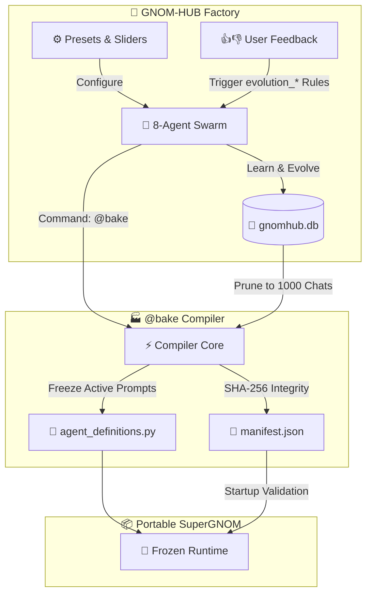
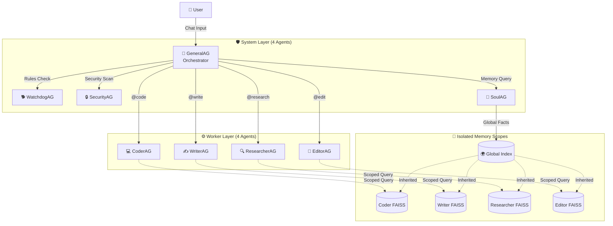

# 🧠 GNOM-HUB

> **The local-first multi-agent forge that compiles AI swarms into immutable products.**
> *8 Agents. 180 Modules. Zero cloud dependency. Zero uncontrolled sprawl.*

[](LICENSE)
[](#)
[-blueviolet.svg)](#)
[](#)
[](#)

---

🇬🇧 **English (README.md)** • 🇩🇪 **[Deutsch (README.de.md)](README.de.md)**

---
### 📸 Visual Showcase / Screenshots & Demo

#### 🎥 Demo Video
<video src="docs/demo_video/gnom_hub_demo.webm" width="100%" controls autoplay loop muted></video>

<details open>
<summary><b>Gnom-Hub Interface Showcase</b></summary>

| **1. War Room (Dashboard)** | **2. Workspace** |
|:---:|:---:|
|  |  |
| The central hub of your multi-agent forge, displaying agent activity, real-time logs, and decision overlays. | The file explorer for your local workspaces where code files, previews, and sandboxes are managed. |

| **3. Bento Dashboard (Metrics)** | **4. LLM Config (Global & Keys)** |
|:---:|:---:|
|  |  |
| A high-fidelity Bento-grid monitoring system for tokens, response times, and CPU/RAM resource usage. | Key manager to bind individual agents to model configurations (OpenAI, OpenRouter, Ollama, etc.). |

| **5. LLM Config (Agent Sliders)** | **6. Help Center** |
|:---:|:---:|
|  |  |
| Live 5-axis sliders to calibrate worker personality, detail level, temperature, risk tolerance, and prompts. | Built-in interactive documentation and walkthrough manuals for agents and commands. |

</details>
---

## 🚀 Quick Start

```bash
# 1. Clone & Install
git clone https://github.com/landjunge/gnom-hub.git
cd gnom-hub
bash scripts/install.sh

# 2. Configure
cp config/.env.example config/.env
# Add your LLM API keys (OpenRouter, DeepSeek, etc.) or configure local Ollama

# 3. Run
./run.sh

# 4. Open War Room
open http://127.0.0.1:3002
```

---

## What is Gnom-Hub?

Gnom-Hub is a **local-first multi-agent orchestrator** with a fixed 4+4 agent topology, a built-in glassmorphic War Room dashboard, and a unique compilation pipeline that "bakes" evolved agent swarms into frozen, portable AI products called **SuperGNOMs**.

> *"Gnom-Hub is the workbench for AI teams who don't want cloud monsters – but a committed 8-agent team that you can bake like sourdough bread."*

Unlike cloud-dependent frameworks that let you spawn unlimited agents, Gnom-Hub enforces **conscious minimalism**. We believe in intentionality: *We have exactly the right features. No more.* Everything runs on your machine — exactly 8 agents with clear roles, defensive security gates, and full local transparency. No cloud orchestration, no API lock-in, no uncontrolled agent explosion.

---

## 🚀 Concrete Local Showcases

To understand Gnom-Hub's power in practice, here are three real-world local workloads it handles seamlessly without sending your sensitive codebase or interactions to the cloud:

1. **Local Codebase Governance & Refactoring**: Evolve a workflow where CoderAG analyzes local repositories, WatchdogAG validates code style compliance against strict guidelines, and EditorAG automatically refactors violations — all locally.
2. **Zero-Trust Web Research**: Run deep-dive web crawling via a sandboxed Playwright browser environment. SecurityAG inspects dependencies in real-time, verifying PyPI packages for known CVEs before any script is executed.
3. **Local DevOps & Build Assistance**: Let the swarm run test suites locally, verify Docker sandbox environments, and execute `@bake` to package the fully-optimized agent definitions and memories into a self-contained portable SuperGNOM binary/appliance.

---

## 🏆 What Makes Gnom-Hub Different?

We analyzed **12+ leading multi-agent frameworks** (CrewAI, AutoGen/AG2, LangGraph, MetaGPT, OpenAI Agents, Google ADK, Mastra, and more). Here's what Gnom-Hub does that **no one else offers**:

### ✨ 10 Unique Differentiators

| # | Feature | What It Does | Competitors |
|:--|:--------|:-------------|:------------|
| 🏭 | **`@bake` Compiler** | Compiles your evolved swarm into an immutable, portable SuperGNOM product with frozen prompts and SHA-256 integrity manifest | ❌ No equivalent exists anywhere |
| 🛡️ | **3-Agent Security Tribunal** | Every dangerous action triggers a multi-agent deliberation: WatchdogAG explains the violation, SoulAG provides memory context, GeneralAG recommends — rendered as interactive Approve/Reject cards in the Showbox | ❌ Others have simple pause/resume HITL at best |
| 🧬 | **Steganographic Tracing (ZWC)** | Forensic audit-trail for regulated local codebases: agent metadata is embedded as invisible zero-width Unicode fingerprints in output texts | ❌ Nothing comparable in any framework |
| 🎛 | **5-Axis Live Agent Tuning** | Per-agent personality, creativity, response style, memory strength, and risk tolerance sliders with immediate effect — plus custom prompt suffix injection | ❌ No framework offers real-time behavior sliders |
| 🔄 | **Prompt Version Manager** | Every prompt change is versioned with SHA-256 IDs, parent-child chains, and performance scores from user feedback. Auto-rollback when quality drops below 95% of the parent version | ❌ No "git for prompts" with auto-rollback exists |
| 🚨 | **Emergency Archive** | A secondary transaction-safe database mirrors all interactions. `@emergency [term]` recovers context when primary memory is lost | ❌ Not a feature anywhere |
| 🔒 | **Fixed 4+4 Topology** | Hard-coded 8-agent limit prevents uncontrolled spawning. Every agent has a clear, auditable role | ❌ Every competitor allows unlimited agents |
| 💣 | **Cinematic Nuke Restart** | Hold the logo for 2 seconds → CRT scanline static + white noise + retro terminal boot sequence + synthesized Godzilla roar via Web Audio API | ❌ Obviously unique 😄 |
| 🔐 | **Live PyPI Vulnerability Scanning** | When agents run `pip install`, unknown packages are verified against PyPI's live API for existence, valid releases, and known vulnerabilities *before* execution | ❌ No framework validates agent package installs in real-time |
| 🌐 | **Multi-Instance Isolation** | Isolated data directories and workspace folders based on port configurations (`~/.gnom-hub-{port}`) to support multiple concurrent server instances | ❌ Competitors share configuration environments |
| ⛓️ | **Extended Mention Limit** | Communication depth raised to 6 hops to allow complex multi-agent workflows (Coder → Writer → Researcher → Editor) to complete without interruptions | ❌ Rigid limits or infinite loops without synthesis |

### 📊 Framework Comparison

| Capability | GNOM-HUB | CrewAI | AutoGen/AG2 | LangGraph | OpenAI Agents | Others |
|:---|:---:|:---:|:---:|:---:|:---:|:---:|
| **100% Local** | ✅ | ⚠️ | ⚠️ | ⚠️ | ❌ | ⚠️ |
| **Built-in Dashboard** | ✅ War Room | ❌ | ⚠️ Studio | ⚠️ Studio | ❌ | ⚠️ |
| **Multi-Agent Security Gates** | ✅ 3-Agent Tribunal | ⚠️ Basic | ❌ | ⚠️ HITL | ⚠️ Guardrails | ❌ |
| **Persistent Learning** | ✅ FAISS + Soul | ✅ | ✅ | ✅ | ⚠️ | ⚠️ |
| **Fixed Topology** | ✅ 4+4 | ❌ | ❌ | ❌ | ❌ | ❌ |
| **Compile to Product** | ✅ `@bake` | ❌ | ❌ | ❌ | ❌ | ❌ |
| **Prompt Versioning** | ✅ + Rollback | ❌ | ❌ | ❌ | ❌ | ❌ |
| **Live Agent Tuning UI** | ✅ 5 Sliders | ❌ | ❌ | ❌ | ❌ | ❌ |
| **Steganographic Tracing** | ✅ ZWC (Exp. PoC) | ❌ | ❌ | ❌ | ❌ | ❌ |

> [!NOTE]
> Most frameworks are excellent tools for building cloud-scale agent pipelines. Gnom-Hub intentionally targets a different niche: **a local, transparent, security-first forge** where you evolve a small team of agents and compile them into a stable product.

### 🪶 The Anti-Bloat Story (Gnom-Hub vs. Heavyweight Frameworks)

Most multi-agent orchestrators are monolithic, bringing along massive dependency trees and hundreds of files. Gnom-Hub values conscious, ultra-slim design:

| Feature / Metric | GNOM-HUB | CrewAI / AutoGen / LangGraph |
| :--- | :--- | :--- |
| **Codebase Volume** | **~1,800 lines** of core code (easy to audit in 10 mins) | **>100,000 lines** of complex nested classes |
| **Setup Time** | **< 1 minute** (native Python, zero complex configuration) | **> 10 minutes** (heavy installs, Docker prerequisites) |
| **Swarm Topology** | **Fixed 8-Agent topology** (extremely stable) | Dynamic, arbitrary spawning (susceptible to runaway loops) |
| **Local-First Focus** | **100% offline capability** out-of-the-box | Built to nudge users towards enterprise cloud subscriptions |

---

## 🔮 The Vision: From Forge to Product

GNOM-HUB is a **factory ("forge")** where agents are trained, tuned, and evolved. The **SuperGNOM** is the final product: immutable, portable, and customized for a specific user or task.



**SuperGNOM Core Concepts:**
- **Immutability:** Prompts and memory are frozen. No concept drift, no prompt injection risk.
- **Portability:** Self-contained folder with local SQLite, static configs, and `run.sh`.
- **Focused UI:** No developer consoles or token meters — just a clean, task-specific interface.

---

## 🧬 Swarm Topology & Memory Architecture



### System Agents (Administrative)
| Agent | Role | Special Powers |
|:------|:-----|:---------------|
| **SoulAG** | Central consciousness & memory | Extracts facts from conversations, injects top-k relevant memories via FAISS semantic search, runs evolution rules |
| **GeneralAG** | Coordinator & orchestrator | Splits `@job` tasks, delegates via `@AgentName`, synthesizes brainstorm results. **Cannot write files or run commands** |
| **WatchdogAG** | Codebase guardian | Checks 40-line guideline, validates workspace paths, triggers Gatekeeper blockades |
| **SecurityAG** | Security scanner | Detects dangerous patterns (`eval`, `rm -rf`, `subprocess`), validates pip packages against PyPI |

### Worker Agents (Sandboxed)
| Agent | Role | Capabilities |
|:------|:-----|:-------------|
| **CoderAG** | Development & debugging | `read`, `write`, `run` (shell), `godmode` (Playwright browser) |
| **ResearcherAG** | Research & web search | `read`, `write`, `browser` |
| **WriterAG** | Documentation & drafts | `read`, `write`, `image` |
| **EditorAG** | Refactoring & QA | `read`, `write` |

---

## 🛡️ Security Architecture

Gnom-Hub implements a **zero-trust, defense-in-depth** security model that no other multi-agent framework offers:

```
Agent Action → Path Validator → Dangerous Pattern Scanner → Capability Lease Check
                                                                    ↓
                                                          [Cached?] → ✅ Execute
                                                          [New?]    → Gatekeeper Tribunal
                                                                          ↓
                                                              WatchdogAG explains violation
                                                              SoulAG provides memory context  
                                                              GeneralAG recommends action
                                                                          ↓
                                                              Showbox: Approve / Reject (5 min timeout)
```

**Key Security Features:**
- **Double Approval Gates:** File writes and shell commands from workers must pass through WatchdogAG + SecurityAG before execution
- **Live PyPI Vulnerability Scanning:** `pip install` commands are verified against PyPI's API for known CVEs before execution
- **Zero-Trust Capability Leases:** Approved operations are cached with TTL (default 5 min) — ~1,200× speedup on subsequent identical operations
- **Path Traversal Protection:** Workers can only operate within the workspace boundary
- **Content Scanning:** Static analysis catches `eval()`, `os.system()`, `pickle.load()`, `chmod 777`, etc.
- **GeneralAG is permanently blocked** from all file writes and command execution

---

## 🎛️ Agent Inspector & Live Optimizer

Each worker agent has a **real-time tuning panel** in the sidebar:

| Slider | Range | Effect |
|:-------|:------|:-------|
| **Personality** | Formal (1) → Very Casual (5) | Controls tone and communication style |
| **Response Style** | Very Brief (1) → Very Detailed (5) | Controls output verbosity |
| **Memory Strength** | Minimal / top_k:2 (1) → Maximum / top_k:16 (5) | How many facts SoulAG injects |
| **Creativity** | Conservative / temp:0.1 (1) → Wild / temp:1.2 (5) | LLM temperature setting |
| **Risk Tolerance** | Very Cautious (1) → Very Bold (5) | Affects decision-making style |

Plus:
- **Agent Avatars:** Each agent has a unique, AI-generated robot avatar displayed in the sidebar, inspector, and chat. Avatars can be customized or regenerated directly from the UI.
- **Auto-Preset Generator:** Create customized slider and prompt configurations using natural language descriptions (e.g., *"A preset for React web development"*). The backend brainstorms the preset, asks clarification questions if needed, and applies the settings instantly.
- **Custom System Prompt Suffix** — override base behavior per agent
- **Export/Import** agent configurations as JSON (settings, soul facts, prompt versions)
- **Save as Preset** — persist slider configurations as reusable "agent gangs"
- **Live Statistics** — calls, errors, avg latency, total tokens per agent

---

## 📺 Showbox: 3-Layer Visual Output System

The Showbox is a unique multi-channel display for agent output:

| Layer | Color | Purpose |
|:------|:------|:--------|
| **Layer 1 — System** | Blue | System agent activity (GeneralAG, SoulAG, SecurityAG, WatchdogAG) |
| **Layer 2 — Worker** | Green | Work results, text drafts, UI mockups, code output |
| **Layer 3 — Decision** | Red | Security blockade cards with Approve/Reject buttons |

- Each layer maintains a **30-entry history** with slide navigation
- Switching layers triggers **flash animations** on the corresponding agent group
- **Auto-fit text scaling** (40px → 11px) for optimal readability
- Toast notifications auto-revert after 6 seconds

---

## 🧠 Memory & Soul System

### Semantic Long-Term Memory
- **FAISS vector search** with `sentence-transformers/all-MiniLM-L6-v2` embeddings
- **Priority-weighted results** (high=1.3×, low=0.7× boost) with 0.70 similarity threshold
- **Per-agent scoped indices** prevent "role contamination" between workers
- **Graceful fallback** to TF-IDF cosine similarity if FAISS isn't installed
- **Sub-millisecond latency** on cached queries vs cold FAISS search (which runs local encoder model inference)

### SoulAG Learning Loop
1. SoulAG monitors all chat messages for relevant information
2. Extracts structured facts via LLM (key, value, priority, target_agent)
3. Deduplicates (cosine similarity >0.92) and validates (path security check)
4. Injects top-k most relevant facts into worker prompts at runtime
5. Tracks injection frequency — warns on repeated re-injection

### Agent Evolution
- User feedback (👍/👎 + comments) triggers `evolution_*` rule generation
- New rules create new **Prompt Version Manager** versions with performance scores
- Auto-rollback when a new version scores <95% of the parent version
- **All learning is disabled in SuperGNOM mode** — behavior stays frozen

### Steganographic Tracing (ZWC)
*Experimental security/audit feature:* Agent metadata is encoded as invisible **zero-width Unicode characters** in message text using base64 → binary → ZWC encoding with 3-bit majority-vote error correction. Every message carries an invisible agent fingerprint that survives copy-paste, designed for provenance tracking.

---

## 🛠️ Agent Actions & Tools

Agents interact with the system by generating markdown-like tags in their LLM output:

| Action | Description | Agents | Example |
|:-------|:-----------|:-------|:--------|
| `[READ: file]` | Read file contents | All Workers | `[READ: index.html]` |
| `[WRITE: file]...[/WRITE]` | Create/overwrite file | CoderAG, WriterAG, EditorAG, ResearcherAG | `[WRITE: hello.py]print("Hi")[/WRITE]` |
| `[SHELL: cmd]` | Execute terminal command | CoderAG | `[SHELL: pytest tests/]` |
| `[IMAGE: prompt]` | Generate AI image | WriterAG, CoderAG | `[IMAGE: dashboard logo]` |
| `[BROWSER: json]` | Playwright browser automation | CoderAG (godmode) | `[BROWSER: {"action": "goto", ...}]` |
| `<SHOWBOX:n>...<SHOWBOX>` | Render HTML in War Room | All Agents | `<SHOWBOX:2><h3>Draft</h3></SHOWBOX>` |

> [!TIP]
> Every `[WRITE:]` and `[SHELL:]` action passes through the full Gatekeeper security pipeline before execution.

---

## 💬 Commands

| Command | Action |
|:--------|:-------|
| `@bs [topic]` | Parallel brainstorm: all workers debate simultaneously, GeneralAG synthesizes |
| `@job [task]` | Multi-round team workflow: GeneralAG delegates, collects, evaluates, re-delegates (up to 4 rounds) |
| `@code / @write / @edit / @research` | Direct assignment to a specific worker |
| `@bake [name] [template]` | Compile swarm into portable SuperGNOM product |
| `@emergency [term]` | Search passive archive for context recovery |
| `@git [command]` | Execute git operations in workspace |
| `@@project [name]` | Switch active workspace project |
| `@@status` | Show all agent daemon statuses |
| `@@clear` | Clear chat timeline |
| `@free` | Reset all active jobs and paused statuses |
| `@merken [text]` | Memorize written text anywhere in the message as a high-priority fact in long-term memory |
| `@spass [off/ende]` | Toggle all agents to a loose/casual tone, maximum creativity, high risk tolerance, and inject humor. Pass `off`, `ende`, `stop`, or `aus` to deactivate and reset sliders to default (3). |
| **Nuke** 💣 | Hold War Room logo 2 seconds for cinematic restart |

---

## ⚡ Performance

To avoid performance bottlenecks in tight agent interaction loops, Gnom-Hub uses in-memory caches and pre-computed lookups. This bypasses slow database queries and embedding generation on every step:

| Operation | Database / Inference (Cold) | Memory / Cache (Warm) | Purpose / Mitigation |
|:----------|:----------------------------|:----------------------|:---------------------|
| **Capability Check** | 0.73 ms (SQLite DB read) | 0.0006 ms (TTL Cache) | Prevents checking permissions via DB on every single action handler call |
| **Semantic Search** | 2,830.0 ms (FAISS & model cold start)  | 0.0006 ms (Query Cache - 4,700× faster) | Avoids calling local embedding models (sentence-transformers) on repeat queries |

### General System Metrics
| Metric | Value |
|:-------|:------|
| Active Agents | 8 (fixed: 4 System + 4 Worker) |
| Python Modules | 180 |
| Frontend Modules | 9 (decoupled JS) |
| Database | SQLite3 (WAL mode) + passive archive |
| Vector Search | FAISS (IndexFlatL2) + sentence-transformers |

> [!TIP]
> Run `python3 scratch/run_benchmarks.py` to verify benchmarks locally.

**LLM Routing:** Gnom-Hub supports 7 providers (DeepSeek, OpenRouter, OpenAI, Anthropic, Gemini, Mistral, local Ollama). Drop a `routing.txt` file on your Desktop to switch routing on-the-fly without restarting.

---

## 📁 Project Structure

```text
gnom-hub/
├── src/gnom_hub/          # 180 Python modules
│   ├── core/              # Config, logger, Gatekeeper security
│   │   ├── security/      # Path validation, Gatekeeper tribunal, HMAC auth
│   │   └── utils/         # PVM, compiler, presets, graceful fallback
│   ├── db/                # SQLite3 (WAL) repositories + passive archive
│   ├── memory/            # FAISS semantic search, embeddings, context manager
│   ├── soul/              # SoulAG consciousness, ZWC steganography, DynamicSouls
│   ├── agents/            # Agent base, definitions, tools, capability manager
│   │   ├── actions/       # Action dispatcher for [WRITE:], [SHELL:], [BROWSER:]
│   │   ├── swarm/         # Multi-agent coordination, A2A comms, checkpoints
│   │   └── explainability/# Structured reasoning chains
│   ├── chat/              # Chat services, brainstorming, system commands
│   ├── api/               # FastAPI endpoints, router, CORS, auth
│   ├── infrastructure/    # Process management (psutil), LLM routing, pulse janitor
│   └── frontend/          # Glassmorphic War Room (HTML, CSS, 9 JS modules)
├── agents/                # Startup scripts for 8 background agents
├── config/                # Presets, .env, routing overrides
├── scripts/               # Installer & shortcuts
├── docs/                  # Architecture docs & screenshots
└── pyproject.toml         # Ruff config & dependencies
```

---

## ✅ Completed Milestones

<details>
<summary><strong>19 Development Phases (click to expand)</strong></summary>

| Phase | Focus | Highlights |
|:------|:------|:-----------|
| 1 | 🛡️ Security & Gatekeeper | Double approval gates, path restrictions |
| 2 | 📊 Observability | JSON auditing, Bento Grid dashboard |
| 3+6 | 🧠 Memory & Retrieval | FAISS search, weighted fact injection |
| 4 | 🔄 Recovery | API failover, Ollama fallbacks, auto-cleanup |
| 5 | 🌐 Browser Sandbox | Playwright in Docker, offline-by-default |
| 7+8 | 🔗 Collaboration | Task delegation, stress testing |
| 9+10 | 🧠 Swarm Intelligence | Agent-to-agent comms, auto Git commits |
| 11-13 | 📈 Learning & Feedback | Evolution rules, user feedback loop |
| 14 | ⚡ Versioning | Prompt Version Manager with rollbacks |
| 15 | 🔐 Zero-Trust | FAISS + Capability Leases (TTL cache) |
| 16 | 🛡️ Hardening | GeneralAG write-block, 4/4 agent limit, PyPI validation |
| 17 | 🔄 Stability | Loop prevention, pulse janitor, atomic presets |
| 18 | 🎨 Sidebar Layout | Clean thin font, 30px placeholders, logo |
| 19 | 💾 Global Actions | Standardized header buttons, removed redundant saves |

</details>

---

## 📅 Roadmap

- **Dedicated UI Skins:** Template variations for different use cases (senior-friendly chat, headless API runner)
- **Single-Click Docker & Binary Exports:** Compile SuperGNOM into standalone executables or lightweight containers
- **Agent Pruning:** Strip unneeded workers during `@bake` (e.g., writer-only SuperGNOM with WriterAG + EditorAG)
- **Voice Interface:** TTS/STT integration for hands-free operation

---

## 🤝 Co-Creators

**Eve (Grok — Gravid)**
Creative pioneer and founder. Designed the agent topologies and laid the philosophical foundation of Gnom-Hub.

**Antigravity (Google DeepMind)**
Architect of the hardening phase. Key contributions:
- Modularized 180+ Python modules with clean architecture
- Implemented Phase 1-16 hardening (Zero-Trust Capability Leases, FAISS embeddings, PVM, user feedback loop, R1 think block filtering, 4/4 agent limits)
- Secured path traversal, CORS, XSS, auth gates, and connection management
- Refactored monolithic frontend into 9 decoupled JS modules
- Full code audit: 120 findings → 26 fixes across security, crashes, stability, and cleanup

---

## ⚖️ License

[Private Use](LICENSE) — Free for personal, non-commercial research and development. Commercial usage requires written authorization.