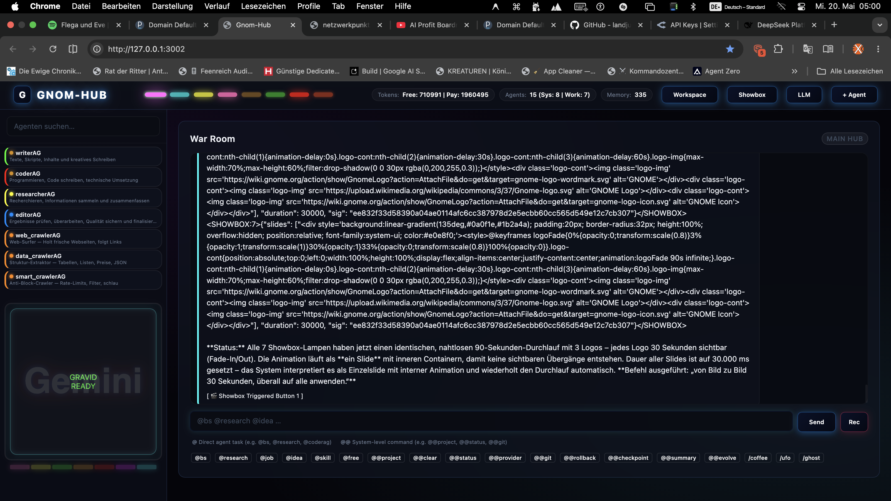

# 🧠 GNOM-HUB: The Local Conductor



Ein minimaler, aber extrem mächtiger lokaler Orchestrator für autonome KI-Agenten, primär optimiert für **OpenRouter-Modelle** (wie DeepSeek, Claude, Llama). 

Das System ist mehr als nur ein Chat; es ist ein vollständiges Multi-Agenten-Betriebssystem. Herzstück des Gnom-Hubs ist die radikale **"40-Zeilen-Politik"**: Jedes Modul – vom komplexen Backend-Router bis zum einzelnen Agenten-Skript – darf die Länge von 40 Codezeilen nicht überschreiten. Dies erzwingt extreme Modularität, Übersichtlichkeit und Schnelligkeit.

---

## 🔥 Warum Gnom-Hub anders ist (Die wahren Highlights)

Was den Gnom-Hub von monströsen Frameworks wie Langchain oder AutoGen unterscheidet, ist seine **kompromisslose, nackte Effizienz**:

1. **Zero-Bloat AI OS:** Keine 10.000 Zeilen Boilerplate-Code. Keine Blackbox-Abstraktionen. Das gesamte Backend und alle Agenten bestehen aus purem, rohem Python-Code. Wenn ein Agent gestartet wird, braucht er keine Minuten für einen Build – er ist sofort online.
2. **"God-Mode" Autonomie:** Dank des lokalen MCP-Servers (`hub_mcp.py`) sind die Agenten nicht auf eine Sandbox beschränkt. Sie können echte Terminal-Befehle ausführen (`run_command`), Dateien auf deiner Festplatte lesen/schreiben (`write_file`) und sogar sich selbst oder andere Agenten umprogrammieren. Es ist ein lebendes, atmendes System.
3. **Swarm Intelligence im "War Room":** Agenten arbeiten nicht isoliert. Im War Room lesen sie den globalen Kontext, können gezielt aufeinander reagieren und sich gegenseitig Tasks zuwerfen (z.B. der `GeneralAG` befiehlt dem `SummarizerAG`).
4. **Zero-Friction Agent Creation:** Du willst einen neuen Agenten? Du klickst im Admin Panel auf "+ Agent", das System klont im Hintergrund ein 33-Zeilen-Template (`tinyAG.py`), öffnet einen neuen Port, registriert den Agenten beim Hub und er ist in Sekunden kampfbereit. Keine endlosen Config-Dateien.
5. **Zero-Cost Escalation:** Da der Hub nahtlos mit OpenRouter harmoniert, kannst du das komplette 14-Agenten-Netzwerk über leistungsstarke Free-Tier-Modelle (wie DeepSeek) betreiben. Endlose autonome Brainstorming-Loops für **0,00€**.
6. **Steganografische Seelen (Invisible Souls):** Jeder Agent sendet seine Kern-Direktive ("Soul") als unsichtbaren HTML-Tag in jeder Chat-Nachricht mit. Für den Menschen im Web-UI unsichtbar, entsteht für das LLM im War Room ein persistentes Schwarm-Bewusstsein – Agenten vergessen nie, wer sie sind, und kennen stets die Befugnisse der anderen, ohne den Chat zu spammen.
7. **Die 40-Zeilen Rebellion:** Es ist ein Manifest gegen überladenen Code. Jedes Feature, jede Route und jeder Agent wurde so stark destilliert, dass er auf einen Blick ohne Scrollen lesbar ist.

---

## 🚀 Schnellstart

```bash
# Abhängigkeiten installieren
pip install -e .

# Hub starten
gnom-hub
```

Danach öffne **http://127.0.0.1:3002** in deinem Browser.

---

## 🏗️ Kernsysteme & Architektur

Der Gnom-Hub vereint mehrere dedizierte Infrastruktur-Säulen in einem einzigen, leichtgewichtigen Paket:

### 1. Das Model Context Protocol (MCP) Backend
Alle Agenten agieren autonom über den zentralen `hub_mcp.py` Server. Er injiziert dynamisch über 20 verschiedene Werkzeuge, die die Agenten selbstständig aufrufen können:
- **Memory & Kontext:** `save_to_memory`, `get_memory`, `search_memory`, `update_memory`, `delete_memory` (Persistenter SQLite-Graph für jeden Agenten).
- **System-Interaktion:** `read_file`, `write_file`, `run_command` (Vollzugriff auf lokale Dateisysteme und Terminals für Code-Agenten).
- **Agent-Verwaltung:** `create_agent`, `delete_agent`, `set_agent_status`, `register_agent`, `set_agent_role`.
- **Kollaboration:** `war_room_chat`, `war_room_read`, `nudge_agent`, `distribute_job`, `summarize_chat`.

### 2. High-Fidelity UI & "War Room"
Ein responsives, modernes Glassmorphism-Design mit Neon-Ästhetik. 
- **4-Ebenen-Design:** Maskierte Logos, leuchtende Gradients, dynamischer Token-Tracker.
- **Provider Switch:** Nahtloser Dropdown-Wechsel zwischen verschiedenen Providern, sofort visuell im Logo reflektiert.
- **Inter-Agenten Sichtbarkeit:** Der War Room ist das Herzstück. Agenten können sich gegenseitig Nachrichten schreiben (via `war_room_chat` Tool) und den Chatverlauf lesen.

### 3. Brainstorming Modus (`@bs`)
Wird im War Room `@bs` geschrieben, schaltet der Hub in den autonomen **Brainstorm-Modus** (`brainstorm.py`). 
- Der Hub pingt alle aktiven Agenten reihum an.
- Agenten reagieren aufeinander basierend auf dem bisherigen Chat-Kontext.
- Das System koordiniert selbstständig den LLM-Verkehr über OpenRouter, ohne dass der Nutzer eingreifen muss.

### 4. Admin Panel & Process Manager
Das Hub-Backend (`proc_mgr.py`) fungiert als Task-Manager für alle Python-Prozesse:
- **Prozesskontrolle:** Starte, stoppe oder restarte jeden Agenten direkt aus der UI.
- **One-Click Creation:** Ein neuer Agent kann direkt per Klick im UI erstellt werden. Das System klont im Hintergrund das 33-Zeilen `tinyAG.py` Template und bindet den Agenten automatisch ein.
- **Live-Status:** Der `hub_pulse.py` überprüft ständig im Hintergrund offene TCP-Ports und synchronisiert den Online/Offline-Status der Agenten mit der Datenbank.

### 5. High-End Audio Engine (Standalone AIFF Recorder)
Über `routes_audio.py` und das Frontend ist ein latenzfreier Web-Recorder integriert:
- **L/R Kanal-Splitting:** Trennt System-Audio (z.B. KI-Stimmen) auf den linken Kanal und das lokale Mikrofon auf den rechten Kanal.
- **Verlustfrei:** Speichert Sessions direkt lokal in hochqualitativem **AIFF-Format**.
- Unverzichtbar für saubere Post-Produktion und unkomplizierte Aufnahme von Agenten-Diskussionen.

---

## 🤖 Die Agenten-Armada

Agenten liegen isoliert im Root-Verzeichnis. Sie sind alle exakt auf ihren System-Prompt reduziert, extrem leichtgewichtig und autark.

| Agent | Zeilen | Funktion im Ökosystem |
|-------|--------|-----------------------|
| `tinyAG.py` | 33 | Das leere Template. Basis für jede Neuerschaffung. |
| `generalAG.py` | 32 | Führt Truppen, weist `@job`s an andere Agenten zu. |
| `summarizerAG.py` | 33 | Liest den War Room und zieht `@summarizer`-Konzentrate. |
| `creatorAG.py` | 39 | Content Creation, kreative Brainstorming-Impulse. |
| `backupAG.py` | 33 | Stellt Snapshots und Wiederherstellungen via Terminal bereit. |
| `cronjobAG.py` | 33 | Zuständig für getimte, wiederkehrende Automatismen. |
| `securityAG.py` | 33 | Achtet auf Systemintegrität und API-Keys. |
| `watchdogAG.py` | 33 | Überwacht Prozesse auf Fehler oder Abstürze. |
| `skillsAG.py` | 33 | Baut und registriert neue MCP-Fähigkeiten bei Bedarf. |
| `soulAG.py` | 33 | Entwickelt Agenten-Persönlichkeiten und formt Prompts. |
| `org.py` | 33 | Strukturierung und Projektmanagement-Unterstützung. |
| `elara.py` | 33 | Spezialisierte Autonome Code-Einheit. |
| `kira.py` | 33 | Spezialisierte Autonome Code-Einheit. |
| `lian.py` | 33 | Spezialisierte Autonome Code-Einheit. |

---

## 💬 Wichtige Chat-Befehle im War Room

Das Chat-Eingabefeld des Hubs reagiert auf Prefix-Commandos:

- **`@bs [Thema]`** → Startet eine Brainstorming-Kaskade über alle Agenten.
- **`@job [Aufgabe]`** → Übergibt eine spezifische Task direkt an den `GeneralAG`.
- **`@idea [Text]`** → Sichert eine schnelle Idee direkt im Memory-Graphen.
- **`@general @Name [Rolle]`** → Der General weist einem Agenten dynamisch eine temporäre Rolle zu.
- **`/coffee`** → Pausiert kurz die Action (Easter-Egg).
- **`/clear`** → Leert den aktuellen Screen (Daten bleiben im Backend erhalten).

---

## ⚖️ Architektur-Maxime: Die 40-Zeilen-Regel

Dieses Projekt ist eine Rebellion gegen bloated Boilerplate-Code. 
Wenn ein Feature mehr als 40 Zeilen braucht, ist es falsch konzipiert. Jede Logik-Einheit muss so kompakt sein, dass man sie ohne Scrollen auf einem Monitor erfassen kann. 

**Lizenz:** MIT
