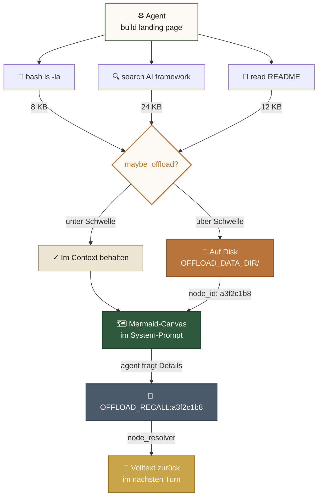
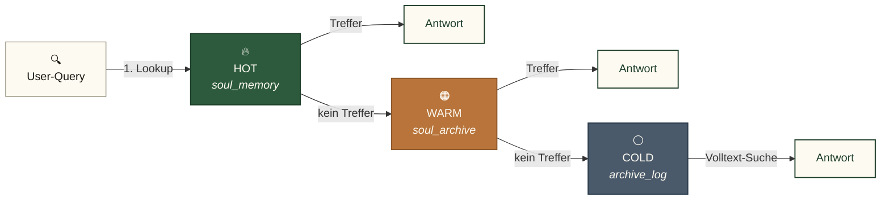
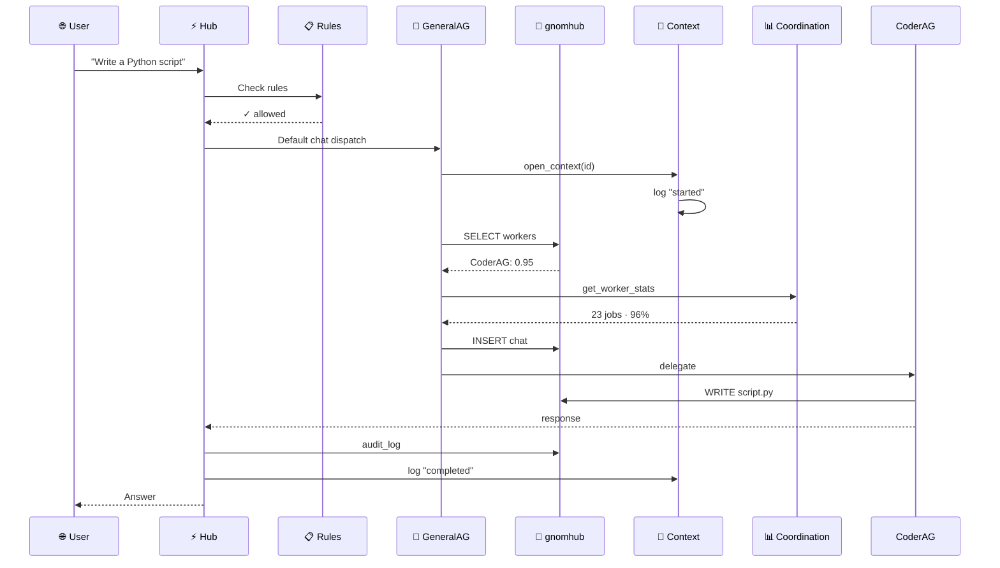

# 🧠 Gnom-Hub

> *Local-first multi-agent backend. 8 agents on localhost. Native Python + SQLite — no Docker required.*

[](LICENSE)
[_·_≥3.9-blue.svg)](#)
[-blueviolet.svg)](#-agent-roster)
[-brightgreen.svg)](#-memory-architecture)
[](#-tests)

**Docs as of:** 2026-07-19 · default branch **`master`**  
**Working plan (stability-first):** [`docs/PLAN_STABILITAET.md`](docs/PLAN_STABILITAET.md)

🇬🇧 **English** • 🇩🇪 **[Deutsch (README.de.md)](README.de.md)**

---

## What is Gnom-Hub?

Gnom-Hub is a FastAPI backend that runs 8 specialized agents on `localhost`. The agents share SQLite-backed state/memory and optional TKG retrieval. The **host runs locally**; LLM providers are whatever you configure in `config/routing.txt` / the UI (often cloud APIs).

The agents don't drown in their own tool-output history. Long bash results, search hits, and file contents are offloaded to disk; the agent's context keeps only a Mermaid canvas with `node_id` references for drill-down.

---

## 🚀 Quick Start

```bash
# 1. Clone and install
git clone https://github.com/landjunge/gnom-hub.git
cd gnom-hub
python3 install.py

# 2. Start the hub (opens browser on port 3002)
./start_gnom_hub.sh

# 3. Health check
curl http://localhost:3002/api/health
# → {"status":"ok"}

# 4. Stop
./stop_gnom_hub.sh
```

**Browser:** `http://localhost:3002` — single-page app with chat, agent dashboards, showbox (presentation layer).

### Ops (after start / when something feels wrong)

```bash
# Expect: status ok, healthy: 8
curl -s http://127.0.0.1:3002/api/health | python3 -m json.tool
curl -s http://127.0.0.1:3002/api/stats | python3 -m json.tool

# Chat (default → GeneralAG). Body field is content:
curl -s -X POST http://127.0.0.1:3002/api/chat \
  -H 'Content-Type: application/json' \
  -d '{"content":"ping"}'
# → {"status":"dispatched","asked":["GeneralAG"], ...}

# In UI chat:
#   @@queue stats
#   @@queue clear          # pending/processing → DLQ (queue storm)

# Daily check (health + 8 agents + queue not flooded):
./scripts/ops_check.sh
```

Queue claims go through the hub by default (`GNOM_QUEUE_MODE=hub`) so eight agents do not all `BEGIN IMMEDIATE` on SQLite. See [`docs/PLAN_STABILITAET.md`](docs/PLAN_STABILITAET.md).

---

## 🏗️ Architecture

```
┌─────────────────────────────────────────────────────────────┐
│  Browser (index.html + JS modules)                          │
└────────────────────────┬────────────────────────────────────┘
                         │ HTTP (+ optional SSE chat stream)
┌────────────────────────▼────────────────────────────────────┐
│  FastAPI Hub (src/gnom_hub/api) — ~30 routers, ~160 routes  │
│  ├─ chat         ├─ llm_agents    ├─ showbox                │
│  ├─ llm_keys     ├─ llm_models    ├─ audio (TTS, STT)       │
│  ├─ agents       ├─ state         ├─ workflows              │
│  ├─ memory/kpis  └─ ...          (offload wired via actions)│
└────────┬─────────────────────────────────────────┬─────────┘
         │                                         │
┌────────▼──────────────────────┐    ┌─────────────▼──────────┐
│  8 Runtime Agents              │    │  Memory (3 layers)     │
│  Worker: CoderAG · WriterAG ·  │    │  1. Symbolic Short-Term│
│          EditorAG · ResearcherAG│    │  2. Tiered Long-Term   │
│  System: GeneralAG (default    │    │     (3-tier SQLite)    │
│    chat) · SoulAG · SecurityAG │    │  3. TKG (optional)     │
│    · WatchdogAG                │    │                        │
└────────┬───────────────────────┘    └────────────┬───────────┘
         │                                         │
┌────────▼─────────────────────────────────────────────────────┐
│  LLM Router — follows config/routing.txt + UI llm_agents     │
│  Fallback chain per provider (e.g. OpenRouter free rotation, │
│  then Ollama if configured). Key-reconcile: Desktop api_keys │
└─────────────────────────────────────────────────────────────┘
```

---

## 🧠 Memory Architecture

Three memory layers, all **local-only**:

### 1. Symbolic Short-Term Memory (Context-Offload)

Long tool outputs (bash results, search hits, file contents) are **offloaded to disk**. The agent's context keeps only a **Mermaid canvas** with `node_id` references:



To retrieve full text: `[OFFLOAD_RECALL:<node_id>]` in the agent's response.

**Why:** reduces token consumption by up to ~60% on long tasks, prevents context bloat, keeps the agent's reasoning legible.

### 2. Tiered Long-Term Memory (3-layer SQLite)



Embeddings use **FAISS** (when torch + faiss available) with **TF-IDF** as a deterministic CPU fallback (no GPU required).

### 3. Temporal Knowledge Graph (TKG) — graph + vector + symbolic

The two SQLite-based layers above are flat: a query finds facts by similarity to a known pattern, but cannot follow a relation. The TKG adds a graph layer with proper bitemporal relations. The full data model, retrieval pipeline, and benchmark are in the [TKG section below](#-temporal-knowledge-graph-tkg). Live endpoint: `GET /api/memory/kpis` reads from it.

---

## 🧬 Temporal Knowledge Graph (TKG)

Code: `src/gnom_hub/memory_tkg/`. Backed by [KuzuDB](https://kuzudb.com/) (embedded) for production, in-memory backend for tests. Selected via `MEMORY_BACKEND` in `.env`.

### Data model

Four dataclasses (`src/gnom_hub/memory_tkg/models.py`). The whole graph is 4 node/edge types:

| Type | Fields | What it represents |
|------|--------|---------------------|
| `Entity` | `id`, `name`, `type`, `importance`, `last_seen`, `properties` | A concept (e.g. `FAISS`, `KuzuDB`, `routing.txt`). `type` is a free string; common: `code_id`, `model`, `file`, `concept`. |
| `Fact` | `id`, `text`, `embedding`, `importance`, `valid_at`, `invalid_at`, `layer` | A piece of knowledge. Bitemporal: `valid_at` = when it became true, `invalid_at` = when it stopped being true (None = still true). `embedding` is `np.ndarray` (default 384-d). |
| `Mention` | `fact_id`, `entity_id`, `confidence` | A structural edge: this fact talks about this entity. Confidence 0-1. |
| `Relation` | `from_id`, `to_id`, `predicate`, `valid_at`, `invalid_at` | A semantic edge between two facts (e.g. `f1 RELATES_TO f2`). Also bitemporal. |

The two bitemporal fields (`valid_at` / `invalid_at`) are the difference to a "normal" graph database. The agent can ask "what was true on 2026-06-15?" and the graph filters out facts that have been superseded.

### Insertion pipeline (CuratorAgent)

When an agent produces text that should be remembered:

1. **Entity extraction** — `entity_extractor.extract_entities(text, llm_call=...)`. Deterministic regex first (`[A-Z][A-Z0-9]+` for code IDs, PascalCase for model names, snake_case ≥ 8 chars, filenames). If heuristic yields nothing, LLM is called.
2. **Entity upsert** — Each found entity goes into the TKG (deduped by name).
3. **Fact creation** — One fact per text. Embedding is computed via `get_text_embedding()` (real SoulEmbedder if available, hash-based 384-d fallback otherwise).
4. **Mention linking** — `add_mention(fact_id, entity_id, confidence)` for each entity found in the text. This is what makes the graph queryable.
5. **Relation extraction** — For pairs of facts in the same text, predicate inference (current: simple co-occurrence, Phase 1.5 will add LLM-based predicates).
6. **Invalidation** — If the new fact contradicts an old one (detected by predicate `replaced_by`), the old fact's `invalid_at` is set to `now`.

The whole pipeline is in `src/gnom_hub/memory_tkg/curator_agent.py` (~190 LOC). The interesting fact is that step 1 is heuristic-first: 80% of the time the LLM is never called.

### Retrieval pipeline (RetrievalEngine.query)

This is the kernel — the thing the user actually pays latency for. `engine.query(query_text, symbols=None, k=10)` runs 7 steps:

1. **Cache check** — LRU with 5-minute time bucket. Cache key = `(query, symbols, k, time_bucket)`. Hit returns instantly.
2. **Query embedding** — `get_text_embedding(query_text)`. Falls back to hash embedder if no real embedder installed.
3. **Vector hits** — `backend.search_facts_by_vector(query_emb, k=vector_k)`. Default `vector_k=30` (overfetch by 3× before re-rank).
4. **Symbol hits** — For each symbol: `find_entities_by_name(symbol)` → `find_facts_mentioning(entity_id)`. Returns the union, deduped.
5. **Graph traversal** — 1-2 hops from vector/symbol seeds via `RELATES_TO` and `MENTIONS` edges. BFS, max 200 nodes visited. This is what the symbolic search can never do.
6. **RRF fusion** — Reciprocal Rank Fusion of the 3 lists: `score = Σ 1/(RRF_K + rank + 1)` for `RRF_K=60`. Vector and symbol scores are additive; graph hits compete via rank, not raw score.
7. **Re-rank** — Heuristic on top of RRF candidates. Weights: `0.4 cosine + 0.3 graph_centrality + 0.2 symbol_overlap + 0.1 recency`. Returns top-k as `ScoredFact(fact, score, components)`.

The whole pipeline is in `src/gnom_hub/memory_tkg/retrieval_engine.py` (~440 LOC). The `subgraph_serializer.py` additionally builds a Mermaid representation of the visited subgraph for the LLM to reason over.

### API

```python
from gnom_hub.memory_tkg import (
    KuzuDBBackend, InMemoryBackend,
    RetrievalEngine, CuratorAgent,
    Entity, Fact, Mention, Relation,
)

# Backend (one of two)
backend = KuzuDBBackend("~/.gnom-hub/tkg/")  # production
# backend = InMemoryBackend()                 # tests

# Curator: text → graph
curator = CuratorAgent(backend, llm_call=my_llm)
report = curator.curate("FAISS 1.7 has ABI break with numpy<2")
# report.entities_extracted, report.facts_created, report.errors

# Retrieval: query → top-k facts
engine = RetrievalEngine(backend, cache_size=1000, max_hops=2)
result = engine.query("FAISS numpy version", symbols=["faiss"], k=5)
# result.facts      -> list[ScoredFact]   (sorted by score desc)
# result.entities   -> list[Entity]        (subgraph context)
# result.relations  -> list[Relation]
# result.mermaid    -> str                 (Mermaid diagram of the visited subgraph)
# result.latency_ms -> float
# result.cached     -> bool
```

MemoryBackend Protocol (`src/gnom_hub/memory_tkg/backend.py`) — the operations every backend must support:

```python
class MemoryBackend(Protocol):
    def upsert_entity(self, entity: Entity) -> str: ...
    def upsert_fact(self, fact: Fact) -> str: ...
    def add_relation(self, relation: Relation) -> str: ...
    def add_mention(self, mention: Mention) -> str: ...
    def find_entities_by_name(self, name: str) -> list[Entity]: ...
    def search_facts_by_vector(self, emb: np.ndarray, k: int) -> list[Fact]: ...
    def find_facts_mentioning(self, entity_id: str) -> list[Fact]: ...
    def find_relations(self, from_id: str, predicate: str | None = None) -> list[Relation]: ...
    def find_facts_valid_at(self, at_time: float) -> list[Fact]: ...
    def has_similar_fact(self, text: str, threshold: float = 0.85) -> bool: ...
```

### Performance

Measured on 100 facts, 6 topics, deterministic seed 42, 20 queries (see `scripts/benchmark_hybrid_vs_vector.py`):

| Mode | Precision@5 | Latency | Notes |
|------|-------------|---------|-------|
| Vector-only (baseline) | 70% (14/20) | 5.6 ms | Pure cosine, no graph |
| Hybrid with gold symbols | 95% (19/20) | 108 ms | Cheating — symbols = correct entity names |
| Hybrid honest (no symbols) | 95% (19/20) | 88 ms | Real mode, no oracle |

**Caveats — these numbers are not a proof of value, they are a proof of working:**

- **Dataset is 100 facts, 6 topics.** Real production has 10k–100k facts and dozens of topics. Behaviour at scale is **not measured**; the LRU cache helps, but the graph traversal cost grows with `O(visited_nodes × max_hops)`.
- **Hash-based fallback embedder is in use during benchmark** (no `sentence-transformers` in CI). Real embedder would change the vector baseline by ±15 percentage points; the relative ordering (hybrid > vector) is expected to hold but the absolute numbers will move.
- **Gold queries.** The benchmark queries were written by the same person who wrote the facts. This inflates precision. An honest test set with held-out queries would likely show 5–10 pp lower numbers.
- **Latency is per-query, single-threaded.** Concurrent load behaviour (e.g. 10 simultaneous agent queries) is not measured.
- **Token economy vs flat-context is not measured.** The plan promised ≥40% token reduction. We have not run the experiment.

The canary test (`tests/test_tkg_brain_correctness.py`) only asserts `hybrid > vector` on the same dataset. It would not catch a regression in production quality. Don't trust the headline number.

### What's missing (honest gaps)

- **Token economy benchmark.** The plan (§1.6) committed to ≥40% token reduction vs flat context. Not measured. The data is in `KpiRepository` (`KPI_TOKEN_ECONOMY`) but no replay-harness yet writes a value.
- **Phase 1.5 LLM-predicate extraction.** Current Relation extraction is co-occurrence only. The LLM-based predicate extractor is on the roadmap, not implemented.
- **Phase 5 multi-backend benchmarks.** KuzuDB vs InMemory vs FAISS-vs-TF-IDF head-to-head, scaling tests, concurrency tests. None of this exists yet.
- **No integration with the runtime agent loop.** `SoulAG` and `ContextManager` were partially wired to the TKG adapter in Phase 4, but the agent's auto-recall path is still a TODO. Right now you have to call `engine.query()` explicitly.
- **No migration of legacy `soul_memory` data.** The 3-layer SQLite memory and the TKG are separate stores. A migration script that lifts `soul_memory` rows into the TKG does not exist.

### Layout

```
src/gnom_hub/memory_tkg/
├── __init__.py
├── models.py                  # 4 dataclasses (Entity, Fact, Mention, Relation)
├── backend.py                 # MemoryBackend Protocol + get_text_embedding + factory
├── in_memory_backend.py       # In-memory backend (tests, 8KB)
├── kuzu_backend.py            # KuzuDB backend (production, ~5MB on disk)
├── graph_schema.cypher        # KuzuDB schema (Node + Edge tables, HNSW index)
├── entity_extractor.py        # Phase 1: heuristic + LLM-fallback extraction
├── temporal_resolver.py       # Phase 1: bitemporal invalidation logic
├── curator_agent.py           # Phase 1: text → TKG via the 6-step pipeline above
├── retrieval_engine.py        # Phase 2: hybrid query (7-step pipeline above)
├── reranker.py                # Phase 2: heuristic re-rank (cosine + graph + symbol + recency)
├── subgraph_serializer.py     # Phase 2: visited subgraph → Mermaid string
└── adapter.py                 # 1:1 with legacy memory API (store_memory, retrieve_relevant, ...)

tests/
├── test_memory_tkg.py                # 10 — backend Protocol compliance
├── test_memory_tkg_phase2.py         # 26 — retrieval engine, reranker, serializer
├── test_kpi_repository.py             # 14 — KPI storage
└── test_tkg_brain_correctness.py     # 2  — canary: hybrid > vector

scripts/
├── tkg_brain_demo.py                 # Phase 0+1 demo → 6.2KB HTML with Mermaid
├── tkg_curator_demo.py               # Phase 1 demo → curator pipeline → HTML
├── tkg_retrieval_demo.py             # Phase 2 demo → 23.5KB HTML with retrieval + subgraph
└── benchmark_hybrid_vs_vector.py     # 100-fact / 20-query benchmark (numbers above)
```

### Replay + KPIs

`scripts/benchmark/replay_harness.py` reads a JSON chat log (format: `example_log.json`) and replays each user message through the engine, writing per-replay KPIs into the `kpi_metrics` table:

- `avg_latency_ms` — mean query latency
- `retrieval_precision_at_5` — fraction of top-5 hits marked relevant
- `token_economy_pct` — **always 0.0 today** (not measured, see above)
- `queries_run` — count

The endpoint `GET /api/memory/kpis?kpi_name=retrieval.precision_at_5&window_hours=24` reads them back. This is the foundation for the Phase 5 A/B switch (`PERFARCH_AB_GROUP=hybrid_a` in `.env`).

### Run it

```bash
# Reproduce the benchmark
python3 scripts/benchmark_hybrid_vs_vector.py

# Run the demos (output → ~/gnom-Workspace/default/tkg_*.html)
python3 scripts/tkg_brain_demo.py
python3 scripts/tkg_curator_demo.py
python3 scripts/tkg_retrieval_demo.py

# Run the test suite
pytest tests/test_memory_tkg.py tests/test_memory_tkg_phase2.py tests/test_kpi_repository.py tests/test_tkg_brain_correctness.py -v
```

---

## 👥 Agent Roster

Runtime permissions are defined **only** in `src/gnom_hub/agents/agent_definitions.py` → `get_soul()` (not the optional gitignored preset under `data/`).

| Agent | Role | Core runtime permissions | Typical actions |
|-------|------|--------------------------|-----------------|
| **GeneralAG** | **Default chat orchestrator** | `read`, `@job`, `general_memory`, `showbox_write` | Delegates; **no** self `[WRITE:]`/`[SHELL:]` |
| **SoulAG** | Observer / memory / TKG | `read`, `write`, `showbox_write` | Facts, nudge; **not** default chat entry; auto-dispatch **off** (`SOUL_AUTO_DISPATCH=0`) |
| **WatchdogAG** | Self-healing | `read`, `showbox_write` | Heartbeats, stuck recovery; **no** shell/write |
| **SecurityAG** | Operator / grants | full toolbox including **`godmode`**, `db_write`, `grant_perm` | Only agent with godmode |
| **CoderAG** | Code worker | `read`, `write`, `run`/`shell`/`code`, `web_search`, `showbox_write` | `[WRITE:]`, `[READ:]`, `[SCREENSHOT:]`, `[SHELL:]` |
| **WriterAG** | Text worker | `read`, `write`, `crawl`, `web_search`, `showbox_write` | `[WRITE:]` long-form / overview HTML |
| **EditorAG** | QA worker | `read`, `write`, `web_search`, `showbox_write` | `[VERIFY:]`, review writes; **no** shell |
| **ResearcherAG** | Research worker | `read`, `write`, `crawl`, `web_search`, `browser`, `showbox_write` | `[READ:]`, extract `[WRITE:]`, web/browser |

Five additional TKG-domain role configs live in `config/agents/` (MemoryArchitect, GraphEngineer, CuratorAgent, RetrievalEngineer, PerfArchitect) but are **not** runtime hub agents — call their Python classes directly if needed.

### Multi-agent collaboration (as of 2026-07)

```
User chat  ──►  GeneralAG only   (nested @Workers in the plan are instructions, not fan-out)
GeneralAG  ──►  atomic slices    (one queue row per @Worker)
Workers    ──►  files under ~/gnom-Workspace/<project>/
```

- **Queue:** `GNOM_QUEUE_MODE=hub` — claims via hub, fewer SQLite writer collisions  
- **Soul:** `SOUL_AUTO_DISPATCH` defaults to **`0`** — SoulAG does not auto-fan workers  
- **Delivery tags:** `[WRITE: path]…[/WRITE]`, `[READ: …]`, `[SCREENSHOT: html | out=…png]`, `[VERIFY: …|must_contain=Gnom-Hub]`  
- **Paths:** relative to workspace root (e.g. `demo/v1/index.html`). Leading `gnom-Workspace/default/` is stripped so agents do not create nested doubles  
- **Hub README:** workers may **read-only** hub `README*.md` paths  

Default workspace project: `~/gnom-Workspace/default/`.

---

## 🗄️ Database Architecture

The hub uses **6 specialized SQLite databases** under `~/.gnom-hub/data/` (port-specific home if not 3002). Each has one main responsibility. Here's how a user query flows through them:



> **SoulAG** is observer/memory — **not** the default chat entry. Messages without `@target` go to **GeneralAG**.

### How a Hub-Start handles the Database

```mermaid
graph TD
    S["🚀 Hub-Start"]:::start --> C{"schema_migrations<br/>existiert?"}:::decision
    C -->|leere DB| F["🌱 Fresh-Mode<br/>alle ausführen"]:::fresh
    C -->|Legacy-Tabellen| B["🔄 Bootstrap-Mode<br/>alle als 'applied'<br/>SQL re-executed"]:::bootstrap
    C -->|vorhanden| N["✓ Normal-Mode<br/>nur pending"]:::normal
    F --> M["📋 schema_migrations<br/>6 rows"]:::end
    B --> M
    N --> M
    M --> END["⚡ Hub ready"]:::end

    classDef start fill:#fdfaf2,stroke:#1a1810,stroke-width:1.5px,color:#1a1810
    classDef decision fill:#fdfaf2,stroke:#b8743a,stroke-width:2px,color:#b8743a
    classDef fresh fill:#ebe4d2,stroke:#8a8470,stroke-width:1px,color:#1a1810
    classDef bootstrap fill:#b8743a,stroke:#8a5529,stroke-width:1.5px,color:#fdfaf2
    classDef normal fill:#2d5a3d,stroke:#1d3d28,stroke-width:1.5px,color:#fdfaf2
    classDef end fill:#1d3d28,stroke:#1a1810,stroke-width:1.5px,color:#fdfaf2
```

The **bootstrap mode** is what makes the system resilient: legacy DBs without `schema_migrations` get all migrations re-applied with tolerance for `ALTER TABLE ADD COLUMN` on existing columns, so old databases never silently miss new columns.

> **Diagram source files** live in [`docs/diagrams/`](docs/diagrams/). See [`docs/diagrams/README.md`](docs/diagrams/README.md) for the design palette and how to edit them.

---

## 💾 Database Layout (6 SQLite files)

| DB | Purpose | Tables |
|----|---------|--------|
| `gnomhub.db` | Main hub — agents, chat, soul memory, showbox, audit, security, workflows | 32 |
| `passive_archive.db` | Long-term archive of passive observations | 1 |
| `soul_passive.db` | Archived soul-memory entries (low priority) | 1 |
| `context.db` | Task context lifecycle (active/completed/failed) | 2 |
| `coordination.db` | Worker performance stats, job history, delegation rules | 3 |
| `rules.db` | Blockade rules (allow/block paths, commands) | 1 |

**Bootstrap migrations** are idempotent: legacy DBs get all migrations re-applied with tolerance for `ALTER TABLE ADD COLUMN` on existing columns.

---

## 🧪 Tests

```bash
# Same sequence as GitHub Actions / pre-push (authoritative green bar):
./scripts/local_ci.sh
# = ruff check src/ tests/  +  pytest with the CI ignore list

# Smoke against a running hub
curl -s http://127.0.0.1:3002/api/health | python3 -m json.tool
```

**CI (GitHub Actions on `master`):** Python **3.10** and **3.11**, job “Lint + Test”.  
**Counts (2026-07-19):** CI ignore list ≈ **680+ passed**, 3 skipped — drifts; trust the latest green run on `master`.

Intentionally ignored in CI: browser/Playwright, `test_default_preset_content` (gitignored `data/`), migrations layout, OpenRouter network, stress/golden/mac-only.

**In-CI highlights:** permission matrix, swarm fan-out/`only=`, path validator (incl. workspace double-prefix), delivery VERIFY/SCREENSHOT, offload, TKG unit tests.

---

## 🔧 Configuration

```bash
# config/.env — only keys you use (no provider is forced)
OPENROUTER_API_KEY=sk-or-...   # common default in routing.txt: openrouter/free
# MINIMAX_API_KEY=sk-...       # optional — only if you set MiniMax in routing/UI
BRAVE_SEARCH_API_KEY=BSA...    # optional
ELEVENLABS_API_KEY=sk-...      # optional TTS

# Queue: hub-side claim (recommended)
export GNOM_QUEUE_MODE=hub

# Soul: no automatic worker orchestration (default)
export SOUL_AUTO_DISPATCH=0

# Optional: context offload
GNOM_HUB_OFFLOAD_ENABLED=true
```

**LLM routing:** `config/routing.txt` + UI. **No** forced MiniMax default.  
**Key source:** reconciler may merge `~/Desktop/api_keys.txt` at startup (do not commit).  
**Workspace:** `~/gnom-Workspace/` (project folder, often `default`).

---

## 📁 Project Structure

```
gnom-hub/
├── src/gnom_hub/                    # ~230 Python modules
│   ├── api/                         # FastAPI endpoints (~30 routers)
│   ├── agents/                      # 8 agents, swarm, tool_registry, actions
│   ├── memory/                      # offload, mermaid canvas, embeddings, FAISS
│   ├── memory_tkg/                  # temporal knowledge graph
│   ├── soul/                        # SoulAG + memory layers
│   ├── db/                          # SQLite + migrations
│   ├── chat/                        # chat + brainstorm dispatch
│   ├── core/security/               # path validator, gatekeeper
│   └── infrastructure/              # hub app, router, process manager
├── tests/                           # see local_ci.sh / GitHub Actions
├── docs/                            # PLAN_STABILITAET, ARCHITECTURE, …
├── config/agents/                   # slider/identity JSON (permissions SSOT = agent_definitions)
├── install.py
├── start_gnom_hub.sh                # hub + browser :3002
└── stop_gnom_hub.sh
```

---

## 📚 Further Reading

- [`docs/PLAN_STABILITAET.md`](docs/PLAN_STABILITAET.md) — stability-first working plan
- [`docs/ARCHITECTURE.md`](docs/ARCHITECTURE.md) — architecture (keep in sync with code)
- [`docs/README_CODE_ALIGNMENT_2026-07.md`](docs/README_CODE_ALIGNMENT_2026-07.md) — README vs code notes
- [`docs/tencentdb-comparison.md`](docs/tencentdb-comparison.md) — memory architecture notes
- [`README.de.md`](README.de.md) — German version

---

## 📜 License

Private use. See [LICENSE](LICENSE).
