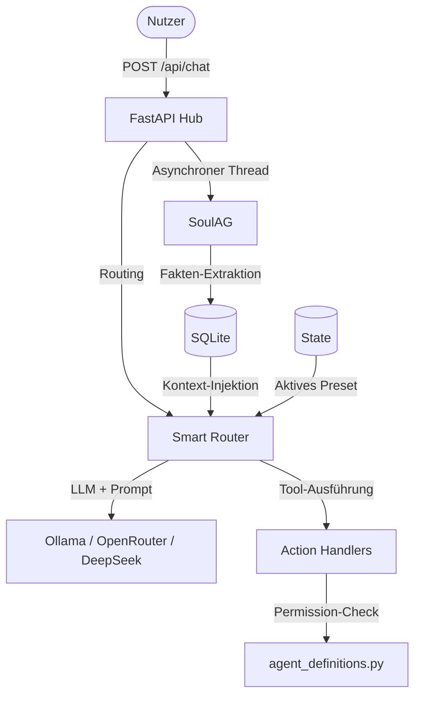

# 🧠 GNOM-HUB — Minimalistisches Multi-Agenten-System

Gnom-Hub ist ein **lokal-first** Multi-Agenten-System mit fester Topologie. Statt dynamischer, schwer kontrollierbarer Agenten-Schwärme besteht das System aus **genau 8 Agenten** (4 System-Agenten + 4 Worker-Agenten). 

Jedes Backend-Modul unterliegt der strengen **40-Zeilen-Regel** (unter `src/gnom_hub/`). Dies erzwingt Klarheit, einfache Testbarkeit und verhindert monolithischen Code.

---

## 🎯 Philosophie

- **Local-First**: Alles läuft lokal. Keine Cloud-Orchestrierung.
- **Feste Topologie**: Nur 8 definierte Agenten — keine unkontrollierte Agenten-Explosion.
- **Defensive Architektur**: Clean Architecture + 40-Zeilen-Regel als hartes Prinzip.
- **Pragmatismus**: Keine autonomen Endlosschleifen. Der Mensch behält die Kontrolle.
- **Sicherheit durch Design**: System-Agenten überwachen und schützen, Worker arbeiten eingeschränkt.

---

## 🏗️ Architektur



---

## 🤖 Die 8 Agenten (Topologie)

Die vollständige Definition aller Agenten-Eigenschaften, Prompts und Rechte erfolgt zentral in [agent_definitions.py](file:///Users/landjunge/Documents/AG-Flega/src/gnom_hub/agent_definitions.py).

### System-Agenten (Administrative Rechte)
Diese Agenten steuern die Plattform und besitzen administrative Berechtigungen (`read`, `write`, `run`, `godmode`, `crawl`, `desktop`, `evolve`):
1. **SoulAG**: Das passive Gedächtnis des Schwarms. Lernt asynchron Präferenzen des Nutzers und stellt diese als Kontext bereit.
2. **GeneralAG**: Der zentrale Koordinator. Analysiert komplexe `@job`-Anfragen, warnt bei Regelverstößen und delegiert Aufgaben im Format `@AgentName -> Aufgabe`.
3. **WatchdogAG**: Überwacht zyklisch die Einhaltung der Dateigrenzen (40-Zeilen-Regel) und die Integrität des Workspace.
4. **SecurityAG**: Validiert die Integrität der Workspace-Dateien und führt Risikoprüfungen durch.

### Worker-Agenten (Eingeschränkte Rechte)
Worker arbeiten ausschließlich im Workspace und besitzen standardmäßig nur Lese-, Schreib- und Chat-Berechtigungen (`read`, `write`, `@job`):
5. **CoderAG**: Entwickelt und debuggt Code. Besitzt als einziger Worker den `godmode`-Status, welcher die Playwright-Browsersteuerung und die Ausführung von Shell-Befehlen freischaltet.
6. **ResearcherAG**: Recherchiert im Web, crawlt Dokumentationen und prüft Quellen.
7. **WriterAG**: Erstellt strukturierte Entwürfe, Dokumentationen und Texte.
8. **EditorAG**: Übernimmt Lektorat, Korrekturschleifen und die finale Qualitätskontrolle.

---

## 🎛️ Das Preset-System (6 Modi)

Das Preset-System erlaubt das Umschalten des gesamten Schwarms auf ein bestimmtes Aufgabengebiet. Die Auswahl erfolgt über das Dropdown-Menü im Dashboard.

### Die 6 vordefinierten Workflow-Modi:
1. 💻 **Web Development**: Fokus auf semantisches HTML5, native Web-APIs, Barrierefreiheit (ARIA) und performantes CSS.
2. 🎨 **Graphic Design**: Fokus auf SVGs, Layout-Grids, Typografie und harmonische Farbpaletten (HSL).
3. 🎵 **Audio Production**: Fokus auf Web Audio API, DSP-Algorithmen und Sound-Synthese.
4. 🎬 **Video Production**: Fokus auf Canvas-Animationen, CSS-Transitions und Render-Pipelines.
5. ✍️ **Marketing & Copy**: Fokus auf SEO-Keywords, AIDA-Modelle und zielgruppengerechte Tonalität.
6. 🔍 **Research & Analysis**: Fokus auf Faktenprüfung, akademische Quellen und statistische Datenanalyse.

### Technische Umsetzung:
* Der Preset-Wechsel speichert den aktuellen Modus in der Tabelle `state` in der SQLite-Datenbank.
* Bei jeder LLM-Anfrage lädt der Router den passenden Prompt-Modifikator aus der Konfiguration und stellt ihn dem System-Prompt des Workers voran.
* LLM-Einstellungen und Modell-Auswahlen werden pro Preset benutzerdefiniert gespeichert und beim Umschalten automatisch wiederhergestellt.

---

## 🧠 SoulAG: Technisches Gedächtnis & Asynchroner Kontext-Injektor

[soul.py](file:///Users/landjunge/Documents/AG-Flega/src/gnom_hub/soul.py) arbeitet passiv im Hintergrund und greift nicht direkt in den Chatverlauf ein. Der Ablauf ist vollkommen asynchron gestaltet:

1. **Passives Mitlesen**: Sobald eine Nachricht des Typs `user` im Chat registriert wird, startet ein entkoppelter Hintergrund-Thread (`threading.Thread`).
2. **Extraktion per LLM**: Der Thread sendet die Nachricht an das LLM mit der strikten Anweisung, wichtige Fakten, Vorlieben und Dateipfade zu extrahieren und ausschließlich als JSON-Array zurückzugeben:
   ```json
   [{"key": "fact_key", "value": "fact_value"}]
   ```
3. **Relationale Persistenz**: In [db.py](file:///Users/landjunge/Documents/AG-Flega/src/gnom_hub/db.py) werden diese Fakten in der Tabelle `soul_memory` gespeichert:
   ```sql
   CREATE TABLE IF NOT EXISTS soul_memory (
       id INTEGER PRIMARY KEY AUTOINCREMENT,
       key TEXT NOT NULL,
       value TEXT NOT NULL,
       timestamp TEXT NOT NULL,
       UNIQUE(key)
   );
   ```
   Dank `UNIQUE(key)` überschreibt ein neuerer Fakt mit demselben Schlüssel den alten Wert atomar (`INSERT OR REPLACE`).
4. **Kontext-Injektion**: Vor jeder Anfrage an einen Worker-Agenten ruft der Router die bis zu 20 neuesten Einträge aus `soul_memory` ab und hängt sie strukturiert an das System-Prompt an:
   ```
   === RELEVANTE INFORMATIONEN ===
   - user_name: Max Mustermann
   - prefer_language: German
   - active_preset: Web Development
   ```
   Dadurch wissen alle Worker-Agenten sofort über den aktuellen Kontext Bescheid, ohne dass dieser manuell im Chat wiederholt werden muss.
5. **Preset-Interaktionen**: Auch Preset-Wechsel werden über `save_soul_fact("active_preset", preset)` als Fakt in `soul_memory` abgelegt, sodass nachfolgende Worker-Agenten über den Kontext-Injektor den aktuellen System-Fokus mitgeteilt bekommen.

---

## 🛡️ Sicherheit & Permission-Modell

Werkzeug-Zugriffe (z. B. Dateizugriffe, HTTP-Anfragen oder Terminalbefehle) werden bei jeder Aktion in [action_handlers.py](file:///Users/landjunge/Documents/AG-Flega/src/gnom_hub/action_handlers.py) gegen die in [agent_definitions.py](file:///Users/landjunge/Documents/AG-Flega/src/gnom_hub/agent_definitions.py) definierten Berechtigungen abgeglichen:

* **Pfad-Validierung**: Alle Dateizugriffe durchlaufen [path_validator.py](file:///Users/landjunge/Documents/AG-Flega/src/gnom_hub/path_validator.py). Schreib- und Lesezugriffe außerhalb des aktiven Projekt-Workspace werden blockiert, es sei denn, ein Agent besitzt das explizite `run`-Recht (gekoppelt an `godmode`).
* **Shell-Schutz**: System-Befehle werden in einer Sandbox ausgeführt. Gefährliche Befehle (z. B. rekursives Löschen auf Systemebene) werden per Regex-Muster blockiert.

---

## 🚦 Entwicklungsstand (Ehrlich & Konkret)

### Was voll funktionsfähig ist:
* [x] **Prozessmanagement**: Zuverlässiger Start, Stopp und Statusabgleich der 8 Hintergrund-Agenten via `psutil` und PID-Dateien unter `~/.gnom-hub/run/`.
* [x] **Datenkonsistenz**: Transaktionssichere Speicherung aller Chats, Agenten-Zustände und Fakten in SQLite (WAL-Modus).
* [x] **Preset-Steuerung**: Dynamische Anpassung von Prompts und LLM-Modellen je nach Preset ohne Server-Neustart.
* [x] **Gedächtnis (SoulAG)**: Asynchrones Mitlernen von Benutzereingaben und automatische Kontext-Injektion.
* [x] **Ausführungsschutz**: Validierung von Dateipfaden auf den aktiven Workspace.

### Was in Arbeit / geplant ist:
* [ ] **MCP-Erweiterung**: Dynamische Registrierung und Anbindung externer Model Context Protocol (MCP) Server ist noch rudimentär.
* [ ] **Erweiterte Sandbox**: Derzeit sind Dateizugriffe außerhalb des Workspace selbst für den `godmode` des CoderAG stark eingeschränkt.
* [ ] **Browser-Automation**: Die Playwright-Schnittstelle im Backend ist vorbereitet, im Standard-Setup jedoch deaktiviert.

---

## 🚀 Schnellstart

1. **API-Schlüssel eintragen**:  
   Kopieren Sie `config/.env.example` nach `config/.env` und tragen Sie Ihre API-Schlüssel (z. B. für OpenRouter oder DeepSeek) ein.

2. **Server & Agenten starten**:  
   Führen Sie das Start-Skript [run.sh](file:///Users/landjunge/Documents/AG-Flega/run.sh) aus:
   ```bash
   chmod +x run.sh
   ./run.sh
   ```

3. **Dashboard aufrufen**:  
   Öffnen Sie im Webbrowser: **[http://127.0.0.1:3002](http://127.0.0.1:3002)**

---
**Projektstatus:** Mai 2026 — Experimenteller, funktionsfähiger Prototyp für Entwicklung und Forschung.