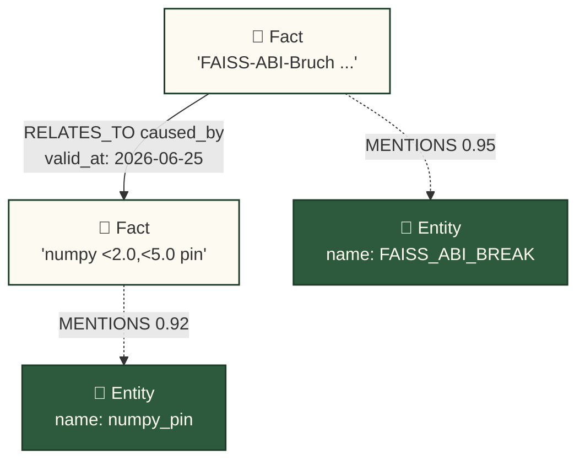
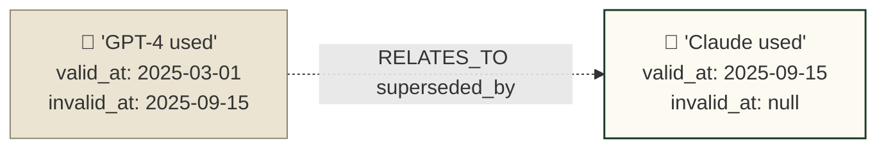

# Memory Graph — TKG Edition

> Deep-Dive zum **Temporal Knowledge Graph** in `src/gnom_hub/memory_tkg/`.
> Konzept-Quelle: [`MEMORY_REDESIGN_2026_TKG.md`](MEMORY_REDESIGN_2026_TKG.md) (v4, ersetzt v3).

## Was ist der TKG?

Der **Temporal Knowledge Graph** (TKG) ist die L2-WARM-Persistenzschicht
von Gnom-Hubs Memory-System. Statt flacher `MemoryRecord`s in SQLite +
separatem FAISS-Vektor-Index + BM25 speichert der TKG **Entities** (Knoten)
und **bitemporale Relationen** (Kanten mit `valid_at` / `invalid_at`) in
**KuzuDB** — Graph + HNSW-Vektor-Index in einer einzigen embedded Datei.
Die Consumer (SoulAG, ContextManager) sehen das nicht: das
`MemoryBackend`-Protocol in `backend.py:31` abstrahiert die Wahl, und der
`adapter.py`-Strangler-Wrapper mappt Legacy-API-Calls 1:1 auf
Backend-Methoden.

## 3-Schichten-Architektur

```
┌──────────────────────────────────────────────────────────────┐
│                AGENT READ PATH                                │
├──────────────────────────────────────────────────────────────┤
│                                                              │
│   Query: "Was ist mit dem FAISS-ABI-Bruch passiert?"         │
│       │                                                      │
│       ▼                                                      │
│   ┌─────────┐  ┌─────────────────────────────────────────┐   │
│   │ L1 HOT  │  │ Mermaid-Graph-Subset (working memory)   │   │
│   │ 200-400 │◄─┤ Projection des L2-Subgraphen           │   │
│   │ Facts   │  │ (kein eigener Storage)                  │   │
│   └────┬────┘  └─────────────────────────────────────────┘   │
│        │ Miss                                                │
│        ▼                                                     │
│   ┌──────────────────────────────────────────────────────┐   │
│   │  L2 WARM — Temporal Knowledge Graph (KuzuDB)         │   │
│   │                                                       │   │
│   │   (Entity:FAISS_ABI_BREAK)                            │   │
│   │       ▲                                               │   │
│   │       │ MENTIONS                                      │   │
│   │       │                                               │   │
│   │   (Fact:"FAISS-ABI-Bruch ... durch numpy pin ...")    │   │
│   │       │                                               │   │
│   │       │ RELATES_TO  predicate=caused_by, bitemporal   │   │
│   │       ▼                                               │   │
│   │   (Fact:"numpy <2.0,<5.0 pin installiert ...")        │   │
│   │                                                       │   │
│   │   [HNSW-Vector-Index] auf Fact.embedding (384-d)      │   │
│   │   [PK-Hash-Index]   auf Entity.id, Fact.id            │   │
│   │   [Bitemporal]      valid_at / invalid_at pro Edge    │   │
│   └────┬─────────────────────────────────────────────────┘   │
│        │ Cold-Migration (composite < 0.05)                  │
│        ▼                                                     │
│   ┌─────────┐                                                │
│   │ L3 COLD │  cold=true markiert, gleiche KuzuDB-Instanz   │
│   │ <800ms  │  365d-Retention, dann physisch gelöscht       │
│   └─────────┘                                                │
└──────────────────────────────────────────────────────────────┘
```

- **L1 HOT** — Python-Dict pro Agent-Prozess, Soft-Cap 200 / Hard-Cap 400.
  Wird aus dem L2-Subgraph projiziert (kein dualer Storage).
- **L2 WARM** — KuzuDB-Datei `data/memory.kuzu` (embedded, single-file).
  Schema: `graph_schema.cypher`. HNSW-Vector-Index auf
  `Fact.embedding` (cosine, 384-d).
- **L3 COLD** — Selbe KuzuDB-Instanz, Fact-Properties mit
  `cold=true`-Markierung. On-demand-Query via `find_facts_valid_at`.

## Bitemporal in 30 Sekunden

Jede `Fact`-Node und jede `RELATES_TO`-Kante trägt drei Zeitstempel:

| Feld          | Bedeutung                                                    |
|---------------|--------------------------------------------------------------|
| `valid_at`    | Ab wann die Aussage über die Welt **wahr** ist               |
| `invalid_at`  | Ab wann die Aussage **nicht mehr wahr** ist (`NULL` = aktiv) |
| `created_at`  | Wann der Curator die Edge **in den Memory geschrieben** hat  |

```
  Welt-Zeit ──────────────────────────────────────────────────►

  Edge-1: "Wir nutzen GPT-4"
          valid_at: 2025-03-01 ━━━━━━━━━━━━━━━━━━┓ invalid_at: 2025-09-15
                                            swapped to Claude
  Edge-2: "Wir nutzen Claude"
                                          valid_at: 2025-09-15 ━━━━━━━━━━► jetzt
                                                  invalid_at: NULL

  Beide Edges bleiben im Graph. Retrieval kann antworten:
    temporal_query(now)  → nur Edge-2 ("Claude")
    temporal_query(2025-06-01) → nur Edge-1 ("GPT-4")
```

Implementiert in `kuzu_backend.py:73-84` (`add_relation`): bei einer
neuen Relation mit gleichem `(from_id, predicate, to_id)` wird der
aktive Edge per `SET r.invalid_at = $now` invalidiert, dann der neue
Edge angelegt. `find_facts_valid_at(t)` filtert via
`valid_at <= t AND (invalid_at IS NULL OR invalid_at > t)`.

## Backend Stack

Konfiguration via `MEMORY_BACKEND` in `.env` (Default: `kuzu`).

| Backend               | Status      | Pfad                                                  | Use-Case                         |
|-----------------------|-------------|-------------------------------------------------------|----------------------------------|
| **KuzuDB**            | implementiert | `src/gnom_hub/memory_tkg/kuzu_backend.py`           | Default — embedded, single-file, HNSW nativ |
| **InMemoryBackend**   | implementiert | `src/gnom_hub/memory_tkg/in_memory_backend.py`      | Unit-Tests, brute-force numpy Cosine |
| **FalkorDB Lite**     | dokumentiert | (Spec: `MEMORY_REDESIGN_2026_TKG.md` §2.0, ADR-008)  | Multi-Process-Setup (Redis-kompatibel) |

Factory: `get_memory_backend()` (`backend.py:59`) — Singleton mit
`threading.Lock`, Pfad aus `KUZU_DB_PATH` (Default `data/memory.kuzu`).
Test-Hook: `reset_memory_backend()` leert den Cache.

## Endpoints

| Methode | Pfad                                  | Quelle                                | Status        |
|---------|---------------------------------------|---------------------------------------|---------------|
| GET     | `/api/memory/search?q=<text>`         | `api/endpoints/memory_search.py:12`   | implementiert |
| POST    | `/api/memory`                         | `api/endpoints/memory_crud.py:17`     | implementiert |
| PUT     | `/api/memory/{m_id}`                  | `api/endpoints/memory_crud.py:31`     | implementiert |
| DELETE  | `/api/memory/{m_id}`                  | `api/endpoints/memory_crud.py:39`     | implementiert |
| GET     | `/api/agents/{a_id}/memory`           | `api/endpoints/memory_crud.py:24`     | implementiert |
| GET     | `/api/agents/{a_id}/memory/count`     | `api/endpoints/memory_crud.py:28`     | implementiert |
| POST    | `/api/soul/save`                      | `api/endpoints/memory_crud.py:50`     | implementiert |
| GET     | `/api/memory/graph?agent=X&layer=hot` | Spec §2.3 (`MEMORY_REDESIGN_2026_TKG.md`) | dokumentiert |
| GET     | `/api/memory/kpis?window=24h&kpi=Y`   | Spec §2.6.2                            | dokumentiert |

Die ersten sieben sind Live-CRUD auf `MemoryRecord`s (SQLite-Pfad,
genutzt von `SoulAG` und `ContextManager`). Die letzten beiden sind im
Redesign-Spec definiert — `memory/graph` liefert Mermaid-Subgraph-Markup
für den Agent-Inspector (`README.md:337`), `memory/kpis` liefert die
4-KPI-Klassen Token-Economy / Retrieval-Quality / Turn-Count /
Task-Success.

## Cypher-Beispiel

Das Schema (`graph_schema.cypher`) hat **zwei Node-Types** (`Entity`,
`Fact`) und **zwei Edge-Types** (`RELATES_TO` Fact→Fact mit `predicate` +
Bitemporal, `MENTIONS` Fact→Entity mit `confidence`). Relationen
leben zwischen **Facts**, nicht zwischen Entities — Entities werden
per `MENTIONS` an Facts geheftet.

```cypher
// 1) Entities anlegen (deduped per id)
MERGE (e_break:Entity {id:'ent_faiss_break'})
  ON CREATE SET e_break.name='FAISS_ABI_BREAK', e_break.type='bug',
                e_break.importance=0.9, e_break.last_seen=time()
MERGE (e_pin:Entity {id:'ent_numpy_pin'})
  ON CREATE SET e_pin.name='numpy_pin', e_pin.type='code_change',
                e_pin.importance=0.8, e_pin.last_seen=time()

// 2) Facts anlegen (mit 384-d Embedding)
CREATE (f_break:Fact {
  id:'fact_001', text:'FAISS-ABI-Bruch in numpy 2.2.6 blockiert Hub-Start',
  embedding:$emb_break, importance:0.9,
  valid_at:1717500000.0, invalid_at:NULL
})
CREATE (f_pin:Fact {
  id:'fact_002', text:'numpy pin <2.0,<5.0 fixt den FAISS-ABI-Bruch',
  embedding:$emb_pin, importance:0.85,
  valid_at:1717500000.0, invalid_at:NULL
})

// 3) Facts vernetzen — bitemporal, add_relation invalidiert aktive Edge
MATCH (a:Fact {id:'fact_001'}), (b:Fact {id:'fact_002'})
CREATE (a)-[r:RELATES_TO {
  predicate:'caused_by', valid_at:1717500000.0, invalid_at:NULL
}]->(b)

// 4) Facts an Entities heften
MATCH (f:Fact {id:'fact_001'}), (e:Entity {id:'ent_faiss_break'})
MERGE (f)-[m:MENTIONS {confidence:0.95}]->(e)
```

`add_relation` (`kuzu_backend.py:73`) invalidiert vor dem Insert alle
`RELATES_TO`-Edges mit gleichem `(from, predicate, to)` und
`invalid_at IS NULL` durch `SET r.invalid_at = $now` — die
Bitemporal-Split-Mechanik.

## Mermaid-Subgraph-Visualisierung

Der Agent-Inspector (`worker_sidebar.js:411`) rendert einen
Mermaid-`graph TD`-View, der direkt aus dem L2-Subgraphen abgeleitet
ist. Zwei typische Subgraph-Formen:





Bitemporale Knoten zeigen **beide** Zeitstempel im Label — der
Inspector lässt den User auf einen Knoten klicken, um `text` und
vollständige Bitemporal-Timestamps zu sehen (`README.md:337`).

## Tests

Die Test-Suite `tests/test_memory_tkg.py` ist **parametrisiert** über
beide Backends (`kuzu` und `in_memory`) — jeder Test läuft zweimal
und garantiert Repository-Pattern-Isolation.

| Test                                  | Was es prüft                                              |
|---------------------------------------|-----------------------------------------------------------|
| `test_both_backends_satisfy_protocol` | Strukturelles Subtyping beider Backends vs `MemoryBackend` Protocol |
| `test_upsert_get_entity`              | Entity INSERT + UPDATE (importance-Drift)                 |
| `test_upsert_fact_and_search`         | Fact INSERT + Vektor-Search (`search_facts_by_vector`)    |
| `test_mention_roundtrip`              | `MENTIONS`-Edge Fact→Entity, Rück-Lookup                  |
| `test_bitemporal_relation`            | **TC-11**: aktiver Edge wird invalidiert wenn gleiche Relation neu eingefügt wird |
| `test_reset_memory_backend`           | Factory-Singleton + `reset_memory_backend`-Hook           |

Zusätzlich dokumentiert im Redesign-Spec (`MEMORY_REDESIGN_2026_TKG.md`
§2.6.3, TC-12 bis TC-15):

| ID    | Name                          | Verifiziert                                                |
|-------|-------------------------------|------------------------------------------------------------|
| TC-12 | Graph-Traversal-Korrektheit   | 100 Queries, traversierter Subgraph 1–2 hops, keine Orphans |
| TC-13 | HNSW-vs-FAISS-Perf            | 10k Facts, p95-Vector-Search < 30ms (KuzuDB-HNSW)         |
| TC-14 | Cluster-Detection             | PageRank-Output konsistent, Cluster-Summaries sinnvoll    |
| TC-15 | Turn-Count-Reduktion          | 50 Tasks, ≥30% weniger Turns vs. no-memory baseline       |

Lauf:

```bash
python3 -m pytest tests/test_memory_tkg.py -v
```

## Weiterführend

- [`MEMORY_REDESIGN_2026_TKG.md`](MEMORY_REDESIGN_2026_TKG.md) — v4 Konzept, 694 Zeilen, ADR-007 bis ADR-011
- [`ARCHITECTURE.md`](ARCHITECTURE.md) — System-Architektur-SoT (Routing, Provider-Chain, Agent-Rollen)
- `README.md` §"Memory Architecture — the TKG-Hirn" (Zeile 109) und §"Memory-Visualization (TKG-Inspector)" (Zeile 309)
- `src/gnom_hub/memory_tkg/` — Implementation (4 Module + Schema)
- `src/gnom_hub/api/endpoints/memory_search.py` + `memory_crud.py` — Live-Endpoints