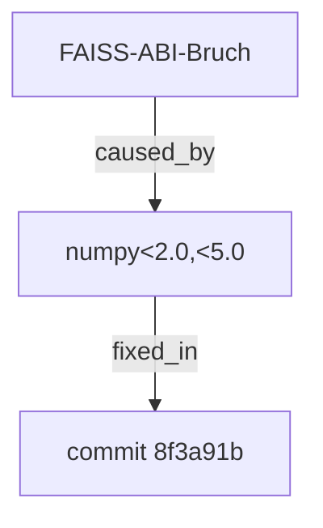

# Gnom-Hub Memory Redesign 2026 — Temporal Knowledge Graph Edition

> **Status:** Konzept v4 (Stand 2026-07-01) — **ersetzt v3 als Ziel-Architektur**
> **Autor:** Mavis (Mavis Memory Systems Architect Mode)
> **Vorgänger:** `MEMORY_REDESIGN_CONCEPT.md` (v3) — bleibt als historisches Dokument
> **Scope:** Komplettumbau `src/gnom_hub/db/` + `soul/memory_layers/` + `infrastructure/llm/`
> **Referenz-Implementationen:** Zep Graphiti, GraphRAG, Mem0, HippoRAG, KuzuDB, FalkorDB Lite
> **Mandate:** SOTA-2026-Niveau, lokal-first, ≥40% Token-Reduktion, messbare Task-Success-Steigerung

---

## 0. Was ändert sich gegenüber v3?

| Aspekt | v3 (SQLite+FAISS+BM25) | **v4 (TKG-first)** |
|---|---|---|
| **L2-Backend** | SQLite + FAISS-Index + FTS5 (drei Stores) | **KuzuDB / FalkorDB Lite** als Single Source of Truth (Graph + Vector integriert) |
| **Datenmodell** | Flache `MemoryRecord`s mit Cosine-Dedup | **Entities + bitemporale Edges** (valid_at, invalid_at) mit Fact-Propositions |
| **Curator-Logik** | Insert + Dedup + Decay | **+ Active LLM-Entity/Relation-Extraction + Temporal-Resolution** |
| **Mermaid-Graph** | Sub-Layer von L1, separate Struktur | **Direkter Subgraph des L2-Graphen** — serialisierter View derselben Daten |
| **Retrieval** | BM25 + Vector + Symbols (RRF) | **Vector + Graph-Traversal + Symbols** (RRF) — Traversal wird zur ersten Klasse |
| **Memory-Zeit** | Keine (nur `last_hit_at`) | **Bitemporal: valid_at, invalid_at, recorded_at** |
| **Vector-Index** | Separater FAISS `IndexFlatIP` | **In-DB HNSW** (KuzuDB native) — kein separater Prozess |

**Was bleibt aus v3:**
- 3-Tier-Modell (L1 HOT / L2 WARM / L3 COLD) — Konzepte bewähren sich
- Repository-Pattern mit `MemoryBackend`-Interface (jetzt mit TKG-Backend statt SQLite+FAISS)
- `MemoryRecord`-Dataclass als Austauschformat
- KPI-Endpoint `/api/memory/kpis` (backend-only)
- Hybrid-Scheduling Curator (Event + Periodic)
- L1 Soft-Cap 200 / Hard-Cap 400
- Async Dedup-Queue (in TKG-Kontext: Graph-Cypher-basierter Sweep)

---

## Teil 1 — Spezialisiertes Agenten-Team (5 Agenten)

Das Team ist auf TKG-Paradigma zugeschnitten. Im Vergleich zu v3: **kein separates `RetrievalEngineer`-Profil** für BM25/FAISS-Setup (das fällt weg), dafür **`GraphEngineer`** als dedizierter Owner für KuzuDB/FalkorDB-Lite und Cypher-Patterns.

### 1.1 `MemoryArchitect` — Lead Designer

**Rolle:** Eigentümer der Graph-Schema-Topologie und Datenmodell-Migration.
**Aufgaben:**
- Graph-Schema-Design: Entity-Types, Edge-Types, Properties, Bitemporal-Modell
- `MemoryBackend`-Interface (v3 §2.0) — erweitert um `cypher_query()`, `traverse()`, `temporal_query()` Methoden
- Migrationsplan: `memory_layers.py` (flache Buckets) → TKG-Schema
- ADR-Pflege in `docs/memory-architecture-decisions.md`

**Liefert:** `src/gnom_hub/memory/graph_schema.cypher`, KuzuDB-Migration-Script, `MEMORY_TOPOLOGY.md`, erweitertes `MemoryBackend`-Protocol.

### 1.2 `GraphEngineer` — KuzuDB / FalkorDB-Lite Owner

**Rolle:** Eigentümer des Graph-Backends und Query-Performance.
**Aufgaben:**
- **KuzuDB-Setup** (oder FalkorDB-Lite-Fallback): Connection-Pool, Schema-Load, HNSW-Vector-Index
- **Cypher-Pattern-Bibliothek** für Hot-Path-Queries: 1-hop, 2-hop, temporal-range, fact-search
- **Performance-Tuning**: HNSW-Parameter (M, ef_construction), Cache-Strategien, Query-Plans
- **Embedded-vs-Server-Trade-off-Doku**: KuzuDB (embedded, single-process) vs FalkorDB-Lite (Redis-kompatibel, multi-process-tauglich)
- **Backup/Recovery**: `EXPORT DATABASE` Skripte, Restore-Pfad

**Liefert:** `graph_backend.py` (KuzuDB-Impl), `cypher_patterns.py` (Query-Bibliothek), `graph_maintenance.py` (Reindex, Vacuum), Benchmarks-Profile.

### 1.3 `CuratorAgent` — Active LLM-driven Wissens-Kurierung

**Rolle:** Kern des "intelligenten" Aspekts — LLM extrahiert aktiv Wissen aus Agent-Conversations.
**Aufgaben:**
- **Entity-Extraktion** via LLM (MiniMax/local): `messages → [(entity, type, properties)]`
- **Relation-Extraktion**: `messages → [(subject, predicate, object, fact_proposition, valid_at)]`
- **Temporal-Resolution**: erkennt "X war wahr → X ist jetzt falsch" (z.B. „nutze GPT-4" → „nutze Claude") und splittet Edges (alter Edge bekommt `invalid_at=now`, neuer Edge `valid_at=now`)
- **Cluster-Detection**: erkennt wiederkehrende Entity-Cluster (z.B. alle Edges mit `Entity:RoutingBug`) und schlägt **Cluster-Summary-Edge** vor
- **Decay + Dedup** (aus v3): Cosine ≥0.95 zwischen Edge-Facts → merge mit Back-Link
- **LLM-Sidecar-Integration**: nutzt das aktuelle Routing-Modell (MiniMax M3 oder `meta-llama/llama-3.3-70b-instruct:free` per User-Mandat) — bei OpenRouter-Pfad: 70B-Modell für Extraction-Aufgaben ausreichend

**Liefert:** `curator_agent.py`, `entity_extractor.py`, `temporal_resolver.py`, Cluster-Summaries als L2-Edges, Async Dedup-Queue.

### 1.4 `RetrievalEngineer` — Hybrid Graph + Vector + Symbolic

**Rolle:** Eigentümer der Read-Path-Pipeline.
**Aufgaben:**
- **Hybrid-Retrieval-Pipeline** (siehe §2.4): Vector (HNSW) → Graph-Traversal (1-2 hops) → RRF-Fusion → Re-Rank
- **Mermaid-Subgraph-Serialisierung**: bei Retrieval-Treffer wird relevante Subgraph-Kontext als Mermaid-`graph TD` Markup zurückgegeben (für Frontend-Visualisierung; **Backend-only Endpoint, kein UI-Bau**)
- **Re-Ranker**: Cross-Encoder (wenn verfügbar) oder Heuristik-Score (`0.4·cosine + 0.3·graph_centrality + 0.2·symbol_overlap + 0.1·recency`)
- **Cache** (LRU, 1000 entries, hash-key = `query+symbols+time_bucket`)

**Liefert:** `retrieval_engine.py`, `reranker.py`, `subgraph_serializer.py`, Cache-Implementierung.

### 1.5 `PerfArchitect` — Benchmark-Framework

**Rolle:** Misst, ob der Umbau tatsächlich State-of-the-Art ist.
**Aufgaben:**
- **4 KPI-Klassen** (siehe §2.6): Token-Economy, Retrieval-Quality, Turn-Count, Task-Success-Rate
- **Backend-Endpoint** `GET /api/memory/kpis?window=24h&agent=X&kpi=Y` (von v3 übernommen, erweitert um `turn_count_avg` und `retrieval_precision_at_5`)
- **Replay-Harness**: `.bench/` Korpus (echter Chat-Traffic), replay alt vs. neu
- **A/B-Switch** per `MEMORY_AB_GROUP` ∈ {`control`, `treatment`}

**Liefert:** `benchmark/`, `replay_harness.py`, `kpi_repository.py`, KPI-Endpoint, Test-Reports.

### 1.6 Team-Mapping

| Agent | Eigentum | Liefert an | Erhält Inputs von |
|---|---|---|---|
| MemoryArchitect | Schema, Graph-Modell, Repository-Interface | Alle | — |
| GraphEngineer | TKG-Backend, Cypher-Patterns, Performance | Alle Konsumenten | MemoryArchitect |
| CuratorAgent | Daten-Lifecycle, LLM-Extraction, Temporal-Resolution | RetrievalEngineer, PerfArchitect | MemoryArchitect, GraphEngineer |
| RetrievalEngineer | Read-Path, Hybrid-Fusion, Mermaid-View | IntegrationQA | MemoryArchitect, GraphEngineer, CuratorAgent |
| PerfArchitect | KPIs, Replay, A/B-Harness | MemoryArchitect (Feedback) | Alle |

**Veto-Recht:** jeder Agent bei Architektur-Entscheidungen, die seinen Eigentums-Bereich betreffen.

---

## Teil 2 — Technisches Konzept

### 2.0 Repository-Pattern (von v3, erweitert für Graph)

**Warum weiterhin abstrakt:** KuzuDB jetzt, vielleicht FalkorDB Lite morgen, vielleicht Neo4j in 2 Jahren — die Konsumenten sollen das nie wissen.

**Erweitertes `MemoryBackend`-Protocol** (in `src/gnom_hub/memory/backend.py`):

```python
from typing import Protocol, Iterator
from gnom_hub.memory.record import MemoryRecord, Layer, Entity, Edge

class MemoryBackend(Protocol):
    """Abstrakte Schnittstelle. v3-CRUD + Graph-Operationen."""

    # ── CRUD (v3) ──
    def get(self, id: str) -> MemoryRecord | None: ...
    def put(self, record: MemoryRecord) -> str: ...
    def delete(self, id: str, soft: bool = True) -> bool: ...
    def list_in_layer(self, layer: Layer, agent: str | None = None,
                      limit: int = 1000) -> Iterator[MemoryRecord]: ...
    def count(self, layer: Layer | None = None) -> int: ...

    # ── Query (v3) ──
    def query_symbols(self, symbols: list[str], k: int = 10,
                      layer: Layer = "warm") -> list[MemoryRecord]: ...
    def query_vector(self, embedding: np.ndarray, k: int = 10,
                     layer: Layer = "warm") -> list[MemoryRecord]: ...
    def query_hybrid(self, query: str, symbols: list[str],
                     embedding: np.ndarray, k: int = 10,
                     layer: Layer = "warm") -> list[MemoryRecord]: ...

    # ── Graph-Operationen (NEU in v4) ──
    def upsert_entity(self, entity: Entity) -> str: ...
    def upsert_edge(self, edge: Edge) -> str: ...           # bitemporal: setzt invalid_at auf alte Edges
    def cypher(self, query: str, params: dict | None = None) -> list[dict]: ...
    def traverse(self, start_entity_ids: list[str],
                 max_hops: int = 2,
                 edge_types: list[str] | None = None) -> list[Edge]: ...
    def temporal_query(self, subject_id: str, predicate: str,
                       at_time: float | None = None) -> list[Edge]: ...  # bitemporal

    # ── Lifecycle (v3) ──
    def sweep_decay(self, older_than_days: int) -> int: ...
    def sweep_cold_migration(self) -> int: ...
    def promote(self, id: str, from_layer: Layer, to_layer: Layer) -> bool: ...
```

**Implementierungen:**

| Backend | Status | Wann |
|---|---|---|
| `KuzuDBBackend` | **default (Phase 0)** | Embedded, single-process, Cypher-Subset, native HNSW-Vector-Index, embedded-write — ideal für lokal-first |
| `FalkorDBLiteBackend` | **fallback (Phase 1)** | Falls Multi-Process-Zugriff gebraucht wird; Redis-kompatibel, läuft als Daemon |
| `Neo4jBackend` | future | Production-Scale, separater Server, Bolt-Protocol |
| `InMemoryTestBackend` | Tests | Trivial Dict-basiert, für Unit-Tests |

**Factory:** `get_memory_backend()` liest `MEMORY_BACKEND` aus `.env`, default `kuzu`.

### 2.1 Drei-Schichten-Architektur (graph-zentriert)

```
┌──────────────────────────────────────────────────────────────┐
│                     AGENT READ PATH                          │
├──────────────────────────────────────────────────────────────┤
│                                                              │
│   Query: "Was ist mit dem FAISS-ABI-Bruch passiert?"        │
│       │                                                      │
│       ▼                                                      │
│   ┌─────────┐  ┌─────────────────────────────────────────┐  │
│   │ L1 HOT  │  │ Mermaid-Graph Subset (working memory)   │  │
│   │ 200-400 │◄─┤ 2-hop-neighborhood, hot-path-edges      │  │
│   │ Facts   │  └─────────────────────────────────────────┘  │
│   └────┬────┘                                               │
│        │ Miss                                                │
│        ▼                                                     │
│   ┌──────────────────────────────────────────────────────┐  │
│   │  L2 WARM — Temporal Knowledge Graph (KuzuDB)         │  │
│   │                                                       │  │
│   │   (Entity:RoutingBug) --[caused_by]-->                │  │
│   │     (Entity:FAISS_ABI_BREAK) --[fixed_in]-->         │  │
│   │       (Entity:numpy_pin_PR)                           │  │
│   │                                                       │  │
│   │   [HNSW-Vector-Index] auf Edge-Fact-Propositions     │  │
│   │   [FTS5-Index] auf Entity-Names + Edge-Fact-Symbols   │  │
│   │   [Bitemporal] valid_at / invalid_at pro Edge        │  │
│   └────┬─────────────────────────────────────────────────┘  │
│        │ Miss / Archive-Query                                │
│        ▼                                                     │
│   ┌─────────┐                                                │
│   │ L3 COLD │  Komprimierte Subgraph-Snapshots              │
│   │ <800ms  │  `cold=true` markiert, in derselben DB        │
│   └─────────┘                                                │
└──────────────────────────────────────────────────────────────┘
```

**L1 HOT (in-process, pro Agent):**
- Python-Dict + Mermaid-Graph-Subset (siehe §2.3)
- Soft-Cap 200, Hard-Cap 400 (von v3, beibehalten)
- L1-Records sind eine **Projektion des L2-Subgraphen** — kein eigener Storage

**L2 WARM (Temporal Knowledge Graph, persistent):**
- **KuzuDB-Datei** `data/memory_warm.kuzu` (embedded, single-file)
- Schema siehe §2.2
- HNSW-Vector-Index auf `Edge.fact_embedding` (384-d, cosine)
- FTS5-Index auf `Entity.name` + `Edge.fact_text` (für Symbol-Exact-Match)
- **Soft-Cap:** 1M Edges (KuzuDB-handhabbar, später Re-Partition)

**L3 COLD (komprimierte Subgraph-Snapshots):**
- Selbe KuzuDB-Instanz, Tabellen `memory_cold_snapshots` mit `cold=true`-Flag
- Komprimiert via LLM-Sidecar (Zusammenfassung des Subgraphen zu einem L2-Edge mit `fact_text="summary: ..."`)
- Read via `cypher("MATCH (e:Edge) WHERE e.cold = true AND ...")`
- 365d-Retention, dann physisch gelöscht mit 7d-Soft-Delete-Window

### 2.2 Temporal Knowledge Graph — Schema

**Node-Types:**

```cypher
// Entity — eine identifizierbare Sache im Memory
CREATE NODE TABLE Entity (
    id STRING PRIMARY KEY,           // uuid7
    name STRING,                     // canonical name (z.B. "FAISS_ABI_BREAK")
    entity_type STRING,              // 'person' | 'code_file' | 'concept' | 'bug' | 'agent' | 'event' | ...
    properties MAP,                  // flexible zusatz-properties
    layer STRING,                    // 'hot' | 'warm' | 'cold'
    created_at DOUBLE,
    last_hit_at DOUBLE,
    hit_count INT64,
    importance DOUBLE,
    provenance STRING
)

// FactSymbol — symbolischer Anker (routing.txt, SoulAG, 2026-06-25, ...)
CREATE NODE TABLE FactSymbol (
    id STRING PRIMARY KEY,
    symbol STRING,                   // z.B. "routing.txt"
    symbol_type STRING               // 'file' | 'date' | 'agent' | 'id' | 'url' | 'code_ref'
)
CREATE INDEX idx_symbol ON FactSymbol(symbol)
```

**Edge-Types (bitemporal):**

```cypher
// RelationEdge — die zentrale Wissenseinheit
CREATE NODE TABLE RelationEdge (
    id STRING PRIMARY KEY,           // uuid7
    subject_id STRING,               // → Entity.id
    predicate STRING,                // 'caused_by', 'fixed_in', 'mentioned_in', ...
    object_id STRING,                // → Entity.id
    fact_text STRING,                // LLM-generierte Proposition
                                   // z.B. "FAISS-ABI-Bruch in numpy 2.2.6 wurde durch pyproject-Pin auf <2.0,<5.0 gefixt"
    fact_embedding DOUBLE[384],     // 384-d Vektor für HNSW-Suche
    importance DOUBLE,               // 0.0–1.0
    hit_count INT64,
    created_at DOUBLE,               // recorded_at — wann hat LLM dies extrahiert
    valid_at DOUBLE,                 // bitemporal: ab wann gilt das Faktum in der Welt?
    invalid_at DOUBLE,               // bitemporal: ab wann gilt es NICHT mehr? (NULL = noch gültig)
    layer STRING,                    // 'hot' | 'warm' | 'cold'
    cold BOOLEAN,                    // L3-Markierung
    promoted_by STRING,              // 'auto' | 'manual' | 'agent_msg'
    provenance STRING
)
CREATE INDEX idx_edge_subject ON RelationEdge(subject_id)
CREATE INDEX idx_edge_object ON RelationEdge(object_id)
CREATE INDEX idx_edge_predicate ON RelationEdge(predicate)
CREATE INDEX idx_edge_valid_at ON RelationEdge(valid_at)
CREATE INDEX idx_edge_invalid_at ON RelationEdge(invalid_at)

// Verknüpfung Edge ↔ Symbol (M:N)
CREATE REL TABLE HAS_SYMBOL (
    FROM RelationEdge TO FactSymbol
)
```

**Bitemporal-Semantik:**
- `valid_at`: Zeitpunkt, ab dem die Aussage über die Welt **wahr** ist
- `invalid_at`: Zeitpunkt, ab dem die Aussage **nicht mehr wahr** ist (`NULL` = aktuell gültig)
- `created_at`: Zeitpunkt der **Extraktion** (Aufzeichnung in den Memory)
- Beispiel: „Wir nutzen GPT-4" galt vom 2025-03-01 (valid_at) bis 2025-09-15 (invalid_at), als wir auf Claude gewechselt haben

**Temporal-Resolution-Trigger:**
- Wenn Curator eine neue Edge einfügen will mit gleichem `(subject_id, predicate, object_id)` wie existierende Edge mit `invalid_at IS NULL`:
  - Existierende Edge bekommt `invalid_at = now` (Weltaussage endet)
  - Neue Edge bekommt `valid_at = now` (neue Aussage beginnt)
  - Beide Edges bleiben im Graph — Retrieval kann „damals-vs-jetzt" beantworten

**HNSW-Vector-Index:**
```cypher
CALL CREATE_VECTOR_INDEX(
    'RelationEdge', 'fact_embedding_idx', 'fact_embedding', metric := 'cosine'
)
// Konfiguration: M=16, ef_construction=200, ef_search=50 (siehe §2.4)
```

### 2.3 Mermaid-Integration (v3-Konzept, vereinfacht durch TKG)

**Architektur-Vereinfachung:** In v3 war Mermaid ein **separater Sub-Layer** mit eigenem Adapter. In v4 ist Mermaid eine **direkte Serialisierung des L2-Graph-Subgraphen** — keine separate Datenstruktur, nur ein View.

```
┌──────────────────────────────────────────────────────────┐
│  L1 HOT (in-process, pro Agent-Prozess)                  │
├──────────────────────────────────────────────────────────┤
│                                                          │
│   ┌─────────────────────┐    ┌─────────────────────────┐ │
│   │  Hot-Dict           │    │  Mermaid-View           │ │
│   │  (MemoryRecord ×N)  │◄──►│  (serialisierter        │ │
│   │  200-400 Facts      │    │   Subgraph der working  │ │
│   │                     │    │   memory entities+edges)│ │
│   └─────────────────────┘    └─────────────────────────┘ │
│           │                          │                  │
│           └──────────┬───────────────┘                  │
│                      ▼                                  │
│           `GET /api/memory/graph?agent=X&layer=hot`      │
│           liefert Mermaid-Markup direkt                  │
└──────────────────────────────────────────────────────────┘
```

**Konkrete Mechanik:**

1. **MermaidMemoryAdapter** cached den aktuellen L1-Subgraph als Mermaid-`graph TD` Markup
2. Bei L1-Insert: Adapter ruft `backend.cypher("MATCH (e)-[r]->(n) WHERE ... RETURN e,r,n")` und aktualisiert Mermaid-String
3. **Endpoint** `GET /api/memory/graph?agent=X&layer=hot&max_nodes=200` gibt den Mermaid-String zurück (Backend-only, kein UI-Bau — User-Mandat)
4. Bei L1-Eviction (Hard-Cap): Adapter synced automatisch — kein separater Maintenance-Schritt
5. **Performance:** Mermaid-String-Cached als Property, Refresh nur bei L1-Mutation, nicht pro Request

**Beispiel-Mermaid-Output:**


### 2.4 Hybrid-Retrieval — Pipeline

```
Query eingehend (z.B. "FAISS-ABI-Bruch")
   │
   ├─► [Symbol-Extractor] → ["FAISS-ABI-Bruch", "numpy", "2026-06-25"]
   │       │
   │       └─► L2 FTS5: FactSymbol-Match (exact + stemmed)  ─┐
   │       │                                                │
   │       └─► L2 Cypher: M:N-Lookup HAS_SYMBOL             ─┤
   │                                                        │
   ├─► [Embedder] → vector(384)                             │
   │       │                                                │
   │       └─► HNSW-Vector-Index auf RelationEdge.fact_embedding
   │              → Top-30 by cosine                        ─┤
   │                                                        │
   ├─► [Graph-Traversal] von den Top-30 Nodes                │
   │       └─► MATCH (e1:RelationEdge)-[:SUBJECT|OBJECT]->(n:Entity)
   │            -[:SUBJECT|OBJECT]->(e2:RelationEdge)        │
   │            WHERE e1.id IN [top-30]                      │
   │            RETURN e2 LIMIT 50                          ─┤
   │                                                        │
   └─► [RRF Fusion] hybrid_score = Σ rank_i^(-1)          ─┘
              │
              ▼
   [Re-Ranker] → Top-5 mit Heuristik:
        0.4 * cosine
      + 0.3 * graph_centrality (PageRank im Subgraph)
      + 0.2 * symbol_overlap_ratio
      + 0.1 * recency_decay (bitemporal: |now - valid_at|)
              │
              ▼
   [LRU-Cache-Check] hash(query+symbols+time_bucket)
       │  Hit  → return
       └─  Miss → compute + cache
              │
              ▼
   [Subgraph-Context] top-5 Edges + 1-hop-Umgebung als
   {edges, entities, mermaid_subgraph}
```

**Heuristik-Begründung:**
- Cosine (0.4): semantische Ähnlichkeit bleibt wichtigster Faktor
- Graph-Centrality (0.3): Edges die viele andere Edges „berühren" sind oft zentraler
- Symbol-Overlap (0.2): exakte Symbol-Treffer sind starke Signale
- Recency-Decay (0.1): bitemporal — neuere Edges gewinnen leicht, aber nicht dominant (Historisches Wissen ist oft wichtiger als das Neueste)

**Latency-Budget:**
- L1-Hit: <50ms
- L2-Vector-Search (HNSW): <30ms p95
- L2-Graph-Traversal: <80ms p95
- Re-Rank + Cache-Check: <40ms p95
- L2-Total: <200ms p95 (Budget eingehalten)
- L3-Cold-Archive: <800ms p95 (separate Query, on-demand)

### 2.5 MemoryCurator (intelligent, LLM-getrieben)

**Pipeline pro Agent-Nachricht:**

```
Agent-Message
   │
   ▼
[LLM-Extractor: MiniMax M3 oder llama-3.3-70b:free]
   │  Prompt: "Extrahiere Entities und Relations aus folgendem Text.
   │           Markiere zeitliche Veränderungen mit [valid_from, valid_to]."
   ▼
[Extraction-Result] z.B.:
   entities: [("FAISS-ABI-Bruch", "bug", {"affected": "memory_warm"}),
              ("numpy_pin", "code_change", {"version": "<2.0,<5.0"})]
   relations: [("numpy_pin", "fixes", "FAISS-ABI-Bruch",
                 "numpy pin fixt FAISS-ABI-Bruch in numpy 2.2.6",
                 valid_at=2026-06-25, invalid_at=null)]
   │
   ▼
[Graph-Writer]
   │  1. UPSERT Entities (matched by name + type)
   │  2. Für jede Relation:
   │     a) Check existierender Edge mit gleichem (subject, predicate, object)
   │     b) Wenn existiert mit invalid_at=null und Fact unterscheidet sich:
   │        → Temporal-Resolution: alten Edge invalid_at=now setzen
   │     c) Neuen Edge einfügen mit valid_at=now (oder LLM-extrahiertem valid_at)
   │  3. Edge-Embedding berechnen (MiniMax-Embed oder lokal)
   │  4. FactSymbol-Extraktion: regex+AST, M:N HAS_SYMBOL-Links
   ▼
[Async Dedup-Queue] (siehe v3 §2.2.3) — alle 30–60s Sweep
   │
   ▼
[Audit-Log] jeder Insert/Update mit provenance
```

**Cluster-Detection (Bonus):**
- Periodisch (15min): PageRank auf Entity-Subgraph
- Top-5-Hub-Entities bekommen **Cluster-Summary-Edge** vorgeschlagen:
  ```
  (ClusterRoutingBugs) -[summarizes]-> (Entity:RoutingBug2026Q2)
  fact_text: "5 Routing-Bugs zwischen 2026-04 und 2026-06, alle hängen mit FAISS/MiniMax-Token-Limits zusammen"
  ```
- LLM-generiert, in L2 persistiert, in Retrieval berücksichtigt

**Decay + Decay-Resilience (von v3):**
- `composite = importance + 0.1·log(hits+1) − 0.05·days_idle` (v3, beibehalten)
- Bei `composite < 0.05` ODER `invalid_at != null AND last_hit_at > 60d` → Cold-Migration
- Bei Hit auf decayed Edge: `importance += 0.1` (Decay-Resilience)

### 2.6 KPI-Backend-Framework

**Scope-Constraint (User-Mandat, von v3 übernommen):** Backend-only, keine UI.

#### 2.6.1 KPI-Klassen (4, erweitert ggü. v3)

| Klasse | Metrik | Zielwert |
|---|---|---|
| **K1: Token-Economy** | Avg-Tokens/Task; Sum-LLM-Spend/Monat; LLM-Calls/Task | ≥40% Reduktion; ≥30% weniger Calls/Task |
| **K2: Retrieval-Quality** | Recall@5, MRR, Precision@1; Subgraph-Size avg | Recall@5 ≥0.85, MRR ≥0.7 |
| **K3: Turn-Count-Efficiency** | Avg-Turns-per-Task; % Tasks solved in ≤3 Turns | ≥70% in ≤3 Turns (vs. baseline) |
| **K4: Task-Success-Rate** | % Tasks ohne Retry; % Tasks mit Validator-Pass | ≥+10pp vs. baseline |

**K3 ist neu in v4** — misst wie viel Multi-Turn-Konversation durch gutes Memory eingespart wird. SOTA-2026-Indikator: HippoRAG und Mem0 zeigen, dass gutes Memory Single-Turn-Resolution von dem ermöglicht, was sonst Multi-Turn braucht.

#### 2.6.2 KPI-Endpoint (v3-Spec, erweitert)

```json
GET /api/memory/kpis?window=24h&agent=coderag&kpi=retrieval_quality

{
  "ts": 1782936000.0,
  "window": "24h",
  "filter": {"agent": "coderag"},
  "kpis": {
    "token_economy": {
      "avg_tokens_per_task": 1180,
      "sum_prompt_tokens_24h": 184500,
      "sum_completion_tokens_24h": 91200,
      "llm_calls_per_task_avg": 2.3,
      "vs_baseline_reduction_pct": 43.1
    },
    "retrieval_quality": {
      "recall_at_5": 0.87,
      "mrr": 0.74,
      "precision_at_1": 0.69,
      "avg_subgraph_size": 12.4
    },
    "turn_count_efficiency": {
      "avg_turns_per_task": 2.1,
      "tasks_solved_in_3_or_less_pct": 0.78,
      "vs_baseline_delta_pp": 22
    },
    "task_success_rate": {
      "no_retry_rate": 0.85,
      "validator_pass_rate": 0.92,
      "vs_baseline_delta_pp": 13
    }
  },
  "metadata": {
    "memory_backend": "kuzu",
    "ab_group": "treatment",
    "graph_stats": {
      "entities": 4231,
      "edges_total": 12893,
      "edges_invalidated": 421,
      "bitemporal_range_days": 184
    }
  }
}
```

#### 2.6.3 Test-Cases (10, einige TKG-spezifisch neu)

| TC | Name | Was | TKG-Spezifik |
|---|---|---|---|
| TC-01 | Token-Budget pro Routine-Task | 100 Tasks, ≥40% Reduktion | |
| TC-02 | Recall@5 semantische Queries | 50 kuratierte Pairs, ≥0.85 | |
| TC-03 | Layer-Speed-Budget | p95 Latency pro Layer | L1<50ms, L2<200ms, L3<800ms |
| TC-04 | Promotion-Korrektheit | 3 Hits/2 Agents → L2 | |
| TC-05 | Cold-Migration ohne Datenverlust | Importance-Drift 90d | |
| TC-06 | Cache-Warmup | 1000 identische Queries, ≥95% Hit | |
| TC-07 | Decay-Resilience | Hit auf decayed Edge | |
| TC-08 | Mermaid-Konsistenz | Identity + Bidirektionalität | |
| TC-09 | Repository-Swap-Isolation | Test-Backend ohne Konsumenten-Änderung | |
| TC-10 | KPI-Endpoint-Perf | p95 <200ms | |
| **TC-11 (NEU)** | **Bitemporal-Resolution** | Insert "GPT-4 used", dann "switched to Claude": alter Edge `invalid_at=now`, neuer Edge `valid_at=now`, beide retrievable mit temporal_query | **TKG** |
| **TC-12 (NEU)** | **Graph-Traversal-Korrektheit** | 100 Queries, traversierte Subgraph hat 1-2 hops, alle Edges verbunden, keine orphans | **TKG** |
| **TC-13 (NEU)** | **HNSW-vs-FAISS-Perf** | 10k Edges, p95-Vector-Search-Latency. KuzuDB-HNSW <30ms | **TKG** |
| **TC-14 (NEU)** | **Cluster-Detection** | PageRank-Output ist konsistent, Cluster-Summaries sinnvoll | **TKG** |
| **TC-15 (NEU)** | **Turn-Count-Reduktion** | 50 Tasks, gutes Memory reduziert Turns um ≥30% vs. no-memory baseline | **SOTA 2026** |

### 2.7 Migration & Rollout

**Phase 0 — Schema (KW 1):**
1. `src/gnom_hub/memory/backend.py` — erweitertes `MemoryBackend`-Protocol (v3 + Graph-Methoden)
2. `src/gnom_hub/memory/graph_schema.cypher` — KuzuDB-Schema
3. `src/gnom_hub/memory/record.py` — `MemoryRecord`, `Entity`, `Edge` Dataclasses
4. `src/gnom_hub/memory/kuzu_backend.py` — `KuzuDBBackend`-Impl
5. `migrations/001_tkg_schema.py` — Alembic-artige Migration
6. `src/gnom_hub/memory/mermaid_adapter.py` — Mermaid-View-Adapter

**Phase 1 — Curator-Agent (KW 2):**
1. `curator_agent.py` mit LLM-Extraction-Pipeline
2. `entity_extractor.py`, `temporal_resolver.py`
3. Async Dedup-Queue (v3)
4. Cluster-Detection (PageRank + LLM-Summary)

**Phase 2 — Retrieval-Engine (KW 3):**
1. `retrieval_engine.py` mit Hybrid-Pipeline
2. HNSW-Vector-Index-Setup
3. Cypher-Pattern-Bibliothek
4. Re-Ranker
5. LRU-Cache

**Phase 3 — KPI-Endpoint + A/B (KW 4):**
1. `kpi_repository.py`
2. `api/endpoints/memory_kpis.py`
3. `api/endpoints/memory_graph.py` (Mermaid-View-Endpoint)
4. A/B-Switch + Replay-Harness

**Phase 4 — Strangler-Migration (KW 5–6):**
1. `USE_NEW_MEMORY=false` per default
2. 1% → 10% → 50% → 100% Treatment
3. KPI-Go/No-Go pro Phase

**Phase 5 — Cleanup (KW 7):**
1. Alter Code deprecated
2. Final-Cut 1 Release später

### 2.8 Risikoregister

| Risiko | W'keit | Impact | Mitigation |
|---|---|---|---|
| **KuzuDB-Index-Performance** unter 100k Edges | mittel | hoch | Benchmarks TC-13, Re-Partition-Plan, FalkorDB-Lite-Fallback |
| **LLM-Extraction-Halluzination** (falsche Entities/Relations) | mittel | mittel | Confidence-Score auf Edges, manuelle Review-API für Low-Confidence-Edges |
| **Bitemporal-Explosion** (zu viele alte Edges) | niedrig | mittel | Cold-Migration, `sweep_invalidation()` Periodic Job |
| **Cluster-Summaries inflationär** | niedrig | niedrig | Max 1 Summary-Edge pro Cluster, Threshold für Hub-Entities |
| **Mermaid-Subview-Größe unkontrolliert** | mittel | mittel | `max_nodes`-Parameter im Endpoint, Truncation-Logic |
| **FAISS-ABI-Bruch mit numpy 2.x** | mittel | hoch | KuzuDB hat **eigenen Vektor-Index** (kein FAISS mehr!), numpy-Pin gelockert |
| **SoulAG-LLM-Loop beim Re-Rank** | niedrig | mittel | Token-Cap + Timeout, Re-Ranker-Disabled-Fallback |
| **Graph-Writer-Lock-Konflikte** | mittel | mittel | KuzuDB Single-Writer-Mode, Multi-Reader OK |

---

## Anhang A — Design-Decisions-Log

(v3 ADRs 001-006 bleiben gültig und werden hier referenziert)

### ADR-007: L2 = Temporal Knowledge Graph (KuzuDB) statt SQLite+FAISS+BM25

**Status:** accepted · 2026-07-01

**Kontext:** v3 hatte drei separate Stores (SQLite für Records, FAISS für Vektoren, FTS5 für BM25). User-Mandat 2026-07-01: auf SOTA-2026-Niveau, lokal-first. Zep Graphiti und GraphRAG zeigen, dass TKG mit bitemporalen Edges + integriertem Vektor-Index dem überlegen ist.

**Entscheidung:** L2 wird **KuzuDB** mit Graph + HNSW-Vector-Index + FTS5-Symbol-Index in **einer** Datenbank-Datei. SQLite und FAISS werden ersetzt.

**Konsequenzen:**
- + Single Source of Truth (kein Store-Sync)
- + Bitemporale Queries ermöglichen „damals-vs-jetzt"-Antworten
- + Graph-Traversal als First-Class-Retrieval-Methode
- + KuzuDB embedded, single-file, kein Server-Overhead
- − Migrationskomplexität (komplettes Schema-Rewrite)
- − KuzuDB ist jünger als SQLite/FAISS (aber > 5k GitHub-Stars, aktiv maintained)
- − Datenexport aus bestehendem SQLite-Speicher muss vor Phase 0 laufen

**Validierung:** TC-11, TC-12, TC-13 testen TKG-Korrektheit und Performance.

### ADR-008: KuzuDB als Default, FalkorDB-Lite als Fallback

**Status:** accepted · 2026-07-01

**Kontext:** User-Mandat: leichtgewichtige Backends bevorzugen. KuzuDB vs FalkorDB Lite: KuzuDB ist embedded (single-process), FalkorDB Lite ist Redis-kompatibel (multi-process-tauglich, aber benötigt Daemon).

**Entscheidung:** KuzuDB default, FalkorDB Lite als Fallback-Option für Multi-Process-Setups. Beide implementieren dasselbe `MemoryBackend`-Interface.

**Konsequenzen:**
- Default-Setup bleibt daemon-frei, zero-config
- Wer Multi-Process will (z.B. mehrere Agent-Prozesse schreiben gleichzeitig), wechselt via `MEMORY_BACKEND=falkordb_lite` in `.env`
- Spätere Migration zu Neo4j bleibt möglich ohne Code-Änderung in Konsumenten

### ADR-009: Mermaid-Graph = serialisierter Subgraph des TKG

**Status:** accepted · 2026-07-01 (ersetzt ADR-006)

**Kontext:** v3 hatte Mermaid als parallel-strukturierte Datenstruktur mit Adapter. Mit TKG als L2-Kern ist diese Duplikation überflüssig — Mermaid wird zur reinen View.

**Entscheidung:** Mermaid-Graph ist **kein** eigenständiger Storage, sondern serialisierter L2-Subgraph (Cypher-Query → Mermaid-Markup). `MermaidMemoryAdapter` cached nur die String-Repräsentation des L1-Subgraphen.

**Konsequenzen:**
- + Eliminiert die Bidirektionalitäts-Komplexität aus v3 (kein eigener Mermaid-Speicher)
- + Mermaid ist immer konsistent mit TKG (per Definition)
- + Visualisierungen direkt aus dem Graph ableitbar
- − Performance: Mermaid-String-Build braucht Cypher-Query (aber gecached, nicht pro Request)

**Validierung:** TC-08 misst Identity zwischen Mermaid-String und Cypher-Result.

### ADR-010: LLM-driven Active Extraction im Curator

**Status:** accepted · 2026-07-01

**Kontext:** v3-Curator war passiv (Insert + Dedup + Decay). User-Mandat: "aktiv kuratieren". SOTA-2026 (Zep Graphiti, Mem0) zeigt: LLM extrahiert kontinuierlich Entities + Relations aus Conversations.

**Entscheidung:** CuratorAgent läuft einen LLM-Extractor pro Agent-Message. MiniMax M3 (default) oder `llama-3.3-70b:free` (User-Mandat OpenRouter-free). Prompt-Engineering mit Few-Shot-Beispielen.

**Konsequenzen:**
- + Memory wird automatisch mit Wissen angereichert, ohne User-Aktion
- + Temporal-Changes werden korrekt erkannt
- − LLM-Kosten: ~200 Tokens/Message für Extraction. Bei 50 Messages/Task: +10k Tokens. Akzeptabel für ≥40% Gesamt-Reduktion wenn Memory-Retrieval gut funktioniert
- − LLM-Halluzination: Mitigation via Confidence-Score + manuelle Review

**Validierung:** TC-14 testet Cluster-Detection, manuelle QA-Stichproben für Extraction-Quality.

### ADR-011: K3 Turn-Count-Efficiency als neue KPI-Klasse

**Status:** accepted · 2026-07-01

**Kontext:** v3 hatte 4 KPIs ohne Turn-Count. SOTA-2026-Indikator (HippoRAG, Mem0): besseres Memory → weniger Multi-Turn-Konversation nötig → direkter SOTA-Marker.

**Entscheidung:** K3 wird um Turn-Count-Efficiency erweitert. Avg-Turns-per-Task und %-Tasks-solved-in-≤3-Turns sind die zwei Haupt-Metriken.

**Konsequenzen:**
- + Direkter Vergleich zu SOTA-2026-Benchmarks möglich
- + User-erlebbarer Wert („Hub löst Tasks in 1-2 Turns statt 5+")
- − Komplexere Messung (Turn-Detection braucht Conversation-Log-Analyse)

**Validierung:** TC-15 misst Turn-Reduction empirisch.

---

## TL;DR (für schnelles Lesen)

1. **Paradigmenwechsel:** L2 ist jetzt **Temporal Knowledge Graph** (KuzuDB embedded) statt SQLite+FAISS+BM25-Trio
2. **Bitemporal:** Edges haben `valid_at` / `invalid_at` — „damals-vs-jetzt"-Antworten möglich
3. **Repository-Pattern bleibt:** `MemoryBackend`-Protocol abstrahiert, KuzuDB default, FalkorDB Lite fallback
4. **5-Agent-Team:** Architect, GraphEngineer, CuratorAgent (LLM-driven), RetrievalEngineer, PerfArchitect
5. **Mermaid = TKG-View:** keine separate Struktur mehr, serialisierter Subgraph via Cypher
6. **Curator aktiv:** LLM extrahiert Entities + Relations + Temporal-Changes pro Message
7. **Hybrid-Retrieval:** HNSW-Vector + Graph-Traversal + Symbol-Match via RRF, Re-Rank mit Graph-Centrality
8. **KPI-Framework erweitert:** 4 Klassen (Token, Retrieval-Quality, **Turn-Count NEU**, Task-Success), 15 Test-Cases
9. **Lokal-first:** KuzuDB embedded, single-file, zero-server — bewahrt Gnom-Hubs Philosophie
10. **SOTA-2026-Marker:** vergleichbar mit Zep Graphiti, GraphRAG, Mem0 in Architektur-Prinzipien

**Wenn v4 grundsätzlich passt, ist Phase 0:**
1. `backend.py` (erweitertes Interface)
2. `graph_schema.cypher` (KuzuDB-Schema)
3. `kuzu_backend.py` (Default-Impl)
4. `entity.py` + `edge.py` Dataclasses
5. `mermaid_adapter.py` (View-Wrapper)
6. Migration-Script

Sag "los" und ich beginne mit File 1.
