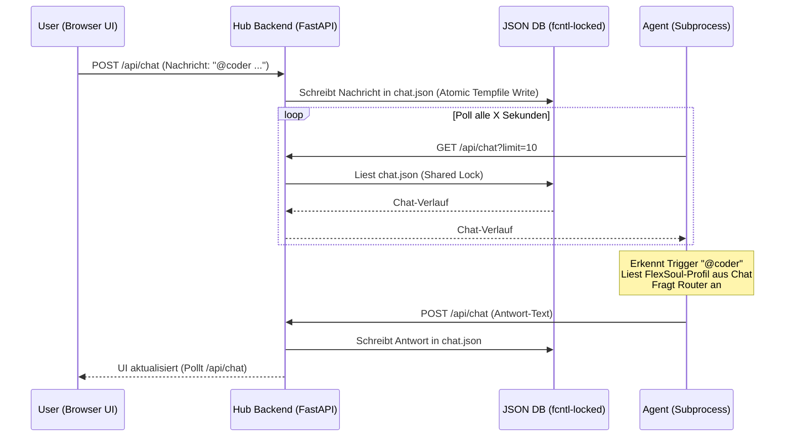

# 🧠 Gnom-Hub: Technischer Architektur- & Entwickler-Report

Willkommen bei **Gnom-Hub**! Dieses Dokument dient als vollständiger Onboarding- und Referenz-Report für Entwickler, die am Gnom-Hub-Projekt mitarbeiten, Features erweitern oder das Multi-Agenten-System warten möchten.

---

## 1. Vision & Systemphilosophie

Gnom-Hub ist ein leichtgewichtiges, lokales Multi-Agenten-System, das sich durch extreme Code-Effizienz und einen minimalen ökologischen Fußabdruck auszeichnet:
*   **Die 40-Zeilen-Regel:** Kein Python-Modul darf länger als 40 Zeilen sein. Das zwingt Entwickler zur Modularität und verhindert monolithischen Spaghetti-Code.
*   **Keine aufgeblähten Frameworks:** Das System verzichtet bewusst auf LangChain, CrewAI, Docker oder tonnenweise Node-Module. Es basiert auf nativem Python (FastAPI) und Vanilla HTML/JS.
*   **Privatsphäre & Sicherheit:** Alle Agenten interagieren lokal über eine dateibasierte JSON-Datenbank mit prozesssicheren Dateisperren (`fcntl`) und schützen ihre Arbeitsdaten kryptografisch.

---

## 2. Systemarchitektur & Prozessfluss

Gnom-Hub besteht aus drei Hauptkomponenten:
1.  **FastAPI Backend Server:** Empfängt API-Anfragen vom Frontend, verwaltet den Zustand und bietet Endpunkte für die Agenten.
2.  **Vanilla Frontend (War Room):** Ein responsives, cyberpunk-artiges Dashboard (Glassmorphism-Design), über das der Nutzer mit den Agenten kommuniziert.
3.  **Hintergrund-Agenten (Subprocesses):** Die 8 Agenten laufen als eigenständige Python-Prozesse, die periodisch das Backend nach neuen Nutzerbefehlen abfragen (Poll-Verfahren).



---

## 3. Die 4 Kern-Technologien des Hubs

### 3.1 Steganographisches Gedächtnis (Zero-Width Characters)
Um das System-Gedächtnis unsichtbar im Chat zu speichern, nutzt `zwc_soul.py` steganographische Codierung über unsichtbare Unicode-Zeichen:
*   **ZWC-Mapping:** Das Zeichen `'0'` wird auf `\u200b` (Zero-Width Space) abgebildet, das Zeichen `'1'` auf `\u200c` (Zero-Width Non-Joiner).
*   **Ablauf:** Daten werden serialisiert (JSON) -> Base64-codiert -> in Binärbits zerlegt -> in ZWC übersetzt und an den Antworttext des Agenten angehängt.
*   **Fehlerkorrektur (ECC):** Jedes Bit wird dreimal wiederholt (`bit * 3`). Beim Decodieren findet eine Mehrheitsentscheidung (Triple-Redundancy Majority Voting) statt, um Übertragungsverluste zu korrigieren.

### 3.2 Kryptografischer Selbstschutz (HMAC-SHA256)
Jede Datei im Workspace wird automatisch von den Sicherheitsmechanismen geschützt:
*   `SecurityAG` (`agents/securityAG.py`) signiert alle geschriebenen Workspace-Dateien mit einem HMAC-SHA256-Hash, der auf einem lokal in `~/.gnom-hub/data/.hub_secret` generierten Schlüssel basiert.
*   Die Signatur wird als unsichtbare ZWC-Kette in die Datei eingebettet (z.B. als Python-Kommentar oder HTML-Kommentar).
*   `WatchdogAG` prüft alle 60 Sekunden die Integrität aller Workspace-Dateien. Wurde eine Signatur verändert oder entfernt, schlägt das System Alarm.

### 3.3 FlexSoul (Stiller Beobachter)
`SoulAG` beobachtet alle Chats im Hintergrund und lernt die Präferenzen des Nutzers:
*   Er analysiert Schreibstil, Vorlieben und Abneigungen des Nutzers und speichert diese als JSON-Datenstruktur ab.
*   Dieses Profil wird steganographisch als **FlexSoul** transportiert.
*   Bei jeder LLM-Anfrage extrahieren die Agenten dieses Profil und injizieren es als System-Prompt-Erweiterung, sodass sich das Verhalten des gesamten Schwarms dynamisch dem Nutzer anpasst.

### 3.4 Multi-Provider LLM-Routing
Die Datei `src/gnom_hub/router.py` steuert die Kommunikation mit KI-Modellen über eine intelligente Fallback-Kette:
1.  **Spezifisches Modell:** Nutzt das für den Agenten fest zugeordnete Modell aus `router_config.py`.
2.  **DeepSeek Cloud:** Falls verfügbar, wird `deepseek-chat` verwendet.
3.  **OpenRouter Free Tier:** Fallback auf kostenlose OpenRouter-Modelle (z.B. `qwen3-coder:free` für Coder, `trinity-large-thinking:free` für Researcher).
4.  **Lokal (Ollama):** Fallback auf lokale Ollama-Modelle (z.B. `llama3`, `phi3`).

---

## 4. Die 8 Agenten im Detail

Die Agenten teilen sich in **System-Agenten** (halten das System stabil) und **Worker-Agenten** (führen Aufgaben aus) auf. Alle Worker basieren auf der `BaseAgent`-Klasse (`src/gnom_hub/agent_base.py`) und bestehen aus nur ca. 8 Zeilen Code.

| Agent | Typ | Zeilen | Trigger | Beschreibung & Spezialisierung |
| :--- | :--- | :---: | :--- | :--- |
| **GeneralAG** | System | 8 | `@job` | Zerlegt Aufgaben, koordiniert Worker und fasst Brainstorm-Ergebnisse zusammen. |
| **SecurityAG** | System | 30 | — | Berechnet HMAC-SHA256 Signaturen und bettet sie als ZWC in Dateien ein. |
| **WatchdogAG** | System | 26 | — | Pollt alle 60s den Workspace und schlägt bei Manipulationen Alarm. |
| **SoulAG** | System | 15 | `@soul` | Baut das Nutzerprofil (FlexSoul) auf und verwaltet das Langzeitgedächtnis. |
| **CoderAG** | Worker | 8 | `@code` | Generiert Code, debuggt und führt Shell-Befehle im Workspace aus. |
| **WriterAG** | Worker | 8 | `@write` | Schreibt Dokumentationen, Texte, Artikel und Markdown. |
| **ResearcherAG**| Worker | 8 | `@research`| Führt Web-Crawls durch und recherchiert Fakten. |
| **EditorAG** | Worker | 8 | `@edit` | Qualitätssicherung, Lektorat und Polishing von Texten. |

---

## 5. Das Action-Tag-System (Tools)

Die Agenten führen Aktionen aus, indem sie spezielle Markup-Tags in ihre Chat-Antworten einbetten. Diese Tags werden von `action_handlers.py` geparst und ausgeführt.

### 5.1 Tag-Syntax & Berechtigungen

*   **Dateien lesen:** `[READ: pfad/zur/datei]`
    *   *Berechtigung:* Fast alle Agenten (standardmäßig im Workspace).
*   **Dateien schreiben:** `[WRITE: dateiname]Inhalt[/WRITE]`
    *   *Berechtigung:* Benötigt `write` Permission (z.B. `WriterAG`, `CoderAG`). Erstellt ein Backup (`.bak`), signiert den Inhalt per HMAC und speichert die Datei ab.
*   **Shell-Befehle ausführen:** `[SHELL: befehl]`
    *   *Berechtigung:* Benötigt `run` Permission (nur `CoderAG`). Gefährliche Befehle (z.B. `rm -rf /`) werden blockiert. Läuft in einer Sandbox mit Timeout.
*   **Webseiten crawlen:** `[CRAWL: url]`
    *   *Berechtigung:* Benötigt `crawl` Permission (`ResearcherAG`). Nutzt `crawler_engine.py` zum Auslesen von Webinhalten.
*   **Showbox-Slides aktualisieren:** `<SHOWBOX:presentation_name>["HTML Slide 1", "HTML Slide 2"]</SHOWBOX>`
    *   *Berechtigung:* Alle Agenten. Aktualisiert die interaktiven Präsentations-Slides in der SQLite-Datenbank des Hubs. Alphanumerische Namen werden als neue Präsentationen gespeichert; Zahlen (1 bis 7) und leere Namen werden abwärtskompatibel zugeordnet.

### 5.2 Pfad-Sicherheit (`path_validator.py`)
Das System sperrt Agenten standardmäßig in das Workspace-Verzeichnis (`gnom_workspace/`).
*   Jeder Dateizugriff über `[READ:]` oder `[WRITE:]` wird durch die Hilfsfunktion `_safe(working_dir, file_path, perms)` validiert.
*   Pfade außerhalb des Workspace werden abgefangen und blockiert, es sei denn, der Agent besitzt die Berechtigung `run` (die alte, unsichere `godmode`-Berechtigung wurde zugunsten von `run` deprecated).

---

## 6. Datenbanksystem (`db.py`)

Gnom-Hub speichert seine Konfiguration und Verläufe in JSON-Dateien im Verzeichnis `~/.gnom-hub/data/`.
*   **Concurrency-Sicherheit:** Da mehrere Agenten-Prozesse und der FastAPI-Server gleichzeitig auf die JSONs zugreifen, verwendet das System `fcntl.flock` zur kooperativen Dateisperrung.
    *   `fcntl.flock(fd, fcntl.LOCK_SH)` (Shared Lock) wird zum Lesen verwendet.
    *   `_aw` schreibt Dateien atomar: Es erstellt eine temporäre Datei im selben Dateisystem und ersetzt die Ziel-JSON-Datei mittels `os.replace`. Dies verhindert korrupte JSONs bei Schreibkonflikten.
*   **Wichtige JSON-Dateien:**
    *   `agents.json`: Registrierte Agenten und deren Live-Status.
    *   `chat.json`: Der gesamte Chatverlauf im War Room.
    *   `memory.json`: Steganographische Langzeitdaten.
    *   `state.json`: Globaler Zustand des Hubs (aktives Projekt, Sprache).
    *   `llm_keys.json`: Konfigurierte API-Schlüssel.

---

## 7. Entwickler-Richtlinien & Workflow

Wenn du Änderungen am Gnom-Hub vornimmst, halte dich strikt an folgende Konventionen:

### 7.1 Code-Richtlinien
1.  **Halte die 40-Zeilen-Regel ein!** Wenn dein Modul zu groß wird, teile es in kleinere, hochspezialisierte Helper-Dateien auf.
2.  **Kein `print()` in Backend-Modulen:** Verwende stattdessen das Logger-Framework:
    ```python
    from .log import get_logger
    logger = get_logger("dein_modul")
    logger.info("Eine Information")
    ```
3.  **Keine absoluten Pfade hardcoden:** Verwende immer die in `config.py` definierten Konstanten (`PROJECT_ROOT`, `WORKSPACE_DIR`, etc.).
4.  **Keine Secrets committen:** API-Schlüssel gehören ausschließlich in `config/.env` und dürfen niemals ins Git-Repository gepusht werden.

### 7.2 Linting & Formatting
Wir verwenden **Ruff** zur statischen Codeanalyse und Formatierung. Führe Ruff vor jedem Commit aus:
```bash
# Linting prüfen
ruff check src/ agents/

# Automatische Fehlerkorrektur
ruff check --fix src/ agents/
```

### 7.3 Testing
Unit-Tests werden mit `pytest` ausgeführt:
```bash
pytest tests/
```

---

## 8. Bekannte Mechanismen & Handover-Notizen

### 8.1 "Nuke" Restart (Hard-Reset)
*   Im Admin-Dashboard gibt es den **Nuke**-Knopf (2 Sekunden gedrückt halten).
*   Dieser sendet einen Request an `/api/admin/nuke`.
*   Der Server signalisiert dem Haupt-Wrapper-Prozess in `__main__.py` den Exit-Code `42`.
*   Der Wrapper fängt den Exit-Code auf, bereinigt offene Sockets und startet den Server auf einem freien Port neu. Dies verhindert verwaiste Prozesse und `Address already in use` Fehler.

### 8.2 SFTP-Deployment
*   Durch den Befehl `@publish` im Chat werden HTML/CSS/MD-Dokumente aus dem Workspace per SFTP auf den konfigurierten Zielserver (z. B. `netzwerkpunkt.de`) hochgeladen (`ftp_deploy.py` & `ftp_sync.py`). Die Zugangsdaten werden aus der `.env` geladen.

---

*Für weiterführende Details siehe die Konzepte im Ordner [docs/](file:///Users/landjunge/Documents/AG-Flega/docs/):*
*   [Developer Handover Report](file:///Users/landjunge/Documents/AG-Flega/docs/developer_handover_report.md)
*   [Security Agent Konzept](file:///Users/landjunge/Documents/AG-Flega/docs/security-agent-konzept.md)
*   [Backup Agent Konzept](file:///Users/landjunge/Documents/AG-Flega/docs/backup-agent-konzept.md)
